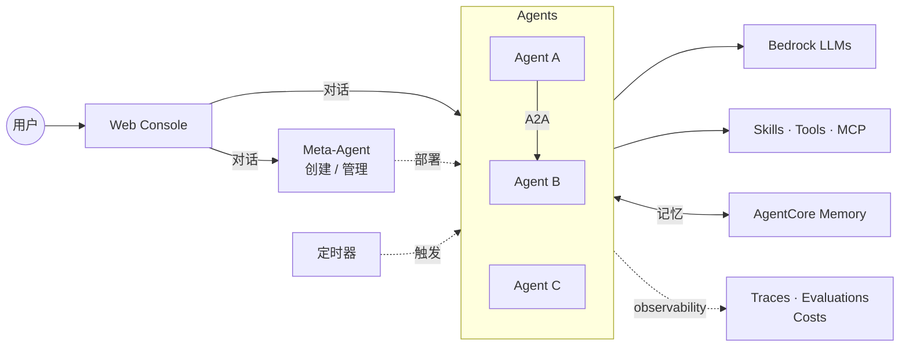
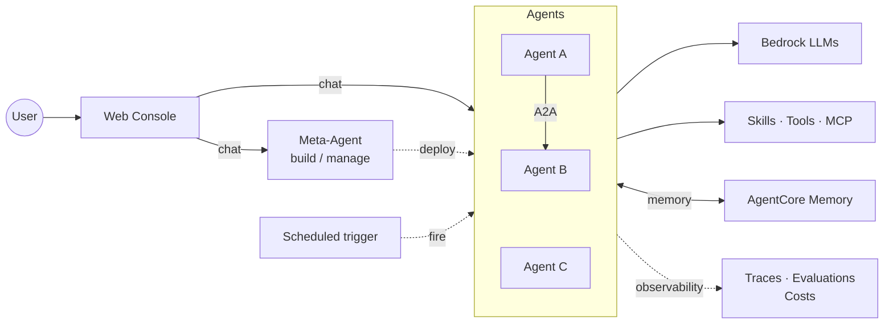

# Agent Studio

基于 AWS Bedrock AgentCore 的 Agent 编排平台。用自然语言向 Meta-Agent 描述需求，它为你创建、部署、维护可直接运行的 Agent。Meta-Agent 由 Kiro CLI 驱动，Agent 基于 Strands。

## 能做什么

- **对话创建 Agent** — 告诉 Meta-Agent 你的需求，它写 prompt、挑工具、生成代码、完成部署
- **可视化调试** — 对话流式返回，每次 tool 调用的输入输出都显示在消息流里
- **Agent 互调** — `link_agent` 把一个 Agent 挂为另一个的工具，通过 A2A 协议调用，密钥自动下发
- **Skill 热插拔** — AgentSkills.io 格式，运行时按需加载，跨 Agent 复用
- **多模态输入** — 图片 / PDF / Excel / CSV / TSV 自动解析，无需额外配置
- **定时触发** — 可视化 cron 构建器，每次执行留痕为卡片，可直接查看运行详情
- **MCP 工具集** — AWS 官方 MCP 目录全量接入，workspace 级自助启用；per-workspace runtime，资源策略硬隔离
- **Workspace IAM 隔离** — 三层权限模型（Permission Boundary 天花板 → per-workspace 角色 → target 级授权）；Admin Console 一键授权，敏感 target 二次确认；`SimulatePrincipalPolicy` 实时检查，进度条展示每个 target 的已授权/缺失 action
- **跨会话记忆** — 基于 AgentCore Memory，Agent 自动记住用户偏好与事实，跨 session、跨设备持续生效；用户可在记忆抽屉中查看和删除
- **平台级可观测性** — 调用追踪、延迟分位数、错误率、Token 成本按 Agent 和 workspace 自动聚合，一屏总览
- **Marketplace** — 跨 workspace 发布和克隆 Agent / Skill / Tool，元数据公开，源码克隆后才可见

## 架构



完整系统图（CloudFront / Lambda / EventBridge / Evaluator 等）与关键设计说明见 [docs/architecture.md](docs/architecture.md)。

## 安全与权限

Agent Studio 对每个 workspace 实施三层权限控制，在赋能 Agent 访问 AWS 资源的同时防止越权：

```
Permission Boundary（天花板）
  └─ Workspace Role（身份策略 + 按需生成的 WorkspaceGrants 内联策略）
       └─ Per-workspace MCP Runtime（资源策略绑定 workspace 角色）
```

- **Permission Boundary** — `AgentStudioWorkspaceCeiling` 管理策略封顶 workspace 角色的最大权限。写操作、IAM 变更、角色提权被显式 Deny，无论身份策略怎么配都不会超出天花板
- **Per-workspace 角色** — 按需创建 `AgentStudio-ws-{id}` IAM 角色并绑定 Permission Boundary。Agent 和 MCP runtime 都以该角色身份运行。未创建角色的 workspace 只能使用平台内置工具
- **Per-workspace MCP Runtime** — 每个 workspace 在 `/#/mcp` 页自助启用 MCP target，后端创建专属 AgentCore Runtime（`asmcp_{wsHash}_{target}`），用 `put-resource-policy` 把 `InvokeAgentRuntime` 绑定到该 workspace 角色，阻断跨 workspace 调用
- **Enable 时边界拦截** — 启用前自动校验目标声明的 action 是否在 ceiling 内，不在的直接拒绝（400 boundary_gap），避免"READY 但沉默失败"
- **敏感等级分级** — 每个 target 标注 sensitivity（low / medium / high）：low+medium 允许 editor 自助启用，high 需要 admin。启用弹窗展示 sensitivity 原因
- **Ceiling 哈希漂移守卫** — 部署时 `sync-mcp-iam-policies.py --export-ceiling` 把 boundary 的 Allow 集合 + SHA256 写入 Lambda bundle，运行时与实时 boundary policy Description 对比，不一致则拒绝所有 enable 请求
- **管理员 Fleet 视图** — 平台管理员在 `/#/admin/mcp-fleet` 查看所有 workspace × 启用目标矩阵，可按 target 批量升级（CVE 修补场景），全程写入审计表
- **自动 IAM 生成** — 启用时目标的 `iam_policy` 自动合并进 workspace role 的 `WorkspaceGrants` 内联策略，去重 + 9500 字节护栏；禁用时自动回收

## 快速开始

```bash
bash scripts/deploy-all.sh --region us-east-1
```

首次部署约 15–20 分钟，依次开通：CDK 基础设施（Cognito / Lambda / CloudFront / WAF / DDB / S3）→ Base zip → Meta-Agent → 前端。

常用子命令：

```bash
bash scripts/deploy-all.sh --only-agent       # 仅更新 Meta-Agent
bash scripts/deploy-all.sh --only-frontend    # 仅更新前端
bash scripts/deploy-all.sh --skip-frontend    # 基础设施 + Meta-Agent
bash scripts/deploy-all.sh --dry-run          # 预检 + cdk diff

bash scripts/build-mcp.sh                     # 构建 MCP Docker 镜像并推送到 ECR(全局共享)
# MCP runtime 创建已改为 per-workspace 自助流程 → 在 /#/mcp 页启用

cd frontend && npm run dev                    # 本地开发
```

脚本会自动复用 `.env` 中已记录的资源。

**初次使用 MCP:** 部署完成后进入 `/#/admin` 创建 workspace 角色(需要 admin 权限),然后进入 `/#/mcp` 启用所需的 MCP target。每次启用约 3–5 分钟。

## 项目结构

```
agent-studio/
├── frontend/              # React 19 + Vite 8 + Tailwind 4 + Zustand 5
├── meta-agent/            # Meta-Agent on AgentCore Runtime（Kiro CLI 驱动）
│   ├── kiro_adapter/      # Kiro 胶水层（ACP 驱动、stdio MCP、SSE mapper）
│   ├── tools/             # Meta 工具集（Agent 生命周期、skill、MCP、schedule、secret、link 等）
│   ├── tools_library/     # 预构建 Agent 工具模板（web_search、s3_read、chart 等）
│   └── templates/         # 代码生成 + prompt 模板
├── lambda/
│   ├── crud/              # Python CRUD Lambda（含 kiro_key.py 管理 key + usage）
│   ├── invoke-node/       # Node.js SSE streaming proxy
│   └── a2a-proxy/         # A2A JSON-RPC proxy
├── mcp-runtime/           # AWS MCP 目录接入（mcp-registry.yaml 控制启用项）+ Dockerfile
├── infra/                 # AWS CDK (TypeScript)
├── scripts/               # 部署 / 测试脚本
└── .env.example
```

## 测试

```bash
bash scripts/run-tests.sh
```

---

# Agent Studio (English)

An agent orchestration platform on AWS Bedrock AgentCore. Describe what you need in natural language and the Meta-Agent creates, deploys, and maintains the agent for you. The Meta-Agent is powered by the Kiro CLI; agents run on Strands.

## What It Does

- **Conversational agent creation** — Tell the Meta-Agent what you need; it writes the prompt, picks tools, generates the code, deploys.
- **Visualized debugging** — Streaming responses with every tool call's input and output surfaced in the chat stream.
- **Agent-to-agent** — `link_agent` mounts one agent as another's tool over A2A; credentials are provisioned automatically.
- **Hot-swappable skills** — AgentSkills.io format, lazy-loaded at runtime, reusable across agents.
- **Multimodal input** — Images / PDF / Excel / CSV / TSV parsed out of the box, no extra setup.
- **Scheduled triggers** — Visual cron builder; every run is archived as a card with a click-through to full run details.
- **MCP toolbelt** — The full AWS-official MCP catalog, self-serve per workspace; per-workspace runtimes with resource-policy isolation.
- **Workspace IAM isolation** — Three-layer permission model (Permission Boundary ceiling → per-workspace role with auto-generated WorkspaceGrants → per-workspace MCP runtime pinned via resource policy); sensitivity-gated enable (editor for low/medium, admin for high); enable-time boundary-intersection check refuses targets whose actions would be capped by the ceiling; platform-admin Fleet view for CVE broadcast-upgrades.
- **Cross-session memory** — Powered by AgentCore Memory: agents remember user preferences and facts across sessions and devices. Users can view and manage memories from the chat drawer.
- **Platform-level observability** — Trace timeline, latency percentiles, error rates, and token costs aggregated per agent and per workspace on a single screen.
- **Marketplace** — Publish and clone agents / skills / tools across workspaces; metadata is public, source stays private until cloned.

## Architecture



Full system diagram (CloudFront / Lambda / EventBridge / Evaluator, …) and key design notes live in [docs/architecture.md](docs/architecture.md).

## Security & Permissions

Agent Studio enforces a three-layer permission model on every workspace, enabling AWS resource access while preventing privilege escalation:

```
Permission Boundary (ceiling)
  └─ Workspace Role (identity policy + auto-generated WorkspaceGrants inline policy)
       └─ Per-workspace MCP Runtime (resource policy pinned to workspace role)
```

- **Permission Boundary** — The `AgentStudioWorkspaceCeiling` managed policy caps the maximum privileges of any workspace role. Write operations, IAM mutations, and privilege escalation are explicitly denied
- **Per-workspace role** — `AgentStudio-ws-{id}` IAM roles are created on demand and bound to the Permission Boundary. Both Agents and MCP runtimes in the workspace execute under this role. Workspaces without a role can only use platform built-in tools
- **Per-workspace MCP runtime** — Each workspace self-serves MCP target provisioning at `/#/mcp`; the backend creates a dedicated AgentCore Runtime (`asmcp_{wsHash}_{target}`) and uses `put-resource-policy` to restrict `InvokeAgentRuntime` to the owning workspace role, blocking cross-workspace invocation
- **Enable-time boundary check** — Before creating a runtime, the backend asserts every action the target declares is within the current ceiling; missing actions fail fast with `400 boundary_gap` so operators never get a "READY but silently useless" runtime
- **Sensitivity-gated enable** — Each target is labeled low / medium / high sensitivity. Editors can enable low + medium; high requires admin. The confirm modal surfaces sensitivity reasons
- **Ceiling hash drift guard** — At deploy, `sync-mcp-iam-policies.py --export-ceiling` bakes the boundary's Allow-set + SHA256 into the Lambda bundle; at runtime, a mismatch against the live boundary's policy description halts all enable requests
- **Platform-admin Fleet view** — Ops can view the workspace × target matrix at `/#/admin/mcp-fleet` and broadcast-upgrade any target across all enabled workspaces (batched 10 at a time, audit-logged — intended for CVE rollout)
- **Auto IAM generation** — Enabling a target merges its `iam_policy` into the workspace role's `WorkspaceGrants` inline policy with dedup + 9500-byte size guard; disabling revokes the statements

## Quick Start

```bash
bash scripts/deploy-all.sh --region us-east-1
```

First run takes 15–20 minutes and provisions, in order: CDK infra (Cognito / Lambda / CloudFront / WAF / DDB / S3) → base zip → Meta-Agent → frontend.

Common subcommands:

```bash
bash scripts/deploy-all.sh --only-agent       # Meta-Agent code only
bash scripts/deploy-all.sh --only-frontend    # Frontend only
bash scripts/deploy-all.sh --skip-frontend    # Infra + Meta-Agent
bash scripts/deploy-all.sh --dry-run          # Preflight + cdk diff

bash scripts/build-mcp.sh                     # Build & push MCP Docker images to ECR (shared)
# MCP runtime provisioning is now per-workspace self-serve → enable from /#/mcp

cd frontend && npm run dev                    # Local dev
```

Resources already recorded in `.env` are reused automatically.

**First-time MCP usage:** after deploy completes, open `/#/admin` to create your workspace role (admin role required), then enable the MCP targets you need at `/#/mcp`. Each enable takes ~3–5 minutes.

## Project Structure

```
agent-studio/
├── frontend/              # React 19 + Vite 8 + Tailwind 4 + Zustand 5
├── meta-agent/            # Meta-Agent on AgentCore Runtime (Kiro-driven)
│   ├── kiro_adapter/      # Kiro glue (ACP driver, stdio MCP, SSE mapper)
│   ├── tools/             # Meta tools (agent lifecycle, skills, MCP, schedule, secrets, link, ...)
│   ├── tools_library/     # Pre-built agent tool templates (web_search, s3_read, chart, ...)
│   └── templates/         # Codegen + prompt templates
├── lambda/
│   ├── crud/              # Python CRUD Lambda (includes kiro_key.py — key + usage)
│   ├── invoke-node/       # Node.js SSE streaming proxy
│   └── a2a-proxy/         # A2A JSON-RPC proxy
├── mcp-runtime/           # AWS MCP catalog integration (mcp-registry.yaml gates what's enabled) + Dockerfile
├── infra/                 # AWS CDK (TypeScript)
├── scripts/               # Deploy + test scripts
└── .env.example
```

## Testing

```bash
bash scripts/run-tests.sh
```
