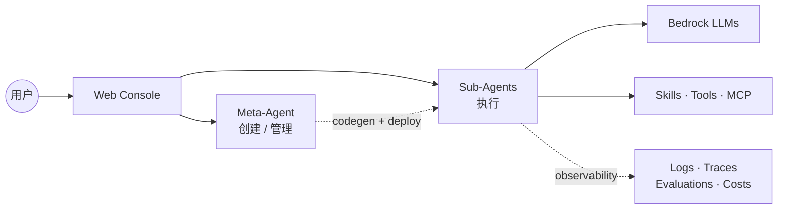
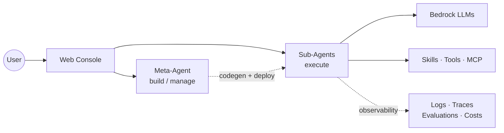

# Agent Studio

基于 AWS Bedrock AgentCore 的 Agent 编排平台。用自然语言创建、部署、运营 Sub-Agent。Meta-Agent 由 **Kiro CLI** 驱动（ACP 协议 + stdio MCP），Sub-Agent 基于 Strands。

## 能做什么

- **对话创建** — 告诉 Meta-Agent 你要什么，它写 prompt、选工具、生成代码、部署上线
- **Kiro 驱动的 Meta-Agent** — 每个 workspace 自带一把 Kiro API Key（admin 配置），Meta-Agent 通过 Kiro CLI 调用 Claude/Sonnet 等模型；Workspace Settings 里可见实时 credits 用量（进度条 + 订阅等级 + 重置日期 + 超额信息），所有成员可见，admin 用以轮换密钥
- **表单 + AI 双模式编辑** — 不想写代码就改表单；要精细控制就让 AI 助手改 prompt 和 tool 源码。AI 助手（编辑/技能/工具三条）与聊天头部共享 Kiro 模型选择器，模型列表每次启动从 Kiro 后端动态拉取
- **流式测试** — tool-use 过程可视化，每一步都看得见
- **Skill 热插拔** — AgentSkills.io 格式，运行时按需加载，跨 Agent 共享
- **MCP 工具集** — 49 个 AWS 官方 MCP target（默认 36 个启用），14 个服务类别，直连 AgentCore Runtime
- **多模态输入** — 图片 + PDF / Excel / CSV / TSV，内置 `read_document` 自动解析
- **定时触发** — 可视化 Schedule builder（每 N 分钟 / 每小时 / 每天 / 每周 / 每月 / 自定义 cron），含人类可读描述与下 5 次触发预览；每次执行记录为卡片，点击弹出运行详情（输入、输出、tool 调用、附件）
- **Agent 互调** — `link_agent` 把另一个 Agent 挂为 tool，走 A2A 协议 + 自动配密钥
- **Marketplace** — Agent / Skill / Tool 发布 + 克隆（元数据跨 workspace 可见，源码隔离）
- **多 Workspace + RBAC** — switcher + 成员邀请 + 四级角色 + ownership 转让
- **Observability** — OTEL gen_ai spans 直通 CloudWatch `aws/spans`，驱动成本仪表板、token 用量统计和 CloudWatch 日志查看器
- **Cost Dashboard** — 按 agent / workspace 聚合 token 用量 + 估算费用

## 架构



详细系统图（CloudFront / Lambda / EventBridge / Evaluator 等）见 [docs/architecture.md](docs/architecture.md)。

## 快速开始

一键部署：

```bash
bash scripts/deploy-all.sh --region us-east-1
```

完成：CDK 基础设施（Cognito / Lambda / CloudFront / WAF / DDB / S3）→ Base zip → Meta-Agent → 前端。首次 15-20 分钟。

### 常用子命令

```bash
bash scripts/deploy-all.sh --only-agent       # 只更新 Meta-Agent
bash scripts/deploy-all.sh --only-frontend    # 只更新前端
bash scripts/deploy-all.sh --skip-frontend    # 基础设施 + Meta-Agent
bash scripts/deploy-all.sh --dry-run          # 预检 + cdk diff

bash scripts/build-mcp.sh                     # 构建 MCP Docker 镜像
bash scripts/deploy-mcp.sh                    # 部署 MCP targets
bash scripts/deploy-mcp.sh --only cloudwatch  # 只部署单个

cd frontend && npm run dev                    # 本地开发
```

脚本会检测 `.env` 里已有资源复用。

## 关键设计

### Meta-Agent 后端：Kiro CLI
Meta-Agent 不再是纯 Strands loop。每次 invoke：

1. Invoke Lambda 从 Secrets Manager 读取该 workspace 的 Kiro API Key（`agent-studio/workspaces/{wsId}/kiro-api-key`），注入 Meta-Agent payload（plaintext 只走 SigV4+TLS，永不落 Runtime env）
2. AgentCore 容器里 `kiro-cli-chat acp --agent meta-agent` 进程通过 ACP 协议驱动推理
3. Meta-Agent 的 33 个 `@tool` 函数（agent CRUD、skill、MCP、schedule、secret、preview、link 等）通过 **stdio MCP subprocess** 暴露给 Kiro，保持进程内直接调用，不经网络
4. Kiro 流式 `session/update` 事件 → `kiro_adapter/sse_mapper.py` 转回前端既有的 SSE 帧格式（文本 + `__tool` 标记）
5. 额外 action：
   - `list_models`：每次启动从 Kiro 后端拉模型列表（前端 picker 不再硬编码）
   - `get_usage`：在容器内跑 `kiro-cli-chat chat "/usage"` 解析 TUI 输出，返回 `{currentUsage, usageLimit, resetsOn, tier, overagesEnabled, overageRate}`

Credit 数据路径：前端 → `GET /api/workspaces/{wsId}/kiro-key/usage`（viewer+） → crud Lambda → `InvokeAgentRuntime` → Kiro CLI `/usage` → 反向 SSE 帧双解码 → 60s in-memory cache，PUT/DELETE key 时自动 bust。

### Observability
Sub-Agent 启动时经 ADOT auto-instrumentation 钩住 Strands / botocore，emit OTEL spans 到 CloudWatch `aws/spans`（含 `gen_ai.request.model` / `gen_ai.usage.input_tokens` / `gen_ai.usage.output_tokens`）。前端 Cost Dashboard、Schedule Executions、Agent Logs 查看器都从此取数。

### A2A 互操作
每个 Sub-Agent 和 Meta-Agent 暴露三个端点：
- `GET /a2a/agents/{id}/.well-known/agent-card.json` — RFC 8615 发现
- `GET /a2a/agents/{id}/authenticatedExtendedCard` — Bearer 鉴权扩展卡
- `POST /a2a/agents/{id}` — JSON-RPC 2.0 (`message/send`, `message/stream`)

API 密钥 SHA-256 hash 存 `agent-studio-a2a-keys` DDB 表，每用户每 Agent 一把，UI 可生成/吊销。外部客户端（Google ADK / CrewAI / LangGraph）可直接对接。

### Workspace / RBAC
四级角色：**viewer**（只读）/ **editor**（改配置 + 部署）/ **admin**（管成员）/ **owner**（唯一，可转让）。切 workspace 自动清 chat 历史避免跨域幻影。

### Agent Detail Page
`/agents/{id}` 左侧 sticky 导航 + 右侧滚动内容，scroll-spy 高亮，IntersectionObserver lazy-mount。Sections：Schedules / Costs / Integration + Advanced 组（Deployments / Endpoints / Secrets / Logs）。Schedules 行展开后显示最近 20 条执行（卡片形式，带状态 / 耗时 / tokens / 触发源），点击任一卡片弹出运行详情 modal（metrics / input / output / tool calls / attachments），底部"加载更多"按 `nextToken` 翻页。viewer 只读，editor+ 可 Edit。

### Sandbox + Browser
每个 Sub-Agent 默认内置两个沙箱工具：`run_command`（Code Interpreter，支持 python / js / ts / shell，session 复用 1h）和 `browser_use`（navigate / click / fill / eval / screenshot，CDP over WebSocket，session 复用 1h）。`fetch_webpage` 作为轻量 HTML scraper 保留在 tools_library 里按需引入。账户级共享资源经 `scripts/provision-agentcore-shared.sh` provision，ID 通过 env vars 传到 Sub-Agent。

## 项目结构

```
agent-studio/
├── frontend/              # React 19 + Vite 8 + Tailwind 4 + Zustand 5
├── meta-agent/            # Kiro-backed Meta-Agent on AgentCore Runtime
│   ├── main.py            # Entrypoint（ACP 驱动，keepalive + auto-continue 监督）
│   ├── kiro_adapter/      # Kiro CLI ↔ Agent Studio 胶水层
│   │   ├── acp_client.py      #   ACP subprocess 驱动
│   │   ├── sse_mapper.py      #   ACP session/update → 前端 SSE 帧
│   │   ├── kiro_home.py       #   per-invocation KIRO_HOME materialization
│   │   └── mcp_stdio_server.py#   33 tools 通过 stdio MCP 暴露给 Kiro
│   ├── tools/             # 33 个 meta 工具（agent 生命周期、skill、MCP、schedule、secret、link 等）
│   ├── tools_library/     # 7 个预构建 sub-agent 工具模板
│   └── templates/         # 代码生成 + prompt 模板
├── lambda/
│   ├── crud/              # Python CRUD Lambda（含 kiro_key.py 管理 key + usage）
│   ├── invoke-node/       # Node.js SSE streaming proxy（Meta-Agent + Sub-Agent）
│   └── a2a-proxy/         # A2A JSON-RPC proxy
├── mcp-runtime/           # 49 个 AWS MCP target（36 默认启用）+ mcp-registry.yaml + Dockerfile
├── infra/                 # AWS CDK (TypeScript)
├── scripts/               # 部署 / 测试脚本
└── .env.example
```

## 测试

```bash
bash scripts/run-tests.sh
```

---

# Agent Studio (English)

An agent orchestration platform on AWS Bedrock AgentCore. Create, deploy, and run sub-agents via natural language. The Meta-Agent is powered by the **Kiro CLI** (ACP protocol + stdio MCP); sub-agents run on Strands.

## What It Does

- **Conversational creation** — Tell the Meta-Agent what you want; it writes the prompt, picks tools, generates code, deploys.
- **Kiro-backed Meta-Agent** — Each workspace owns a Kiro API key (admins configure it once); the Meta-Agent calls Claude/Sonnet etc. through Kiro. Workspace Settings surfaces live credit usage (progress bar, subscription tier, reset date, overage line) to all members so anyone can alert the admin when credits run low.
- **Form + AI dual editing** — Forms for quick tweaks; AI assistants for prompt + tool source edits. The edit, skill, and tool assistants share one Kiro model picker with the chat header; the model list is fetched from Kiro at cold start, not hard-coded.
- **Streaming chat testing** — Real-time tool-use visualization.
- **Hot-swappable Skills** — AgentSkills.io format, lazy-loaded at runtime, shared across agents.
- **MCP toolbelt** — 49 AWS-official MCP targets (36 enabled by default) across 14 service categories, direct-connect.
- **Multimodal input** — Images + PDF / Excel / CSV / TSV via built-in `read_document`.
- **Scheduled triggers** — Visual schedule builder (every-N-minutes / hourly / daily / weekly / monthly / custom cron) with plain-English descriptions and the next 5 fire times previewed. Each execution is a card; click to pop a run-detail modal with inputs, outputs, tool calls, and attachments.
- **Agent-as-tool** — `link_agent` mounts one agent as another's tool over A2A, keys auto-provisioned.
- **Marketplace** — Publish and clone agents / skills / tools; metadata visible across workspaces, source stays private until cloned.
- **Multi-workspace + RBAC** — Switcher, invitations, viewer/editor/admin/owner, ownership transfer.
- **Observability** — OTEL gen_ai spans flow into CloudWatch `aws/spans`, powering the cost dashboard, token-usage summaries, and the inline CloudWatch log viewer.
- **Cost dashboard** — Token usage and estimated spend aggregated per agent / workspace.

## Architecture



Full system diagram (CloudFront / Lambda / EventBridge / Evaluator, …) lives in [docs/architecture.md](docs/architecture.md).

## Quick Start

```bash
bash scripts/deploy-all.sh --region us-east-1
```

Provisions everything: CDK infra (Cognito / Lambda / CloudFront / WAF / DDB / S3) → Base zip → Meta-Agent → frontend. First run takes 15–20 min.

### Subcommands

```bash
bash scripts/deploy-all.sh --only-agent       # Meta-Agent code only
bash scripts/deploy-all.sh --only-frontend    # Frontend only
bash scripts/deploy-all.sh --skip-frontend    # Infra + Meta-Agent
bash scripts/deploy-all.sh --dry-run          # Preflight + cdk diff

bash scripts/build-mcp.sh                     # Build MCP Docker images
bash scripts/deploy-mcp.sh                    # Deploy MCP targets
bash scripts/deploy-mcp.sh --only cloudwatch  # Single target

cd frontend && npm run dev                    # Local dev
```

Existing resources listed in `.env` are reused.

## Key Design

### Meta-Agent backend: Kiro CLI
The Meta-Agent is no longer a plain Strands loop. Per invocation:

1. The Invoke Lambda reads the workspace's Kiro API key from Secrets Manager (`agent-studio/workspaces/{wsId}/kiro-api-key`) and injects it into the Meta-Agent payload (plaintext only rides SigV4+TLS, never lands in Runtime env).
2. Inside the AgentCore container, `kiro-cli-chat acp --agent meta-agent` drives reasoning over ACP.
3. The Meta-Agent's 33 `@tool` functions (agent CRUD, skill management, MCP, scheduling, secrets, preview, link, …) are exposed to Kiro via a **stdio MCP subprocess** — in-process calls, no network hop.
4. Kiro's streamed `session/update` events are translated by `kiro_adapter/sse_mapper.py` back into the SSE frame format the frontend already consumes (plain text + `__tool` markers).
5. Extra short-circuit actions in the entrypoint:
   - `list_models`: fetched from Kiro at cold start so the picker isn't hard-coded.
   - `get_usage`: runs `kiro-cli-chat chat "/usage"` inside the container, parses the TUI, returns `{currentUsage, usageLimit, resetsOn, tier, overagesEnabled, overageRate}`.

Credit data path: frontend → `GET /api/workspaces/{wsId}/kiro-key/usage` (viewer+) → crud Lambda → `InvokeAgentRuntime` → Kiro CLI `/usage` → SSE `data:` frames double-decoded → 60 s in-memory cache, busted on key PUT/DELETE.

### Observability
Sub-agent boot wires ADOT auto-instrumentation around Strands + botocore. OTEL spans flow to CloudWatch `aws/spans` with `gen_ai.request.model`, `gen_ai.usage.input_tokens`, `gen_ai.usage.output_tokens`. The Cost Dashboard, Schedule Executions view, and the inline agent log viewer all read from here.

### A2A interop
Every Sub-Agent and the Meta-Agent expose three endpoints:
- `GET /a2a/agents/{id}/.well-known/agent-card.json` — RFC 8615 discovery
- `GET /a2a/agents/{id}/authenticatedExtendedCard` — bearer-auth extended card
- `POST /a2a/agents/{id}` — JSON-RPC 2.0 (`message/send`, `message/stream`)

API keys are SHA-256-hashed in the `agent-studio-a2a-keys` DDB table, scoped per user per agent, issuable/revocable from the UI. External clients (Google ADK, CrewAI, LangGraph) can connect directly.

### Workspace / RBAC
Four roles: **viewer** (read-only), **editor** (config + deploy), **admin** (manage members), **owner** (single, transferable). Workspace switching clears chat history to avoid cross-workspace phantoms.

### Agent Detail Page
`/agents/{id}` is a sticky side-nav + scrolling content layout with scroll-spy highlighting and IntersectionObserver lazy-mount. Sections: Schedules / Costs / Integration + an Advanced group (Deployments / Endpoints / Secrets / Logs). Expanding a schedule row lists its most recent 20 runs as cards (status / duration / tokens / trigger source); clicking one pops a run-detail modal with metrics, input, output, tool calls, and attachments, with a Load-more button that pages via `nextToken`. Viewers read-only; editor+ gets Edit.

### Sandbox + Browser
Every sub-agent ships with two built-in sandbox tools: `run_command` (Code Interpreter — python / js / ts / shell, 1h warm session) and `browser_use` (navigate / click / fill / eval / screenshot over CDP WebSocket, 1h warm session). `fetch_webpage` remains available in tools_library as a lightweight HTML scraper. Account-shared sandbox resources are provisioned once via `scripts/provision-agentcore-shared.sh`; their IDs reach sub-agents via env vars.

## Project Structure

```
agent-studio/
├── frontend/              # React 19 + Vite 8 + Tailwind 4 + Zustand 5
├── meta-agent/            # Kiro-backed Meta-Agent on AgentCore Runtime
│   ├── main.py            # Entrypoint (ACP-driven, with keepalive + auto-continue supervisor)
│   ├── kiro_adapter/      # Kiro CLI ↔ Agent Studio glue
│   │   ├── acp_client.py       #  ACP subprocess driver
│   │   ├── sse_mapper.py       #  ACP session/update → frontend SSE frames
│   │   ├── kiro_home.py        #  per-invocation KIRO_HOME materialization
│   │   └── mcp_stdio_server.py #  33 tools exposed to Kiro over stdio MCP
│   ├── tools/             # 33 meta tools (agent lifecycle, skills, MCP, schedule, secrets, link, ...)
│   ├── tools_library/     # 7 pre-built sub-agent tool templates
│   └── templates/         # Codegen + prompt templates
├── lambda/
│   ├── crud/              # Python CRUD Lambda (includes kiro_key.py — key + usage)
│   ├── invoke-node/       # Node.js SSE streaming proxy (Meta-Agent + sub-agent)
│   └── a2a-proxy/         # A2A JSON-RPC proxy
├── mcp-runtime/           # 49 AWS MCP targets (36 enabled by default) + mcp-registry.yaml + Dockerfile
├── infra/                 # AWS CDK (TypeScript)
├── scripts/               # Deploy + test scripts
└── .env.example
```

## Testing

```bash
bash scripts/run-tests.sh
```
