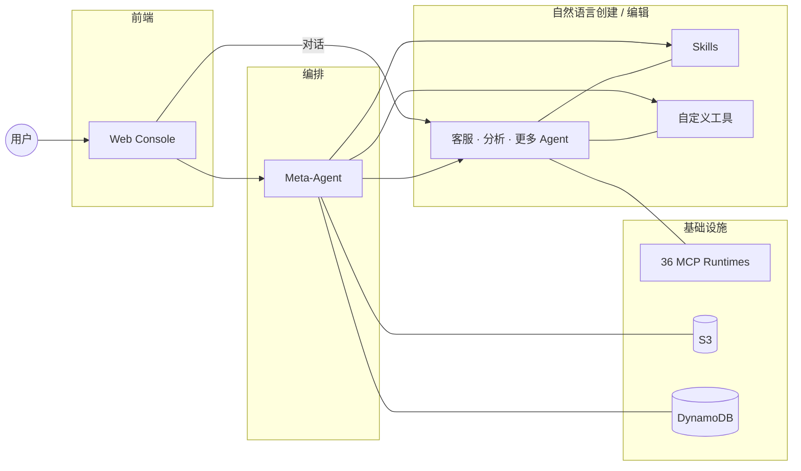
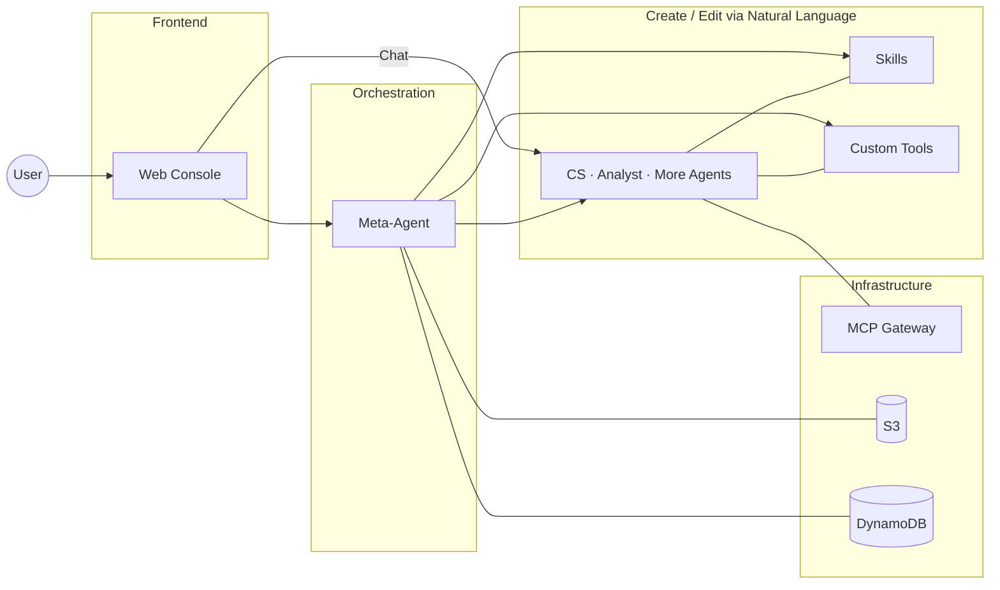

# Agent Studio

用自然语言创建 AI Agent，一句话部署到生产环境。

基于 AWS Bedrock AgentCore，零代码到全代码，从想法到上线只需几分钟。

## 你能用它做什么

- **对话式创建 Agent** — 告诉 Meta-Agent 你想要什么，它帮你写 prompt、选工具、生成代码、部署上线
- **表单 + AI 双模式编辑** — 不想写代码？用表单改配置。想精细控制？AI 助手帮你改 prompt 和 tool 代码
- **实时对话测试** — 流式响应 + tool-use 过程可视化，看到 Agent 每一步在做什么
- **Skill 热插拔** — AgentSkills.io 格式，多文件编辑器，运行时按需加载，Agent 之间共享
- **预构建工具库** — Web 搜索、S3 读写、图表生成、网页抓取等开箱即用
- **MCP 工具市场** — 36 个预部署 MCP 工具服务器，覆盖 14 个 AWS 服务类别，Agent 直连 Runtime，支持分类浏览和搜索
- **多模型切换** — Claude 4.6 / 4.5 / 4 / 3.x，运行时随时切换，不需要重新部署
- **多模态输入** — 图片 + PDF / Excel / CSV 上传，Agent 用 `read_document` 直接读文档内容
- **定时触发** — Agent detail → Schedules 标签，EventBridge Scheduler cron 表达式触发 Agent
- **Agent 互调** — 一个 Agent 把另一个 Agent 挂为 tool，走标准 A2A 协议 + 自动配密钥
- **Marketplace** — workspace 内 publish Agent / Skill / Tool，同部署下登录用户可跨 workspace clone
- **多 Workspace + 角色** — workspace 切换器、邀请成员、角色管理（viewer / editor / admin / owner）

## 架构



- **Frontend** — React 19 + Vite + Tailwind + Zustand，Cognito 认证
- **Meta-Agent** — 跑在 AgentCore Runtime 上的编排 Agent，28 个工具管理 Sub-Agent 全生命周期
- **Sub-Agent** — 每个 Agent 独立部署，独立运行，互不影响，可互相调用

## 快速开始

一条命令部署整个平台：

```bash
bash scripts/deploy-all.sh --region us-east-1
```

脚本自动完成：创建 DynamoDB 表 → 打包 Meta-Agent → CDK 部署基础设施（Cognito、Lambda、CloudFront、WAF）→ 构建前端 → 上线。

首次部署约 15-20 分钟。完成后访问输出的 CloudFront URL 即可使用。

### 部分更新

```bash
bash scripts/deploy-all.sh --only-agent       # 只更新 Meta-Agent 代码（~3 分钟）
bash scripts/deploy-all.sh --only-frontend    # 只更新前端
bash scripts/deploy-all.sh --skip-frontend    # 只更新基础设施 + Meta-Agent
bash scripts/deploy-all.sh --dry-run          # 预检查 + cdk diff，不实际部署
```

### MCP 工具部署

```bash
bash scripts/build-mcp.sh    # 构建 36 个 MCP Runtime Docker 镜像
bash scripts/deploy-mcp.sh   # 部署到 AgentCore Runtime + 生成工具清单
bash scripts/deploy-mcp.sh --list            # 查看会部署哪些 target
bash scripts/deploy-mcp.sh --only cloudwatch # 只部署单个 target
```

### 本地开发

```bash
cd frontend && npm run dev    # 本地前端，自动 proxy 到已部署的后端
```

### 已有环境

如果已有 Cognito 或 Meta-Agent Runtime，脚本会自动检测 `.env` 中的已有资源并复用。

## 安全

- **认证**: Cognito User Pool + JWT token，Amplify `<Authenticator>` 组件
- **API 保护**: CloudFront OAC (SigV4) 保护 Lambda Function URL，Origin 验证 header 保护 API Gateway
- **WAF**: AWS Managed Rules + IP 限速，CloudFront 级别防护
- **数据隔离**: Workspace 级别隔离，Agent 归属校验，Secret 按 Agent 独立存储
- **最小权限**: S3 IAM policy 按路径前缀 scope down，Lambda 不添加 broad resource-based policy
- **Red lines（synth + pre-commit 双重守卫）**: 禁止 Lambda `AuthType=NONE` / `Principal:"*"` / broad resource-based policy，所有新 Lambda 通过 APIGW + Cognito authorizer 或 OAC 暴露

## Workspace + RBAC

顶部栏 workspace switcher 下拉切换。Settings → Workspace 管理成员：邀请（带分享链接）、角色变更、移除。四级角色：viewer（只读）、editor（改配置 + 部署）、admin（管成员）、owner（唯一，可转让）。切换 workspace 自动清空 chat 历史，避免跨 workspace 幻影。

## 定时触发

Agent detail → Schedules 标签。cron(0 9 * * ? *) 或 rate(1 hour) 表达式，目标是 Agent 的 AgentCore Runtime。专用 `AgentStudioSchedulerTargetRole` 执行 `InvokeAgentRuntime`（trust 带 `SourceAccount` + `SourceArn`，仅限本账号 `schedule/default/agent-studio-*`）。

## Agent-as-Tool

在 Agent 编辑页 Linked Agents 小节选择同 workspace 下另一个 Agent。Meta-Agent 执行 `link_agent` 时：
1. 为 caller 生成一把 A2A 密钥（SHA-256 存 DDB）
2. 把密钥写进源 Agent 的 Secrets Manager 条目
3. 把 `agent_caller` tool + `A2A_INVOKE_URL` env 注入源 Agent
4. 重新 deploy 源 Agent

之后源 Agent 运行时可以调 `call_agent(agent_id, prompt)`，走 CloudFront → A2A Proxy Lambda → 目标 Runtime，全程 Bearer 认证。

## Marketplace

Agent / Skill / Tool 详情页带 publish 开关（admin+）。发布后进入 `/marketplace`，同部署下所有登录用户可见（元数据，不含 prompt / 源码）。点击 Clone 拷贝到当前 workspace（editor+）作为 private 资源，Agent clone 不自动部署。

## 文档读取

Sub-Agent 内置 `read_document(file_key)` 工具，自动识别：PDF（pypdf）、xlsx/xlsm（openpyxl）、csv/tsv（pandas）。工作区隔离：key 必须以 `workspaces/{wsId}/storage/` 或 `uploads/attachments/{sessionId}/` 开头，拒绝跨 workspace 读取。10 MB / 50k 字符上限。

## 项目结构

```
agent-studio/
├── frontend/              # Web Console (React 19 + Vite + Tailwind 4)
├── meta-agent/            # 编排引擎 (Strands Agent on AgentCore Runtime)
│   ├── tools/             # 25 个 Agent 生命周期工具
│   ├── tools_library/     # 预构建工具库
│   └── templates/         # 代码生成 + 提示词模板
├── lambda/                # Lambda 函数 (CRUD + SSE streaming)
├── infra/                 # AWS CDK 基础设施
├── mcp-runtime/           # MCP 工具服务器 (Dockerfile + 注册表)
│   ├── mcp-registry.yaml  # 36 个 MCP target 定义
│   └── Dockerfile.template
├── scripts/               # 部署脚本 (deploy-all.sh, deploy-agentcore.sh, deploy-mcp.sh)
└── .env.example
```

## 测试

```bash
bash scripts/run-tests.sh
```

---

# Agent Studio (English)

Create AI agents with natural language. Deploy to production in one command.

Built on AWS Bedrock AgentCore. From zero-code to full-code, from idea to production in minutes.

## What You Can Do

- **Conversational agent creation** — Tell the Meta-Agent what you need. It writes the prompt, picks tools, generates code, and deploys.
- **Form + AI dual editing** — Use forms for quick config changes. Use the AI assistant for fine-grained prompt and tool code editing.
- **Real-time chat testing** — Streaming responses with tool-use visualization. See exactly what your agent does at each step.
- **Hot-swappable Skills** — AgentSkills.io format, multi-file editor, runtime on-demand loading, shared across agents.
- **Built-in tool library** — Web search, S3 read/write, chart generation, web scraping — ready to use out of the box.
- **MCP Tool Marketplace** — 36 pre-deployed MCP tool servers across 14 AWS service categories. Agents connect directly to Runtimes with category browsing and search.
- **Multi-model switching** — Claude 4.6 / 4.5 / 4 / 3.x, switch at runtime without redeployment.
- **Multimodal input** — Images + PDF / Excel / CSV uploads. Agents parse document contents via the `read_document` builtin.
- **Scheduled triggers** — Agent detail → Schedules tab. EventBridge Scheduler cron expressions invoke agents on a timer.
- **Agent-as-tool** — Link one sub-agent as a callable tool of another over the standard A2A protocol. API keys auto-provisioned.
- **Marketplace** — Publish agents / skills / tools from a workspace. Logged-in users across the deployment can browse and clone.
- **Multi-workspace + RBAC** — Workspace switcher, member invitations, role management (viewer / editor / admin / owner).

## Architecture



- **Frontend** — React 19 + Vite + Tailwind + Zustand, Cognito auth
- **Meta-Agent** — Orchestration agent on AgentCore Runtime, 28 tools for full sub-agent lifecycle management
- **Sub-Agent** — Each agent deployed independently, isolated runtime, composable via A2A

## Quick Start

Deploy the entire platform with one command:

```bash
bash scripts/deploy-all.sh --region us-east-1
```

The script handles everything: DynamoDB tables → Meta-Agent packaging → CDK infrastructure (Cognito, Lambda, CloudFront, WAF) → frontend build → go live.

First deploy takes ~15-20 minutes. Access the CloudFront URL printed at the end.

### Partial Updates

```bash
bash scripts/deploy-all.sh --only-agent       # Update Meta-Agent code only (~3 min)
bash scripts/deploy-all.sh --only-frontend    # Update frontend only
bash scripts/deploy-all.sh --skip-frontend    # Update infra + Meta-Agent only
bash scripts/deploy-all.sh --dry-run          # Preflight + cdk diff, no actual deploy
```

### Local Development

```bash
cd frontend && npm run dev    # Local frontend, auto-proxies to deployed backend
```

### Existing Resources

If you already have Cognito or a Meta-Agent Runtime, the script auto-detects existing resources from `.env` and reuses them.

## Security

- **Authentication**: Cognito User Pool + JWT tokens, Amplify `<Authenticator>` component
- **API protection**: CloudFront OAC (SigV4) for Lambda Function URL, origin verification header for API Gateway
- **WAF**: AWS Managed Rules + IP rate limiting, CloudFront-level protection
- **Data isolation**: Workspace-level isolation, agent ownership verification, per-agent secret storage
- **Least privilege**: S3 IAM policies scoped by path prefix, no broad Lambda resource-based policies
- **Red lines (synth + pre-commit guards)**: Lambda `AuthType=NONE`, `Principal:"*"`, and broad resource-based policies are forbidden. All new Lambdas sit behind API Gateway + Cognito authorizer or OAC.

## Workspace + RBAC

Workspace switcher in the top bar. Settings → Workspace for member management: invite (with shareable link), role changes, remove. Four roles — viewer (read-only), editor (config + deploy), admin (manage members), owner (single, transferable). Switching workspaces clears chat history to avoid cross-workspace phantom state.

## Scheduled triggers

Agent detail → Schedules tab. `cron(0 9 * * ? *)` or `rate(1 hour)` expressions target the agent's AgentCore Runtime via a dedicated `AgentStudioSchedulerTargetRole` (trust conditions on `SourceAccount` + `SourceArn`, scoped to `schedule/default/agent-studio-*` in this account).

## Agent-as-tool

In the Agent edit page's Linked Agents section, pick another agent in the same workspace. When the Meta-Agent runs `link_agent`:
1. Mint an A2A API key for the caller (SHA-256 hash in DDB)
2. Inject it into the source agent's Secrets Manager entry
3. Register the `agent_caller` tool + `A2A_INVOKE_URL` env on the source agent
4. Redeploy the source agent

At runtime, the source agent can call `call_agent(agent_id, prompt)`, which goes CloudFront → A2A Proxy Lambda → target runtime, Bearer-authenticated end to end.

## Marketplace

Agent / Skill / Tool detail pages have a publish toggle (admin+). Published resources appear at `/marketplace`, visible to all logged-in users of this deployment (metadata only — no prompts or source). Clone copies the resource into the caller's current workspace (editor+) as a private resource. Cloned agents are not auto-deployed.

## Document reading

Sub-agents have a built-in `read_document(file_key)` tool with auto-detection: PDF (pypdf), xlsx/xlsm (openpyxl), csv/tsv (pandas). Workspace-scoped: keys must start with `workspaces/{wsId}/storage/` or `uploads/attachments/{sessionId}/` — cross-workspace reads are rejected. 10 MB / 50k-char caps.

## Runtime observability

Each agent row shows a live AgentCore status badge (READY / CREATING /
UPDATING / FAILED) backed by a passthrough over `get_agent_runtime`.
Per-agent tabs surface version history (`list_agent_runtime_versions`)
and blue/green endpoints (`create/update/delete_agent_runtime_endpoint`).
No DDB mirror — AgentCore is the source of truth.

## Automatic evaluation

Every workspace provisions an `OnlineEvaluationConfig` on creation.
Three built-in evaluators (`Builtin.Correctness`, `Builtin.Helpfulness`,
`Builtin.GoalSuccessRate`) score every sub-agent session at the TRACE
level. The agent edit page's Evaluations tab renders the latest score
and 7-day mean per evaluator, backed by a CloudWatch Logs Insights
query against `/aws/bedrock-agentcore/evaluations/results/*`.

## In-app trace viewer

Agent edit → Traces tab shows recent sessions and a span tree rendered
from the account's OpenTelemetry data in the `aws/spans` log group —
no AWS Console access required. Session id and agent runtime id come
from OTEL span attributes (`attributes.session.id`,
`attributes.aws.agent.id`).

## A2A interoperability

**Standards-compliant A2A proxy** sits in front of the HTTP AgentCore
runtimes. Each sub-agent and the Meta-Agent expose three spec-aligned
endpoints:

- `GET /a2a/agents/{id}/.well-known/agent-card.json` — RFC 8615 canonical discovery (public)
- `GET /a2a/agents/{id}/authenticatedExtendedCard` — Bearer-auth'd extended card (A2A spec §3.1.11)
- `POST /a2a/agents/{id}` — JSON-RPC 2.0 (`message/send`, `message/stream`)

Meta-Agent uses `/a2a/meta-agent/*` with the same structure.

Authentication: `HTTPAuthSecurityScheme` with `scheme="bearer"` and
`bearerFormat="Agent Studio API Key"`. Keys are per-user-per-agent,
stored as SHA-256 hashes in `agent-studio-a2a-keys`. Users generate and
revoke keys from the Integration section on the agent detail page (or
the A2A modal on Meta-Agent chat). The Meta-Agent runtime itself stays
on `serverProtocol=HTTP`; the proxy lambda translates between the A2A
JSON-RPC envelope and the HTTP payload, reverse-translating `__tool`
markers into A2A `TaskStatusUpdateEvent`s.

External A2A clients (Google ADK, CrewAI, LangGraph, etc.) discover
agents by fetching the well-known card, obtain an API key from the
Agent Studio UI, and invoke via standard JSON-RPC.

## Agent detail page

Every agent has a read-only detail page at `/agents/:id` that stacks
Deployments, Endpoints, Evaluations, Traces, and Integration sections
linearly (same visual pattern as the existing tab components, no new
UI primitives). Viewers get the page; only editor+ sees the "Edit"
button that opens the write-mode edit form.

## Sub-agent sandbox

`run_command` and `fetch_webpage` run inside AgentCore Code Interpreter
and Browser respectively. There is no in-process subprocess call; the
account-shared sandbox resources are provisioned once via
`scripts/provision-agentcore-shared.sh` and their IDs travel to
sub-agents via env vars.

## Project Structure

```
agent-studio/
├── frontend/              # Web Console (React 19 + Vite + Tailwind 4)
├── meta-agent/            # Orchestration engine (Strands Agent on AgentCore Runtime)
│   ├── tools/             # 25 agent lifecycle tools
│   ├── tools_library/     # Built-in tool library
│   └── templates/         # Code generation + prompt templates
├── lambda/                # Lambda functions (CRUD + SSE streaming)
├── infra/                 # AWS CDK infrastructure
├── scripts/               # Deploy scripts (deploy-all.sh, deploy-agentcore.sh)
└── .env.example
```

## Testing

```bash
bash scripts/run-tests.sh
```
