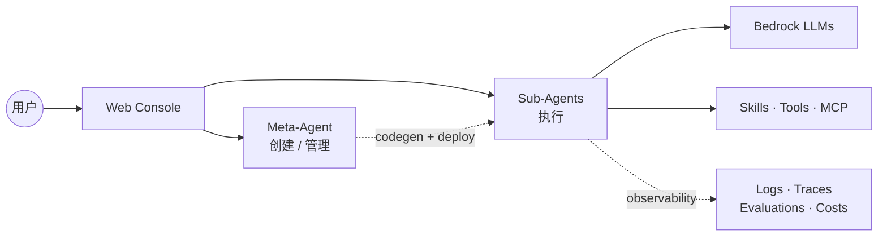
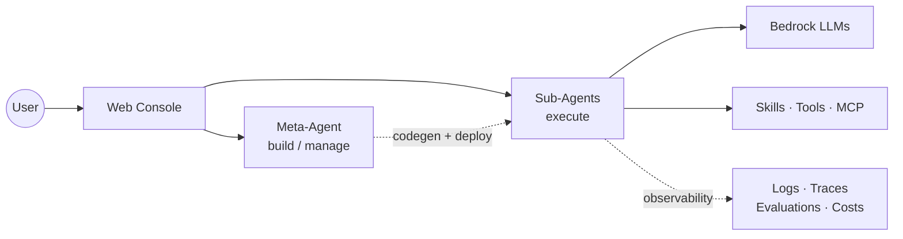

# Agent Studio

基于 AWS Bedrock AgentCore 的 Agent 编排平台。用自然语言描述需求，Meta-Agent 为你创建、部署和维护 Sub-Agent。Meta-Agent 由 Kiro CLI 驱动，Sub-Agent 基于 Strands。

## 能做什么

- **对话创建** — 告诉 Meta-Agent 你想要什么，它会写 prompt、挑工具、生成代码、完成部署
- **Kiro 驱动的 Meta-Agent** — 每个 workspace 绑定一把 Kiro API Key（管理员配置），所有成员都能在 Workspace Settings 看到实时用量（订阅等级 / 重置日期 / 超额费用）
- **表单 + AI 双模式编辑** — 表单用于快速调整，AI 助手（编辑 / 技能 / 工具）改 prompt 和源码；助手与聊天头部共用同一个 Kiro 模型选择器，模型列表从 Kiro 动态拉取
- **对话流式调试** — tool 调用过程实时可视化，每一步都看得到
- **Skill 热插拔** — AgentSkills.io 格式，运行时按需加载，可跨 Agent 复用
- **MCP 工具** — 49 个 AWS 官方 MCP target（默认启用 36 个），覆盖 14 类服务，直连 AgentCore Runtime
- **多模态输入** — 图片 + PDF / Excel / CSV / TSV，内置 `read_document` 自动解析
- **定时触发** — 可视化构建 cron 规则（每 N 分钟 / 每小时 / 每天 / 每周 / 每月 / 自定义），自动生成中文说明并预览接下来 5 次触发时间；每次执行留痕为卡片，点击展开运行详情（输入 / 输出 / tool 调用 / 附件）
- **Agent 互调** — `link_agent` 把一个 Agent 挂载为另一个的工具，通过 A2A 协议调用，密钥自动下发
- **Marketplace** — 跨 workspace 发布和克隆 Agent / Skill / Tool，元数据全局可见，源码在克隆前保持私有
- **多 Workspace + RBAC** — 工作区切换、成员邀请、四级角色、所有权转让
- **可观测性** — OTEL gen_ai spans 直接写入 CloudWatch `aws/spans`，为成本看板、token 统计、日志查看器提供数据源
- **成本看板** — 按 agent / workspace 聚合 token 用量并估算费用

## 架构



完整系统图（CloudFront / Lambda / EventBridge / Evaluator 等）见 [docs/architecture.md](docs/architecture.md)。

## 快速开始

一键部署：

```bash
bash scripts/deploy-all.sh --region us-east-1
```

依次完成：CDK 基础设施（Cognito / Lambda / CloudFront / WAF / DDB / S3）→ Base zip → Meta-Agent → 前端。首次部署约 15–20 分钟。

### 常用子命令

```bash
bash scripts/deploy-all.sh --only-agent       # 仅更新 Meta-Agent
bash scripts/deploy-all.sh --only-frontend    # 仅更新前端
bash scripts/deploy-all.sh --skip-frontend    # 基础设施 + Meta-Agent
bash scripts/deploy-all.sh --dry-run          # 预检 + cdk diff

bash scripts/build-mcp.sh                     # 构建 MCP Docker 镜像
bash scripts/deploy-mcp.sh                    # 部署 MCP targets
bash scripts/deploy-mcp.sh --only cloudwatch  # 仅部署单个 target

cd frontend && npm run dev                    # 本地开发
```

脚本会自动复用 `.env` 中已记录的资源。

## 关键设计

### Meta-Agent 后端
AgentCore 容器由 workspace 的 Kiro API Key 启动 `kiro-cli-chat acp` 进程；Meta-Agent 的 33 个 `@tool` 通过 stdio MCP 暴露给 Kiro，Kiro 的 `session/update` 事件再映射回前端现有的 SSE 帧。完整数据流见 [docs/architecture.md](docs/architecture.md)。

### 可观测性
Sub-Agent 启动时由 ADOT auto-instrumentation 自动插桩 Strands / botocore，OTEL spans 写入 CloudWatch `aws/spans`（包含 `gen_ai.request.model` / `gen_ai.usage.input_tokens` / `gen_ai.usage.output_tokens`）。前端的成本看板、定时任务执行记录、Agent 日志查看器均以此为数据源。

### A2A 互操作
每个 Sub-Agent 和 Meta-Agent 暴露三个端点：
- `GET /a2a/agents/{id}/.well-known/agent-card.json` — RFC 8615 发现
- `GET /a2a/agents/{id}/authenticatedExtendedCard` — Bearer 鉴权扩展卡
- `POST /a2a/agents/{id}` — JSON-RPC 2.0（`message/send` / `message/stream`）

API 密钥以 SHA-256 hash 存入 `agent-studio-a2a-keys` DDB 表，按用户和 Agent 维度隔离，可在 UI 上生成或吊销。外部客户端（Google ADK / CrewAI / LangGraph）可直接对接。

### Workspace / RBAC
四级角色：**viewer**（只读）/ **editor**（配置 + 部署）/ **admin**（成员管理）/ **owner**（唯一，可转让）。切换 workspace 时自动清空 chat 历史，避免跨 workspace 的数据串扰。

### Agent 详情页
`/agents/{id}` 采用左侧吸顶导航 + 右侧滚动内容的布局，配合 scroll-spy 高亮和 IntersectionObserver lazy-mount。顶部 section：Schedules / Costs / Integration，加上 Advanced 折叠组（Deployments / Endpoints / Secrets / Logs）。展开 Schedules 行会显示最近 20 条执行卡片（含状态 / 耗时 / tokens / 触发源），点击任一卡片弹出运行详情 modal（metrics / input / output / tool calls / attachments），底部"加载更多"按 `nextToken` 翻页。viewer 只读，editor+ 可编辑。

### Sandbox + Browser
每个 Sub-Agent 内置两个沙箱工具：`run_command`（Code Interpreter，支持 python / js / ts / shell，会话复用 1 小时）和 `browser_use`（navigate / click / fill / eval / screenshot，基于 CDP over WebSocket，会话复用 1 小时）。`fetch_webpage` 作为轻量 HTML 抓取器保留在 tools_library 中，按需引入。账户级共享资源由 `scripts/provision-agentcore-shared.sh` 一次性开通，资源 ID 通过环境变量传入 Sub-Agent。

## 项目结构

```
agent-studio/
├── frontend/              # React 19 + Vite 8 + Tailwind 4 + Zustand 5
├── meta-agent/            # Kiro-backed Meta-Agent on AgentCore Runtime
│   ├── kiro_adapter/      # Kiro 胶水层（ACP 驱动、stdio MCP、SSE mapper）
│   ├── tools/             # 33 个 meta 工具（agent 生命周期、skill、MCP、schedule、secret、link 等）
│   ├── tools_library/     # 7 个预构建 sub-agent 工具模板
│   └── templates/         # 代码生成 + prompt 模板
├── lambda/
│   ├── crud/              # Python CRUD Lambda（含 kiro_key.py 管理 key + usage）
│   ├── invoke-node/       # Node.js SSE streaming proxy（Meta-Agent + Sub-Agent）
│   └── a2a-proxy/         # A2A JSON-RPC proxy
├── mcp-runtime/           # 49 个 AWS MCP target（默认启用 36 个）+ mcp-registry.yaml + Dockerfile
├── infra/                 # AWS CDK (TypeScript)
├── scripts/               # 部署 / 测试脚本
└── .env.example
```

## 测试

```bash
bash scripts/run-tests.sh
```

---

# Agent Studio (English)

An agent orchestration platform on AWS Bedrock AgentCore. Describe what you need in natural language and the Meta-Agent creates, deploys, and maintains the sub-agent for you. The Meta-Agent is powered by the Kiro CLI; sub-agents run on Strands.

## What It Does

- **Conversational creation** — Tell the Meta-Agent what you want; it writes the prompt, picks tools, generates the code, deploys.
- **Kiro-backed Meta-Agent** — One Kiro API key per workspace (admin-configured); all members see live usage in Workspace Settings (tier, reset date, overage charges).
- **Form + AI dual editing** — Forms for quick tweaks; AI assistants (edit / skill / tool) for prompt and source code. The assistants share one Kiro model picker with the chat header, populated dynamically from Kiro.
- **Streaming chat testing** — Tool-use visualized in real time, step by step.
- **Hot-swappable Skills** — AgentSkills.io format, lazy-loaded at runtime, reusable across agents.
- **MCP tools** — 49 official AWS MCP targets (36 enabled by default) across 14 service categories, direct to AgentCore Runtime.
- **Multimodal input** — Images plus PDF / Excel / CSV / TSV via the built-in `read_document`.
- **Scheduled triggers** — Visual cron builder (every-N-minutes / hourly / daily / weekly / monthly / custom) with plain-English descriptions and the next 5 fire times previewed. Each run shows as a card; click it for the run-detail modal (inputs, outputs, tool calls, attachments).
- **Agent-as-tool** — `link_agent` mounts one agent as another's tool over A2A, with keys provisioned automatically.
- **Marketplace** — Publish and clone agents / skills / tools across workspaces; metadata is public, source stays private until cloned.
- **Multi-workspace + RBAC** — Switcher, member invitations, four roles, ownership transfer.
- **Observability** — OTEL gen_ai spans flow straight into CloudWatch `aws/spans`, feeding the cost dashboard, token-usage summaries, and the inline log viewer.
- **Cost dashboard** — Token usage and estimated spend aggregated per agent / workspace.

## Architecture



Full system diagram (CloudFront / Lambda / EventBridge / Evaluator, …) lives in [docs/architecture.md](docs/architecture.md).

## Quick Start

```bash
bash scripts/deploy-all.sh --region us-east-1
```

Provisions everything end-to-end: CDK infra (Cognito / Lambda / CloudFront / WAF / DDB / S3) → base zip → Meta-Agent → frontend. First run takes 15–20 minutes.

### Subcommands

```bash
bash scripts/deploy-all.sh --only-agent       # Meta-Agent code only
bash scripts/deploy-all.sh --only-frontend    # Frontend only
bash scripts/deploy-all.sh --skip-frontend    # Infra + Meta-Agent
bash scripts/deploy-all.sh --dry-run          # Preflight + cdk diff

bash scripts/build-mcp.sh                     # Build MCP Docker images
bash scripts/deploy-mcp.sh                    # Deploy MCP targets
bash scripts/deploy-mcp.sh --only cloudwatch  # One target only

cd frontend && npm run dev                    # Local dev
```

Existing resources recorded in `.env` are reused automatically.

## Key Design

### Meta-Agent backend
The AgentCore container launches `kiro-cli-chat acp` using the workspace's Kiro API key; the Meta-Agent's 33 `@tool` functions reach Kiro over stdio MCP, and Kiro's `session/update` events are mapped back to the SSE frames the frontend already renders. Full data-flow in [docs/architecture.md](docs/architecture.md).

### Observability
Sub-agent boot wires ADOT auto-instrumentation around Strands and botocore. OTEL spans land in CloudWatch `aws/spans` carrying `gen_ai.request.model`, `gen_ai.usage.input_tokens`, and `gen_ai.usage.output_tokens`. The cost dashboard, schedule-executions view, and inline agent log viewer all read from here.

### A2A interop
Every Sub-Agent and the Meta-Agent expose three endpoints:
- `GET /a2a/agents/{id}/.well-known/agent-card.json` — RFC 8615 discovery
- `GET /a2a/agents/{id}/authenticatedExtendedCard` — bearer-auth extended card
- `POST /a2a/agents/{id}` — JSON-RPC 2.0 (`message/send`, `message/stream`)

API keys live as SHA-256 hashes in the `agent-studio-a2a-keys` DDB table, scoped per user and per agent, issuable and revocable from the UI. External clients (Google ADK, CrewAI, LangGraph) can connect directly.

### Workspace / RBAC
Four roles: **viewer** (read-only), **editor** (config + deploy), **admin** (manage members), **owner** (single, transferable). Switching workspaces clears chat history so data doesn't bleed between them.

### Agent detail page
`/agents/{id}` is a sticky left-nav plus scrolling content, with scroll-spy highlighting and IntersectionObserver lazy-mount. Top sections: Schedules / Costs / Integration, plus an Advanced group (Deployments / Endpoints / Secrets / Logs). Expanding a Schedule row lists its 20 most recent runs as cards (status / duration / tokens / trigger source); clicking a card opens a run-detail modal (metrics, input, output, tool calls, attachments), with a "Load more" button that pages via `nextToken`. Viewers are read-only; editor+ can edit.

### Sandbox + browser
Every sub-agent ships with two built-in sandbox tools: `run_command` (Code Interpreter — python / js / ts / shell, 1 h warm session) and `browser_use` (navigate / click / fill / eval / screenshot via CDP over WebSocket, 1 h warm session). `fetch_webpage` stays in `tools_library` as a lightweight HTML scraper for pull-in-as-needed cases. Account-level shared resources are provisioned once with `scripts/provision-agentcore-shared.sh`; their IDs reach sub-agents via env vars.

## Project Structure

```
agent-studio/
├── frontend/              # React 19 + Vite 8 + Tailwind 4 + Zustand 5
├── meta-agent/            # Kiro-backed Meta-Agent on AgentCore Runtime
│   ├── kiro_adapter/      # Kiro CLI glue (ACP driver, stdio MCP, SSE mapper)
│   ├── tools/             # 33 meta tools (agent lifecycle, skills, MCP, schedule, secrets, link, ...)
│   ├── tools_library/     # 7 pre-built sub-agent tool templates
│   └── templates/         # Codegen + prompt templates
├── lambda/
│   ├── crud/              # Python CRUD Lambda (includes kiro_key.py — key + usage)
│   ├── invoke-node/       # Node.js SSE streaming proxy (Meta-Agent + sub-agent)
│   └── a2a-proxy/         # A2A JSON-RPC proxy
├── mcp-runtime/           # 49 AWS MCP targets (36 enabled by default) + mcp-registry.yaml + Dockerfile
├── infra/                 # AWS CDK (TypeScript)
├── scripts/               # Deploy + test scripts
└── .env.example
```

## Testing

```bash
bash scripts/run-tests.sh
```
