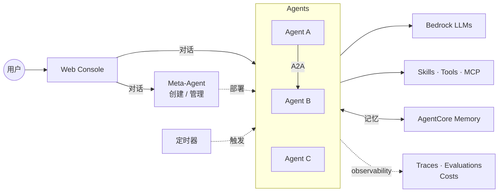
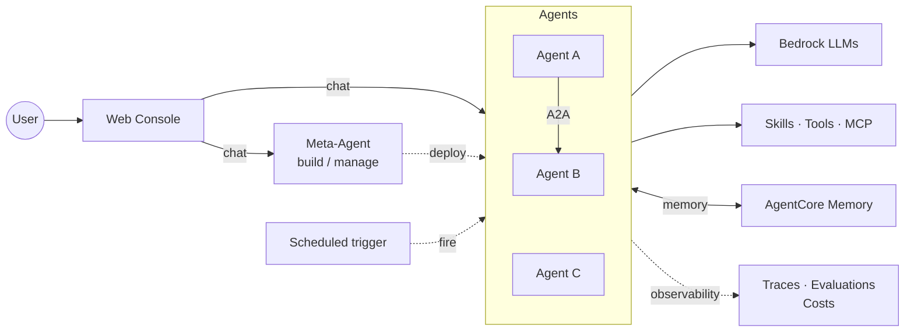

# Agent Studio

基于 AWS Bedrock AgentCore 的 Agent 编排平台。用自然语言向 Meta-Agent 描述需求，它为你创建、部署、维护可直接运行的 Agent。Meta-Agent 由 Kiro CLI 驱动，Agent 基于 Strands。

## 能做什么

- **对话创建 Agent** — 告诉 Meta-Agent 你的需求，它写 prompt、挑工具、生成代码、完成部署
- **可视化调试** — 对话流式返回，每次 tool 调用的输入输出都显示在消息流里
- **Agent 互调** — `link_agent` 把一个 Agent 挂为另一个的工具，通过 A2A 协议调用，密钥自动下发
- **Skill 热插拔** — AgentSkills.io 格式，运行时按需加载，跨 Agent 复用
- **多模态输入** — 图片 / PDF / Excel / CSV / TSV 自动解析，无需额外配置
- **定时触发** — 可视化 cron 构建器，每次执行留痕为卡片，可直接查看运行详情
- **MCP 工具集** — AWS 官方 MCP 目录全量接入，按需启用；per-target IAM 角色，最小权限
- **Workspace IAM 隔离** — 三层权限模型（Permission Boundary 天花板 → per-workspace 角色 → target 级授权）；Admin Console 一键授权，敏感 target 二次确认；`SimulatePrincipalPolicy` 实时检查，进度条展示每个 target 的已授权/缺失 action
- **跨会话记忆** — 基于 AgentCore Memory，Agent 自动记住用户偏好与事实，跨 session、跨设备持续生效；用户可在记忆抽屉中查看和删除
- **平台级可观测性** — 调用追踪、延迟分位数、错误率、Token 成本按 Agent 和 workspace 自动聚合，一屏总览
- **Marketplace** — 跨 workspace 发布和克隆 Agent / Skill / Tool，元数据公开，源码克隆后才可见

## 架构



完整系统图（CloudFront / Lambda / EventBridge / Evaluator 等）与关键设计说明见 [docs/architecture.md](docs/architecture.md)。

## 安全与权限

Agent Studio 对每个 workspace 实施三层权限控制，在赋能 Agent 访问 AWS 资源的同时防止越权：

```
Permission Boundary（天花板）
  └─ Workspace Role（身份策略）
       └─ Target Grants（按需授权）
```

- **Permission Boundary** — `AgentStudioWorkspaceCeiling` 管理策略封顶 workspace 角色的最大权限。写操作、IAM 变更、角色提权被显式 Deny，无论身份策略怎么配都不会超出天花板
- **Per-workspace 角色** — 按需创建 `AgentStudio-ws-{id}` IAM 角色并绑定 Permission Boundary。未创建角色的 workspace 只能使用平台内置工具（搜索、图表、代码解释器）
- **Target 级授权** — 管理员在 Admin Console 按 MCP target 逐项授权（如 CloudWatch、DynamoDB、IAM）。IAM 策略从 `mcp-registry.yaml` 单一数据源自动生成，消除手工维护的漂移风险
- **敏感标识与二次确认** — 每个 target 标注 sensitivity 等级（low / medium / high）。medium 以上的授权操作弹出确认弹窗，展示风险原因和具体 action 列表
- **实时权限检查** — `SimulatePrincipalPolicy` 实时模拟，每个 target 展示进度条和已授权/缺失 action 明细。Agent 创建时 `validate_agent` 自动校验 MCP 权限

## 快速开始

```bash
bash scripts/deploy-all.sh --region us-east-1
```

首次部署约 15–20 分钟，依次开通：CDK 基础设施（Cognito / Lambda / CloudFront / WAF / DDB / S3）→ Base zip → Meta-Agent → 前端。

常用子命令：

```bash
bash scripts/deploy-all.sh --only-agent       # 仅更新 Meta-Agent
bash scripts/deploy-all.sh --only-frontend    # 仅更新前端
bash scripts/deploy-all.sh --skip-frontend    # 基础设施 + Meta-Agent
bash scripts/deploy-all.sh --dry-run          # 预检 + cdk diff

bash scripts/build-mcp.sh                     # 构建 MCP Docker 镜像
bash scripts/deploy-mcp.sh                    # 部署 MCP targets

cd frontend && npm run dev                    # 本地开发
```

脚本会自动复用 `.env` 中已记录的资源。

## 项目结构

```
agent-studio/
├── frontend/              # React 19 + Vite 8 + Tailwind 4 + Zustand 5
├── meta-agent/            # Meta-Agent on AgentCore Runtime（Kiro CLI 驱动）
│   ├── kiro_adapter/      # Kiro 胶水层（ACP 驱动、stdio MCP、SSE mapper）
│   ├── tools/             # Meta 工具集（Agent 生命周期、skill、MCP、schedule、secret、link 等）
│   ├── tools_library/     # 预构建 Agent 工具模板（web_search、s3_read、chart 等）
│   └── templates/         # 代码生成 + prompt 模板
├── lambda/
│   ├── crud/              # Python CRUD Lambda（含 kiro_key.py 管理 key + usage）
│   ├── invoke-node/       # Node.js SSE streaming proxy
│   └── a2a-proxy/         # A2A JSON-RPC proxy
├── mcp-runtime/           # AWS MCP 目录接入（mcp-registry.yaml 控制启用项）+ Dockerfile
├── infra/                 # AWS CDK (TypeScript)
├── scripts/               # 部署 / 测试脚本
└── .env.example
```

## 测试

```bash
bash scripts/run-tests.sh
```

---

# Agent Studio (English)

An agent orchestration platform on AWS Bedrock AgentCore. Describe what you need in natural language and the Meta-Agent creates, deploys, and maintains the agent for you. The Meta-Agent is powered by the Kiro CLI; agents run on Strands.

## What It Does

- **Conversational agent creation** — Tell the Meta-Agent what you need; it writes the prompt, picks tools, generates the code, deploys.
- **Visualized debugging** — Streaming responses with every tool call's input and output surfaced in the chat stream.
- **Agent-to-agent** — `link_agent` mounts one agent as another's tool over A2A; credentials are provisioned automatically.
- **Hot-swappable skills** — AgentSkills.io format, lazy-loaded at runtime, reusable across agents.
- **Multimodal input** — Images / PDF / Excel / CSV / TSV parsed out of the box, no extra setup.
- **Scheduled triggers** — Visual cron builder; every run is archived as a card with a click-through to full run details.
- **MCP toolbelt** — The full AWS-official MCP catalog, enable what you need; per-target IAM roles, least privilege.
- **Workspace IAM isolation** — Three-layer permission model (Permission Boundary ceiling → per-workspace role → target-level grants); Admin Console one-click grants with sensitivity badges and confirmation dialogs; `SimulatePrincipalPolicy` real-time checks with progress bars per target.
- **Cross-session memory** — Powered by AgentCore Memory: agents remember user preferences and facts across sessions and devices. Users can view and manage memories from the chat drawer.
- **Platform-level observability** — Trace timeline, latency percentiles, error rates, and token costs aggregated per agent and per workspace on a single screen.
- **Marketplace** — Publish and clone agents / skills / tools across workspaces; metadata is public, source stays private until cloned.

## Architecture



Full system diagram (CloudFront / Lambda / EventBridge / Evaluator, …) and key design notes live in [docs/architecture.md](docs/architecture.md).

## Security & Permissions

Agent Studio enforces a three-layer permission model on every workspace, enabling AWS resource access while preventing privilege escalation:

```
Permission Boundary (ceiling)
  └─ Workspace Role (identity policy)
       └─ Target Grants (on-demand)
```

- **Permission Boundary** — The `AgentStudioWorkspaceCeiling` managed policy caps the maximum privileges of any workspace role. Write operations, IAM mutations, and privilege escalation are explicitly denied
- **Per-workspace role** — `AgentStudio-ws-{id}` IAM roles are created on demand and bound to the Permission Boundary. Workspaces without a role can only use platform built-in tools (search, charts, code interpreter)
- **Target-level grants** — Admins grant permissions per MCP target (e.g. CloudWatch, DynamoDB, IAM) from the Admin Console. IAM policies are auto-generated from `mcp-registry.yaml` as the single source of truth, eliminating manual drift
- **Sensitivity labels & confirmation** — Each target is labeled low / medium / high sensitivity. Medium+ grants trigger a confirmation dialog showing risk reasons and the specific IAM actions being granted
- **Real-time checks** — `SimulatePrincipalPolicy` provides live simulation with progress bars and per-action granted/missing status. `validate_agent` automatically verifies MCP permissions at agent creation time

## Quick Start

```bash
bash scripts/deploy-all.sh --region us-east-1
```

First run takes 15–20 minutes and provisions, in order: CDK infra (Cognito / Lambda / CloudFront / WAF / DDB / S3) → base zip → Meta-Agent → frontend.

Common subcommands:

```bash
bash scripts/deploy-all.sh --only-agent       # Meta-Agent code only
bash scripts/deploy-all.sh --only-frontend    # Frontend only
bash scripts/deploy-all.sh --skip-frontend    # Infra + Meta-Agent
bash scripts/deploy-all.sh --dry-run          # Preflight + cdk diff

bash scripts/build-mcp.sh                     # Build MCP Docker images
bash scripts/deploy-mcp.sh                    # Deploy MCP targets

cd frontend && npm run dev                    # Local dev
```

Resources already recorded in `.env` are reused automatically.

## Project Structure

```
agent-studio/
├── frontend/              # React 19 + Vite 8 + Tailwind 4 + Zustand 5
├── meta-agent/            # Meta-Agent on AgentCore Runtime (Kiro-driven)
│   ├── kiro_adapter/      # Kiro glue (ACP driver, stdio MCP, SSE mapper)
│   ├── tools/             # Meta tools (agent lifecycle, skills, MCP, schedule, secrets, link, ...)
│   ├── tools_library/     # Pre-built agent tool templates (web_search, s3_read, chart, ...)
│   └── templates/         # Codegen + prompt templates
├── lambda/
│   ├── crud/              # Python CRUD Lambda (includes kiro_key.py — key + usage)
│   ├── invoke-node/       # Node.js SSE streaming proxy
│   └── a2a-proxy/         # A2A JSON-RPC proxy
├── mcp-runtime/           # AWS MCP catalog integration (mcp-registry.yaml gates what's enabled) + Dockerfile
├── infra/                 # AWS CDK (TypeScript)
├── scripts/               # Deploy + test scripts
└── .env.example
```

## Testing

```bash
bash scripts/run-tests.sh
```
