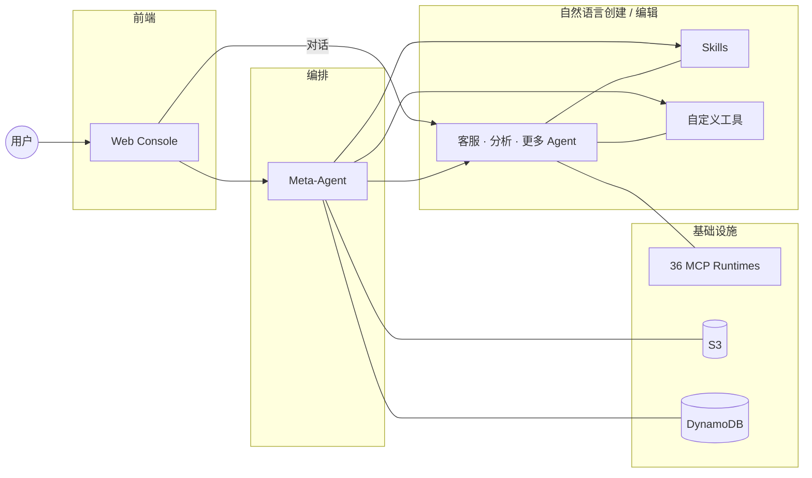
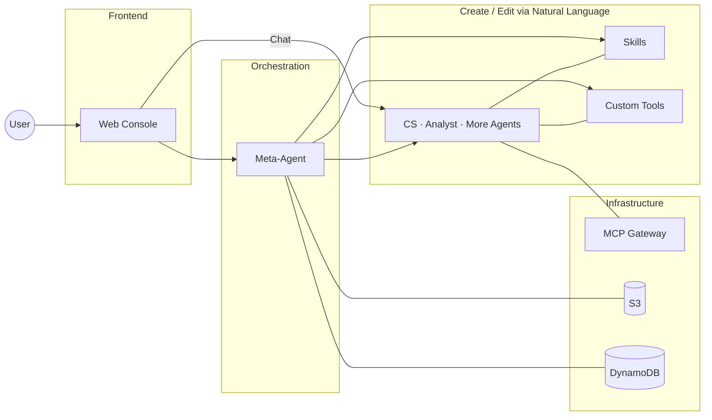

# Agent Studio

用自然语言创建 AI Agent，一句话部署到生产环境。

基于 AWS Bedrock AgentCore，零代码到全代码，从想法到上线只需几分钟。

## 你能用它做什么

- **对话式创建 Agent** — 告诉 Meta-Agent 你想要什么，它帮你写 prompt、选工具、生成代码、部署上线
- **表单 + AI 双模式编辑** — 不想写代码？用表单改配置。想精细控制？AI 助手帮你改 prompt 和 tool 代码
- **实时对话测试** — 流式响应 + tool-use 过程可视化，看到 Agent 每一步在做什么
- **Skill 热插拔** — AgentSkills.io 格式，多文件编辑器，运行时按需加载，Agent 之间共享
- **预构建工具库** — Web 搜索、S3 读写、图表生成、网页抓取等开箱即用
- **MCP 工具市场** — 36 个预部署 MCP 工具服务器，覆盖 14 个 AWS 服务类别，Agent 直连 Runtime，支持分类浏览和搜索
- **多模型切换** — Claude 4.6 / 4.5 / 4 / 3.x，运行时随时切换，不需要重新部署
- **多模态输入** — 支持图片上传，Agent 可以看图理解、分析数据截图

## 架构



- **Frontend** — React 19 + Vite + Tailwind + Zustand，Cognito 认证
- **Meta-Agent** — 跑在 AgentCore Runtime 上的编排 Agent，25 个工具管理 Sub-Agent 全生命周期
- **Sub-Agent** — 每个 Agent 独立部署，独立运行，互不影响

## 快速开始

一条命令部署整个平台：

```bash
bash scripts/deploy-all.sh --region us-east-1
```

脚本自动完成：创建 DynamoDB 表 → 打包 Meta-Agent → CDK 部署基础设施（Cognito、Lambda、CloudFront、WAF）→ 构建前端 → 上线。

首次部署约 15-20 分钟。完成后访问输出的 CloudFront URL 即可使用。

### 部分更新

```bash
bash scripts/deploy-all.sh --only-agent       # 只更新 Meta-Agent 代码（~3 分钟）
bash scripts/deploy-all.sh --only-frontend    # 只更新前端
bash scripts/deploy-all.sh --skip-frontend    # 只更新基础设施 + Meta-Agent
bash scripts/deploy-all.sh --dry-run          # 预检查 + cdk diff，不实际部署
```

### MCP 工具部署

```bash
bash scripts/build-mcp.sh    # 构建 36 个 MCP Runtime Docker 镜像
bash scripts/deploy-mcp.sh   # 部署到 AgentCore Runtime + 生成工具清单
bash scripts/deploy-mcp.sh --list            # 查看会部署哪些 target
bash scripts/deploy-mcp.sh --only cloudwatch # 只部署单个 target
```

### 本地开发

```bash
cd frontend && npm run dev    # 本地前端，自动 proxy 到已部署的后端
```

### 已有环境

如果已有 Cognito 或 Meta-Agent Runtime，脚本会自动检测 `.env` 中的已有资源并复用。

## 安全

- **认证**: Cognito User Pool + JWT token，Amplify `<Authenticator>` 组件
- **API 保护**: CloudFront OAC (SigV4) 保护 Lambda Function URL，Origin 验证 header 保护 API Gateway
- **WAF**: AWS Managed Rules + IP 限速，CloudFront 级别防护
- **数据隔离**: Workspace 级别隔离，Agent 归属校验，Secret 按 Agent 独立存储
- **最小权限**: S3 IAM policy 按路径前缀 scope down，Lambda 不添加 broad resource-based policy

## 项目结构

```
agent-studio/
├── frontend/              # Web Console (React 19 + Vite + Tailwind 4)
├── meta-agent/            # 编排引擎 (Strands Agent on AgentCore Runtime)
│   ├── tools/             # 25 个 Agent 生命周期工具
│   ├── tools_library/     # 预构建工具库
│   └── templates/         # 代码生成 + 提示词模板
├── lambda/                # Lambda 函数 (CRUD + SSE streaming)
├── infra/                 # AWS CDK 基础设施
├── mcp-runtime/           # MCP 工具服务器 (Dockerfile + 注册表)
│   ├── mcp-registry.yaml  # 36 个 MCP target 定义
│   └── Dockerfile.template
├── scripts/               # 部署脚本 (deploy-all.sh, deploy-agentcore.sh, deploy-mcp.sh)
└── .env.example
```

## 测试

```bash
bash scripts/run-tests.sh
```

---

# Agent Studio (English)

Create AI agents with natural language. Deploy to production in one command.

Built on AWS Bedrock AgentCore. From zero-code to full-code, from idea to production in minutes.

## What You Can Do

- **Conversational agent creation** — Tell the Meta-Agent what you need. It writes the prompt, picks tools, generates code, and deploys.
- **Form + AI dual editing** — Use forms for quick config changes. Use the AI assistant for fine-grained prompt and tool code editing.
- **Real-time chat testing** — Streaming responses with tool-use visualization. See exactly what your agent does at each step.
- **Hot-swappable Skills** — AgentSkills.io format, multi-file editor, runtime on-demand loading, shared across agents.
- **Built-in tool library** — Web search, S3 read/write, chart generation, web scraping — ready to use out of the box.
- **MCP Tool Marketplace** — 36 pre-deployed MCP tool servers across 14 AWS service categories. Agents connect directly to Runtimes with category browsing and search.
- **Multi-model switching** — Claude 4.6 / 4.5 / 4 / 3.x, switch at runtime without redeployment.
- **Multimodal input** — Image upload support. Agents can understand screenshots and analyze visual data.

## Architecture



- **Frontend** — React 19 + Vite + Tailwind + Zustand, Cognito auth
- **Meta-Agent** — Orchestration agent on AgentCore Runtime, 25 tools for full sub-agent lifecycle management
- **Sub-Agent** — Each agent deployed independently, isolated runtime

## Quick Start

Deploy the entire platform with one command:

```bash
bash scripts/deploy-all.sh --region us-east-1
```

The script handles everything: DynamoDB tables → Meta-Agent packaging → CDK infrastructure (Cognito, Lambda, CloudFront, WAF) → frontend build → go live.

First deploy takes ~15-20 minutes. Access the CloudFront URL printed at the end.

### Partial Updates

```bash
bash scripts/deploy-all.sh --only-agent       # Update Meta-Agent code only (~3 min)
bash scripts/deploy-all.sh --only-frontend    # Update frontend only
bash scripts/deploy-all.sh --skip-frontend    # Update infra + Meta-Agent only
bash scripts/deploy-all.sh --dry-run          # Preflight + cdk diff, no actual deploy
```

### Local Development

```bash
cd frontend && npm run dev    # Local frontend, auto-proxies to deployed backend
```

### Existing Resources

If you already have Cognito or a Meta-Agent Runtime, the script auto-detects existing resources from `.env` and reuses them.

## Security

- **Authentication**: Cognito User Pool + JWT tokens, Amplify `<Authenticator>` component
- **API protection**: CloudFront OAC (SigV4) for Lambda Function URL, origin verification header for API Gateway
- **WAF**: AWS Managed Rules + IP rate limiting, CloudFront-level protection
- **Data isolation**: Workspace-level isolation, agent ownership verification, per-agent secret storage
- **Least privilege**: S3 IAM policies scoped by path prefix, no broad Lambda resource-based policies

## Runtime observability

Each agent row shows a live AgentCore status badge (ACTIVE / CREATING /
UPDATING / FAILED) backed by a passthrough over `get_agent_runtime`.
Per-agent tabs surface version history (`list_agent_runtime_versions`)
and blue/green endpoints (`create/update/delete_agent_runtime_endpoint`).
No DDB mirror — AgentCore is the source of truth.

## Sub-agent sandbox

`run_command` and `fetch_webpage` run inside AgentCore Code Interpreter
and Browser respectively. There is no in-process subprocess call; the
account-shared sandbox resources are provisioned once via
`scripts/provision-agentcore-shared.sh` and their IDs travel to
sub-agents via env vars.

## Project Structure

```
agent-studio/
├── frontend/              # Web Console (React 19 + Vite + Tailwind 4)
├── meta-agent/            # Orchestration engine (Strands Agent on AgentCore Runtime)
│   ├── tools/             # 25 agent lifecycle tools
│   ├── tools_library/     # Built-in tool library
│   └── templates/         # Code generation + prompt templates
├── lambda/                # Lambda functions (CRUD + SSE streaming)
├── infra/                 # AWS CDK infrastructure
├── scripts/               # Deploy scripts (deploy-all.sh, deploy-agentcore.sh)
└── .env.example
```

## Testing

```bash
bash scripts/run-tests.sh
```
