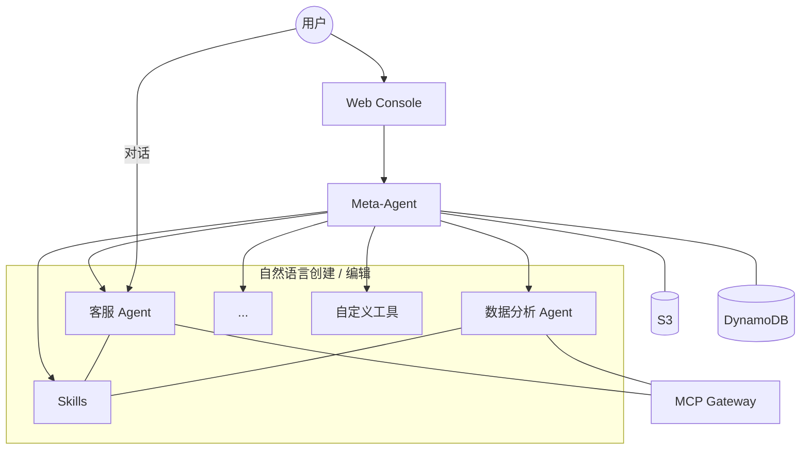
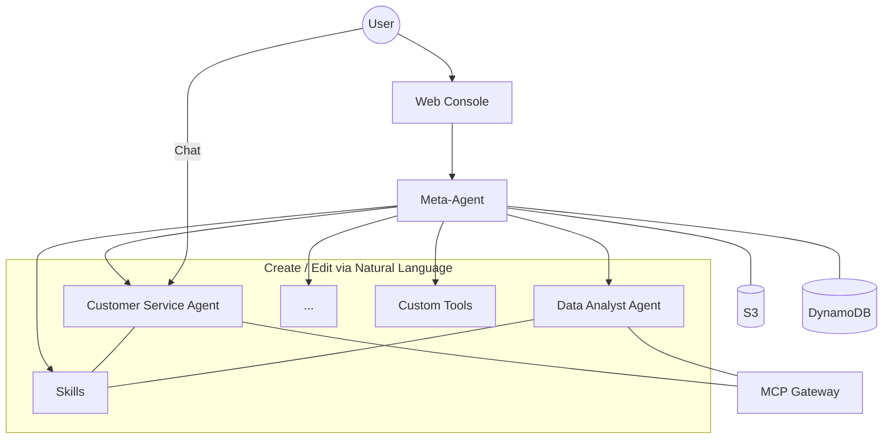

# Agent Studio

基于 AWS Bedrock AgentCore 的 Agent 编排平台。通过自然语言创建、管理和运行 AI Agent。

## 架构



- **Frontend** — React 19 + Vite + Tailwind + Zustand，Cognito 认证，SigV4 签名直连 AgentCore / S3
- **Meta-Agent** — 跑在 AgentCore Runtime 上的编排 Agent，25 个工具管理 Sub-Agent 全生命周期
- **Sub-Agent** — 每个 Agent 独立部署（main.py + tools.py + prompt.txt + config.json）

## 项目结构

```
agent-studio/
├── frontend/              # Web Console (React 19 + Vite + Tailwind 4)
│   └── src/
│       ├── components/    # 页面与 UI 组件 (chat, agents, skills, tools, layout)
│       ├── stores/        # Zustand 状态管理
│       └── lib/           # AgentCore client, S3 操作, 工具函数
├── meta-agent/            # 编排引擎 (Strands Agent on AgentCore Runtime)
│   ├── main.py            # Meta-Agent 入口
│   ├── tools/             # Agent 生命周期工具 (CRUD, 校验, 日志, Skill, MCP, Secrets)
│   ├── tools_library/     # 预构建工具库 (web_search, s3_read, chart 等)
│   ├── templates/         # 代码生成模板 + 提示词模板
│   └── tests/             # 单元测试
├── scripts/               # 部署 / 构建 / 测试脚本
└── .env.example
```

## 功能

- 自然语言创建/编辑 Agent，表单直接改配置，部署前自动校验
- 流式对话 + tool-use 可视化，多 session，多模态（图片）
- Skill 系统（AgentSkills.io 格式），多文件编辑，运行时按需加载
- 预构建工具库 + MCP Gateway 集成
- 权限三档（basic / readonly / data-access），DynamoDB 归属控制
- Claude 4.6/4.5/4/3.x 多模型运行时切换

## 快速开始

```bash
# 1. 配置环境变量
cp .env.example .env
# 编辑 .env 填入 AWS 账号信息（见下方环境变量表）

# 2. 部署 Meta-Agent
bash scripts/deploy-agentcore.sh

# 3. 启动前端
cd frontend && npm install && npm run dev
```

## 测试

```bash
bash scripts/run-tests.sh          # 全部测试 + 覆盖率
```

## 环境变量

| 变量 | 说明 |
|------|------|
| `AGENT_STUDIO_REGION` | AWS Region |
| `AGENT_STUDIO_ACCOUNT_ID` | AWS Account ID |
| `AGENT_STUDIO_META_AGENT_ID` | Meta-Agent Runtime ID |
| `AGENT_STUDIO_COGNITO_USER_POOL_ID` | Cognito User Pool ID |
| `AGENT_STUDIO_COGNITO_CLIENT_ID` | Cognito App Client ID |
| `AGENT_STUDIO_COGNITO_IDENTITY_POOL_ID` | Cognito Identity Pool ID |
| `AGENT_STUDIO_S3_BUCKET` | S3 Bucket（部署包 + 配置 + Skill） |

---

# Agent Studio (English)

AI agent orchestration platform on AWS Bedrock AgentCore. Create, manage, and run AI agents through natural language.

## Architecture



## Project Structure

```
agent-studio/
├── frontend/              # Web Console (React 19 + Vite + Tailwind 4)
│   └── src/
│       ├── components/    # Pages & UI (chat, agents, skills, tools, layout)
│       ├── stores/        # Zustand state management
│       └── lib/           # AgentCore client, S3 ops, utilities
├── meta-agent/            # Orchestration engine (Strands Agent on AgentCore Runtime)
│   ├── main.py            # Meta-Agent entrypoint
│   ├── tools/             # Agent lifecycle tools (CRUD, validation, logs, skills, MCP, secrets)
│   ├── tools_library/     # Built-in tools (web_search, s3_read, chart, etc.)
│   ├── templates/         # Code generation + prompt templates
│   └── tests/             # Unit tests
├── scripts/               # Deploy / build / test scripts
└── .env.example
```

## Features

- Natural language agent creation/editing, form-based config, pre-deploy validation
- Streaming chat + tool-use visualization, multi-session, multimodal (images)
- Skill system (AgentSkills.io format), multi-file editing, runtime on-demand loading
- Built-in tool library + MCP Gateway integration
- Permission tiers (basic / readonly / data-access), DynamoDB ownership control
- Claude 4.6/4.5/4/3.x runtime model switching

## Quick Start

```bash
cp .env.example .env       # Configure AWS credentials (see env table below)
bash scripts/deploy-agentcore.sh   # Deploy Meta-Agent
cd frontend && npm install && npm run dev   # Start frontend
```

## Testing

```bash
bash scripts/run-tests.sh  # All tests + coverage
```

## Environment Variables

| Variable | Description |
|----------|-------------|
| `AGENT_STUDIO_REGION` | AWS Region |
| `AGENT_STUDIO_ACCOUNT_ID` | AWS Account ID |
| `AGENT_STUDIO_META_AGENT_ID` | Meta-Agent Runtime ID |
| `AGENT_STUDIO_COGNITO_USER_POOL_ID` | Cognito User Pool ID |
| `AGENT_STUDIO_COGNITO_CLIENT_ID` | Cognito App Client ID |
| `AGENT_STUDIO_COGNITO_IDENTITY_POOL_ID` | Cognito Identity Pool ID |
| `AGENT_STUDIO_S3_BUCKET` | S3 Bucket for packages, config, and skills |
