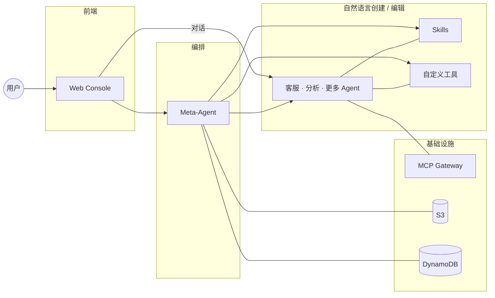
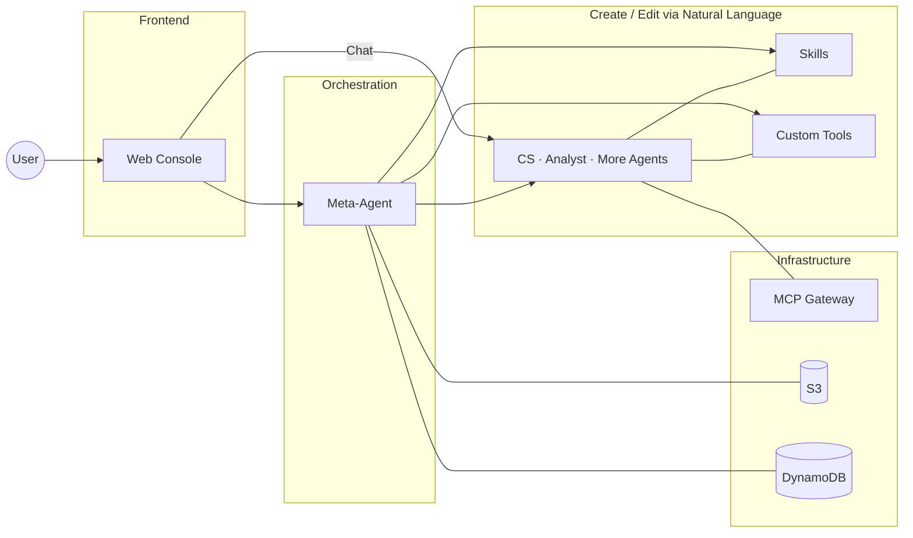

# Agent Studio

基于 AWS Bedrock AgentCore 的 Agent 编排平台。通过自然语言创建、管理和运行 AI Agent。

## 架构



- **Frontend** — React 19 + Vite + Tailwind + Zustand，Cognito 认证，SigV4 签名直连 AgentCore / S3
- **Meta-Agent** — 跑在 AgentCore Runtime 上的编排 Agent，25 个工具管理 Sub-Agent 全生命周期
- **Sub-Agent** — 每个 Agent 独立部署（main.py + tools.py + prompt.txt + config.json）

## 项目结构

```
agent-studio/
├── frontend/              # Web Console (React 19 + Vite + Tailwind 4)
│   └── src/
│       ├── components/    # 页面与 UI 组件 (chat, agents, skills, tools, layout)
│       ├── stores/        # Zustand 状态管理
│       ├── hooks/         # 可复用 hooks (useFileEditor, useAgentDeploy 等)
│       └── lib/           # AgentCore client, S3 操作, 校验器
├── meta-agent/            # 编排引擎 (Strands Agent on AgentCore Runtime)
│   ├── main.py            # Meta-Agent 入口
│   ├── tools/             # Agent 生命周期工具 (CRUD, 校验, 日志, Skill, MCP, Secrets)
│   ├── tools_library/     # 预构建工具库 (web_search, s3_read, chart 等)
│   ├── templates/         # 代码生成模板 + 提示词模板
│   └── tests/             # 单元测试
├── lambda/                # Lambda 函数
│   ├── crud/              # Python — Agent/Skill/Tool/Workspace CRUD (Powertools)
│   ├── invoke-node/       # Node.js — SSE streaming proxy to AgentCore
│   └── shared/            # 认证、权限、中间件、校验
├── infra/                 # AWS CDK 基础设施 (TypeScript)
│   ├── bin/app.ts         # CDK 入口 (WafStack + AgentStudioStack)
│   └── lib/constructs/    # database, api, invoke, cdn
├── mcp-lambdas/           # MCP server stubs (code-executor, dynamodb 等)
├── scripts/               # 部署 / 构建 / 测试脚本
└── .env.example
```

## 功能

- 自然语言创建/编辑 Agent，表单直接改配置，部署前自动校验
- 流式对话 + tool-use 可视化，多 session，多模态（图片）
- Skill 系统（AgentSkills.io 格式），多文件编辑，运行时按需加载
- 预构建工具库 + MCP Gateway 集成
- Claude 4.6/4.5/4/3.x 多模型运行时切换

## 安全与权限

### 认证

- **用户认证**: AWS Cognito User Pool + Identity Pool，JWT token
- **API 保护**: API Gateway 通过 JWT 验证，Invoke Lambda 通过 CloudFront OAC (SigV4) 保护
- **前端**: Amplify `<Authenticator>` 组件，401 自动刷新 token

### 权限隔离

- **Workspace 隔离**: 所有 API 请求 workspace-scoped (`/api/workspaces/{wsId}/...`)，数据按 workspace 隔离
- **Agent 归属**: DynamoDB 记录 `owner` 字段，CRUD/Invoke 操作校验调用者身份
- **权限三档**: 每个 Agent 可配置 permission tier，映射到不同 IAM Role
  - `basic` — 仅 Bedrock 模型调用
  - `readonly` — + S3/DynamoDB 只读
  - `data-access` — + S3/DynamoDB 读写
- **Secret 隔离**: 每个 Agent 独立的 Secrets Manager secret (`agent-studio/{agentId}`)

### 基础设施安全

- **WAF**: CloudFront 级别，AWS Managed Rules + IP 限速 (2000 req/IP)
- **CloudFront OAC**: Lambda Function URL 通过 SigV4 签名访问，不暴露公网
- **Origin 验证**: API Gateway 通过 `x-origin-verify` header 防止绕过 CloudFront 直连
- **S3 权限**: IAM policy 按路径前缀 scope down (`agents/*`, `skills/*`, `uploads/*`)
- **Lambda 安全**: 不添加 broad resource-based policy（Palisade 合规）

## 快速开始

部署分三步，必须按顺序执行：

```bash
# 1. 配置环境变量
cp .env.example .env
# 编辑 .env 填入 AWS 账号信息（见下方环境变量表）

# 2. 部署基础设施（Cognito, DynamoDB, Lambda, CloudFront, WAF）
cd infra && npm install && npx cdk deploy --all

# 3. 部署 Meta-Agent 到 AgentCore Runtime
bash scripts/deploy-agentcore.sh

# 4. 启动前端
cd frontend && npm install && npm run dev
```

> **注意**: CDK 只部署基础设施。Meta-Agent 运行在 Bedrock AgentCore Runtime 上（无 CDK construct），通过 `deploy-agentcore.sh` 独立部署。

## 测试

```bash
bash scripts/run-tests.sh          # 全部测试 + 覆盖率
```

## 环境变量

| 变量 | 说明 | 必填 |
|------|------|------|
| `AGENT_STUDIO_REGION` | AWS Region | 是 |
| `AGENT_STUDIO_ACCOUNT_ID` | AWS Account ID | 是 |
| `AGENT_STUDIO_META_AGENT_ID` | Meta-Agent Runtime ID | 是 |
| `AGENT_STUDIO_COGNITO_USER_POOL_ID` | Cognito User Pool ID | 是 |
| `AGENT_STUDIO_COGNITO_CLIENT_ID` | Cognito App Client ID | 是 |
| `AGENT_STUDIO_S3_BUCKET` | S3 Bucket（部署包 + 配置 + Skill） | 是 |
| `AGENT_STUDIO_CLOUDFRONT_DOMAIN` | CloudFront 域名 | 是 |
| `AGENT_STUDIO_API_URL` | API Gateway 端点 | 是 |
| `ORIGIN_VERIFY_SECRET` | CloudFront → API Gateway 验证密钥 | 是 |

---

# Agent Studio (English)

AI agent orchestration platform on AWS Bedrock AgentCore. Create, manage, and run AI agents through natural language.

## Architecture



## Project Structure

```
agent-studio/
├── frontend/              # Web Console (React 19 + Vite + Tailwind 4)
│   └── src/
│       ├── components/    # Pages & UI (chat, agents, skills, tools, layout)
│       ├── stores/        # Zustand state management
│       ├── hooks/         # Reusable hooks (useFileEditor, useAgentDeploy, etc.)
│       └── lib/           # AgentCore client, S3 ops, validators
├── meta-agent/            # Orchestration engine (Strands Agent on AgentCore Runtime)
│   ├── main.py            # Meta-Agent entrypoint
│   ├── tools/             # Agent lifecycle tools (CRUD, validation, logs, skills, MCP, secrets)
│   ├── tools_library/     # Built-in tools (web_search, s3_read, chart, etc.)
│   ├── templates/         # Code generation + prompt templates
│   └── tests/             # Unit tests
├── lambda/                # Lambda functions
│   ├── crud/              # Python — Agent/Skill/Tool/Workspace CRUD (Powertools)
│   ├── invoke-node/       # Node.js — SSE streaming proxy to AgentCore
│   └── shared/            # Auth, permissions, middleware, validators
├── infra/                 # AWS CDK infrastructure (TypeScript)
│   ├── bin/app.ts         # CDK entry (WafStack + AgentStudioStack)
│   └── lib/constructs/    # database, api, invoke, cdn
├── mcp-lambdas/           # MCP server stubs (code-executor, dynamodb, etc.)
├── scripts/               # Deploy / build / test scripts
└── .env.example
```

## Features

- Natural language agent creation/editing, form-based config, pre-deploy validation
- Streaming chat + tool-use visualization, multi-session, multimodal (images)
- Skill system (AgentSkills.io format), multi-file editing, runtime on-demand loading
- Built-in tool library + MCP Gateway integration
- Claude 4.6/4.5/4/3.x runtime model switching

## Security & Permissions

### Authentication

- **User auth**: AWS Cognito User Pool + Identity Pool, JWT tokens
- **API protection**: API Gateway validates JWT; Invoke Lambda protected by CloudFront OAC (SigV4)
- **Frontend**: Amplify `<Authenticator>` component, auto token refresh on 401

### Permission Isolation

- **Workspace isolation**: All API requests are workspace-scoped (`/api/workspaces/{wsId}/...`)
- **Agent ownership**: DynamoDB records `owner` field; CRUD/Invoke operations verify caller identity
- **Permission tiers**: Each agent has a configurable permission tier mapped to IAM roles
  - `basic` — Bedrock model invocation only
  - `readonly` — + S3/DynamoDB read access
  - `data-access` — + S3/DynamoDB read-write access
- **Secret isolation**: Each agent has its own Secrets Manager secret (`agent-studio/{agentId}`)

### Infrastructure Security

- **WAF**: CloudFront-level, AWS Managed Rules + IP rate limiting (2000 req/IP)
- **CloudFront OAC**: Lambda Function URL accessed via SigV4 signing, not publicly exposed
- **Origin verification**: API Gateway protected by `x-origin-verify` header to prevent CloudFront bypass
- **S3 permissions**: IAM policies scoped by path prefix (`agents/*`, `skills/*`, `uploads/*`)
- **Lambda security**: No broad resource-based policies (Palisade compliance)

## Quick Start

Deployment has 3 steps that must run in order:

```bash
# 1. Configure environment
cp .env.example .env       # Fill in AWS credentials (see env table below)

# 2. Deploy infrastructure (Cognito, DynamoDB, Lambda, CloudFront, WAF)
cd infra && npm install && npx cdk deploy --all

# 3. Deploy Meta-Agent to AgentCore Runtime
bash scripts/deploy-agentcore.sh

# 4. Start frontend
cd frontend && npm install && npm run dev
```

> **Note**: CDK only deploys infrastructure. The Meta-Agent runs on Bedrock AgentCore Runtime (no CDK construct available) and is deployed separately via `deploy-agentcore.sh`.

## Testing

```bash
bash scripts/run-tests.sh  # All tests + coverage
```

## Environment Variables

| Variable | Description | Required |
|----------|-------------|----------|
| `AGENT_STUDIO_REGION` | AWS Region | Yes |
| `AGENT_STUDIO_ACCOUNT_ID` | AWS Account ID | Yes |
| `AGENT_STUDIO_META_AGENT_ID` | Meta-Agent Runtime ID | Yes |
| `AGENT_STUDIO_COGNITO_USER_POOL_ID` | Cognito User Pool ID | Yes |
| `AGENT_STUDIO_COGNITO_CLIENT_ID` | Cognito App Client ID | Yes |
| `AGENT_STUDIO_S3_BUCKET` | S3 Bucket for packages, config, and skills | Yes |
| `AGENT_STUDIO_CLOUDFRONT_DOMAIN` | CloudFront domain | Yes |
| `AGENT_STUDIO_API_URL` | API Gateway endpoint | Yes |
| `ORIGIN_VERIFY_SECRET` | CloudFront → API Gateway verification secret | Yes |
