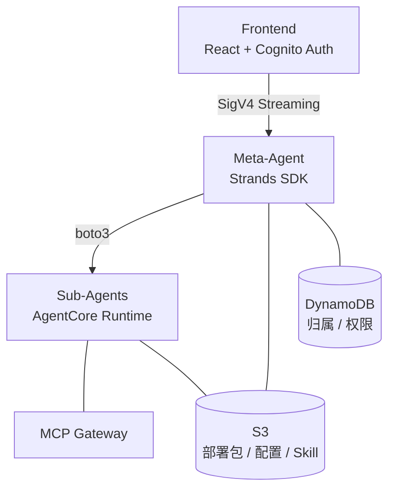

# Agent Studio

基于 AWS Bedrock AgentCore 的 Agent 编排平台。通过自然语言创建、管理和运行 AI Agent。

## 架构



- **Frontend** — React 19 + Vite + Tailwind + Zustand，Cognito 认证，SigV4 签名直连 AgentCore / S3
- **Meta-Agent** — 跑在 AgentCore Runtime 上的编排 Agent，25 个工具管理 Sub-Agent 全生命周期
- **Sub-Agent** — 每个 Agent 独立部署（main.py + tools.py + prompt.txt + config.json）

## 功能

- 自然语言创建/编辑 Agent，表单直接改配置，部署前自动校验
- 流式对话 + tool-use 可视化，多 session，多模态（图片）
- Skill 系统（AgentSkills.io 格式），多文件编辑，运行时按需加载
- 预构建工具库（web_search / s3_read / sql_readonly / chart 等）+ MCP Gateway 集成
- 权限三档（basic / readonly / data-access），DynamoDB 归属控制
- Claude 4.6/4.5/4/3.x 多模型运行时切换

## 快速开始

```bash
# 1. 配置环境变量
cp .env.example .env
# 编辑 .env 填入 AWS 账号信息（见下方环境变量表）

# 2. 部署 Meta-Agent
bash scripts/deploy-agentcore.sh

# 3. 启动前端
cd frontend && npm install && npm run dev
```

## 测试

```bash
bash scripts/run-tests.sh          # 全部测试 + 覆盖率
```

## 环境变量

| 变量 | 说明 |
|------|------|
| `AGENT_STUDIO_REGION` | AWS Region |
| `AGENT_STUDIO_ACCOUNT_ID` | AWS Account ID |
| `AGENT_STUDIO_META_AGENT_ID` | Meta-Agent Runtime ID |
| `AGENT_STUDIO_COGNITO_USER_POOL_ID` | Cognito User Pool ID |
| `AGENT_STUDIO_COGNITO_CLIENT_ID` | Cognito App Client ID |
| `AGENT_STUDIO_COGNITO_IDENTITY_POOL_ID` | Cognito Identity Pool ID |
| `AGENT_STUDIO_S3_BUCKET` | S3 Bucket（部署包 + 配置 + Skill） |
