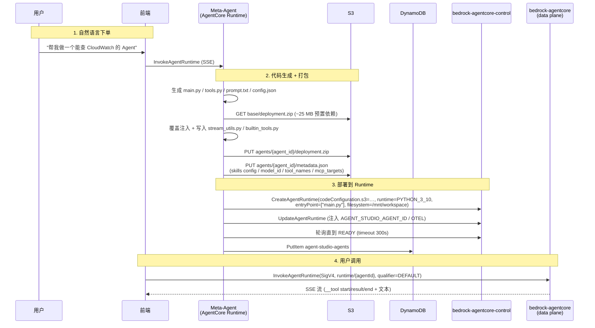

# Agent 生命周期

Agent Studio 目前如何创建、打包、部署、调用一个 Agent。指导未来开发与迁移决策。

> 本文档是 `docs/architecture.md` 的**实现级补充**——架构图讲"在哪"，这里讲"怎么做"。

## 一图看懂



---

## 目录

1. [代码组织](#代码组织)
2. [Agent CRUD 入口](#agent-crud-入口)
3. [代码生成与打包](#代码生成与打包)
4. [Runtime 部署](#runtime-部署)
5. [调用链路](#调用链路)
6. [流式协议](#流式协议)
7. [Skill 分发](#skill-分发)
8. [Tool 注入](#tool-注入)
9. [MCP 集成](#mcp-集成)
10. [IAM 身份模型](#iam-身份模型)
11. [DynamoDB 记录形状](#dynamodb-记录形状)
12. [关键耦合点](#关键耦合点)

---

## 代码组织

```
meta-agent/
├── main.py                       # Meta-Agent 入口（Strands Agent + Kiro CLI + ACP）
├── config.py                     # REGION / S3_BUCKET / AGENT_ROLE_ARN 读 env
├── deploy.py                     # ★ 打包 + CreateAgentRuntime + Invoke + Delete
├── tools/                        # Meta-Agent 的 tool（管 Agent 生命周期）
│   ├── create_agent.py           # ★ 编排入口（338 行）
│   ├── update_agent.py
│   ├── delete_agent.py
│   ├── validate_agent.py         # 静态校验 main.py / tools.py 能否 import
│   ├── invoke_agent.py           # 从 Meta-Agent 内部调用子 Agent (A2A)
│   ├── list_agents.py / get_agent_detail.py
│   ├── create_skill.py / delete_skill.py / update_skill.py / import_skill.py
│   ├── attach_agent_skill.py / sync_agent_skill.py
│   ├── read_skill_file.py / write_skill_file.py
│   ├── list_mcp_servers.py / list_mcp_target_tools.py
│   ├── manage_secrets.py
│   └── _workspace.py             # 解析 caller_id → workspace_id / role_arn
├── templates/
│   ├── agent_template_v2.py      # ★ 子 Agent 的 main.py 模板（普通 + MCP 两版）
│   └── prompt_templates.py       # system prompt 拼装模板
├── tools_library/                # 子 Agent 可选装的预置 tool（不是 Meta 自己用）
│   ├── registry.py               # ★ assemble_tools() → 按 tool 名合并代码
│   ├── web_search.py / fetch_webpage.py
│   ├── s3_read.py / sql_readonly.py
│   ├── chart_generator.py / translate.py
│   └── agent_caller.py           # 跨 Agent 调用
└── builtin_tools.py              # ★ 每个 Agent 都会注入：load_skill / run_skill_script
                                  #   run_command / upload_to_s3 / read_document
                                  #   browser_use / check_capabilities
```

---

## Agent CRUD 入口

| 动作 | Meta-Agent Tool | CRUD Lambda Handler | DDB 操作 |
|------|-----------------|---------------------|----------|
| Create | `meta-agent/tools/create_agent.py` | `lambda/crud/agents.py::create_agent` (POST `/api/workspaces/{wsId}/agents`) | PutItem |
| Update | `update_agent.py` | `update_agent` (PUT …/{agentId}) | UpdateItem (乐观锁 `expected_updated_at`) |
| Delete | `delete_agent.py` | `delete_agent` (DELETE) | status → `archived` 软删 |
| Deploy | `create_agent.py` 内联 | `deploy_agent` (POST) | 更新 `updated_at` |

**两条 Create 路径并存**：前端表单走 CRUD Lambda 直接写 DDB；Meta-Agent 对话式创建走 `meta-agent/tools/create_agent.py`。后者包含完整的代码生成 + 部署链路，前者仅写元数据。

---

## 代码生成与打包

入口：`meta-agent/tools/create_agent.py::create_agent` → `meta-agent/deploy.py::build_deployment_package_v2`。

```
┌─────────────────────────────────────────────────────────┐
│ 1. 按 tool_names 从 tools_library/ 拼接 TOOL_CODE       │
│    registry.py::assemble_tools() 走 _FUNC_NAME_INDEX    │
├─────────────────────────────────────────────────────────┤
│ 2. 选模板                                               │
│    MAIN_PY_TEMPLATE        (纯 tool)                    │
│    MAIN_PY_MCP_TEMPLATE    (有 mcp_targets 时)          │
├─────────────────────────────────────────────────────────┤
│ 3. 静态校验 validate_agent_files()                      │
│    - ast.parse 能否通过                                  │
│    - 依赖 import 是否齐全                                │
├─────────────────────────────────────────────────────────┤
│ 4. S3 下载 base/deployment.zip (~25 MB)                 │
│    SUB_AGENT_BASE_DEPLOYMENT_KEY = "base/deployment.zip" │
│    扁平结构，不能嵌套 site-packages/                      │
├─────────────────────────────────────────────────────────┤
│ 5. 覆盖注入：                                            │
│    - main.py                    ← 模板 + 配置            │
│    - tools.py                   ← TOOLS_PY_HEADER + 合并 │
│    - prompt.txt                 ← system prompt           │
│    - config.json                ← 运行时参数              │
│    - stream_utils.py            ← meta-agent 常驻最新版   │
│    - builtin_tools.py           ← 同上                   │
├─────────────────────────────────────────────────────────┤
│ 6. S3 上传 agents/{agent_id}/deployment.zip             │
│    附带 metadata.json（skills/model/tools/mcp 快照）     │
│    镜像 system_prompt.txt / tool_definitions.py 给前端   │
└─────────────────────────────────────────────────────────┘
```

**关键约束**：
- 扁平 zip：任何 `site-packages/` 嵌套会让 Python 10 找不到 module
- 一次打包独立于 skills：skills 运行时按需从 S3 拉到 `/mnt/workspace/skills/`
- `tools_library/` 模块必须导出三元组：`TOOL_META` (dict) / `TOOL_NAMES` (comma 字符串) / `TOOL_CODE` (Python 源码)

---

## Runtime 部署

入口：`meta-agent/deploy.py::create_runtime`（`create_agent.py` 内部调用）。

```python
# deploy.py:355-374
resp = control.create_agent_runtime(
    agentRuntimeName=agent_name,            # 只能 alphanumeric、<=36 字符
    description=description,
    roleArn=role_arn,                        # 每 workspace 一个角色，带 PermissionBoundary
    networkConfiguration={"networkMode": "PUBLIC"},
    runtime="PYTHON_3_10",                   # Linux / ARM64 容器
    codeConfiguration={
        "code": {"s3": {"bucket": S3_BUCKET, "key": f"agents/{agent_id}/deployment.zip"}},
        "entryPoint": ["main.py"],
    },
    filesystemConfigurations=[{              # /mnt/workspace 跨 warm 持久
        "filesystemType": "LOCAL", "mountPoint": "/mnt/workspace",
    }],
    environmentVariables={...基础 env},
)
# 紧随其后第二次 update 注入 AGENT_STUDIO_AGENT_ID / OTEL_RESOURCE_ATTRIBUTES
control.update_agent_runtime(...)            # 只在 id 就绪后能注入
wait_for_ready(agent_id, timeout=300)        # 轮询 CREATING → READY
```

**冷启动**：第一次 invoke 可能 424 (`AgentStartingException`)。前端 `frontend/src/lib/agentcore-client.ts` 重试 3 次、每次 5 s。

**ARN 形状**：`arn:aws:bedrock-agentcore:{REGION}:{ACCOUNT}:runtime/{agentId}`，qualifier 固定 `DEFAULT`。

---

## 调用链路

```
Browser
   │ fetchAuthSession() → IdToken
   ▼
CloudFront (OAC + WAF)
   │ /invoke/workspaces/{wsId}/agents/{agentId}
   ▼
Lambda Function URL (AuthType=AWS_IAM, OAC-SigV4)
   │ lambda/invoke-node/handler.mjs
   │   - 校验 JWT + workspace 归属 + agent ownership
   │   - InvokeAgentRuntimeCommand(runtimeArn, qualifier=DEFAULT, ...)
   │   - streamifyResponse 把 SSE 透传回浏览器
   ▼
bedrock-agentcore (data plane) → Agent 容器
   │ /invocations POST
   │ payload = { prompt, history, images, model_id, session_id }
   ▼
main.py (agent_template_v2)
   │ Strands agent.run() → yield 事件
   ▼
SSE 回到浏览器
```

**关键文件**：
- `lambda/invoke-node/handler.mjs` — Node 22 运行时，用 `awslambda.streamifyResponse` 做 SSE 透传
- `frontend/src/lib/agentcore-client.ts:129–316` — 请求包装 + 流解析 + `__tool` marker 处理

---

## 流式协议

子 Agent 不吐 AgentCore 原生的 `contentBlockDelta`/`messageStart`，而是 Meta-Agent 时代沉淀的**自定义 JSON-in-SSE** 协议。前端按行 JSON.parse。

| Line | 含义 | 前端处理 |
|------|------|----------|
| 纯文本 | 助手消息 delta | 拼接到当前 message |
| `{"__tool":"start", "name":"..."}` | Tool 调用开始 | 开一个折叠 tool card |
| `{"__tool":"result", "name":"...", "input":"<b64>", "output":"<b64>"}` | Tool 完成 | `atob` 解码 + 展示 |
| `{"__tool":"end", "name":"..."}` | Tool 结束 | 关闭 tool card |
| `{"__keepalive": 1}` | 心跳 | 丢弃 |
| `{"__auto_continue": 1}` | 自动续轮 | 开新 message |
| `{"__error": "msg"}` | 不可恢复错误 | throw |

**注意**：tool input/output 是 base64（可能很大，避免破坏 JSON 引号）。`agent_template_v2.py:530–631` 是编码侧，`agentcore-client.ts:228–316` 是解码侧。

---

## Skill 分发

**不在 zip 里**。部署包仅含 meta 信息，skill 文件运行时按需拉取。

```
s3://bucket/
├── skills/
│   ├── index.json                          # 全局 skill 索引（platform）
│   └── {skill_id}/SKILL.md + scripts/…     # 全局 skill
└── agents/{agent_id}/
    ├── deployment.zip
    ├── metadata.json                       # 含 skills: [{id, name, …}]
    └── skills/{skill_id}/…                 # agent 私有 skill
```

**运行时加载**（`agent_template_v2.py:1109–1212`，实际代码在 `builtin_tools.py`）：
1. 冷启动时 `_load_skills_manifest()` 读 `agents/{AGENT_ID}/metadata.json` 拿到挂载清单
2. `load_skill(name)` 按需把 skill 目录 sync 到 `/mnt/workspace/skills/{skill_id}/`
3. 同一 warm 容器跨 invoke 复用缓存；`_CACHED_SKILLS` 避免重复 sync

**四种 skill 形态**（来自 `check_capabilities` 与 prompt 模板）：
- **prompt skill**：只有 `SKILL.md`，让 Agent 按文档操作
- **scripted skill**：带 `.py/.sh`，用 `run_skill_script(name, script, args)` 在 sandbox 里执行
- **assets-only skill**：`SKILL.md` + 数据文件，`load_skill(name, file='…')` 读单个文件
- **data skill**：纯数据（csv/parquet 等），通常 `load_skill(name, file='data.csv')`

---

## Tool 注入

两层 tool：

| 层 | 来源 | 注入时机 | 生命周期 |
|----|------|----------|----------|
| **预置 tool** | `tools_library/<name>.py` 的 `TOOL_CODE` | 部署时拼到 `tools.py` | 静态 |
| **builtin tool** | `meta-agent/builtin_tools.py` | 每次部署都带最新版 | 随 Agent 更新 |

子 Agent 启动时（`agent_template_v2.py:133`）：

```python
_tool_list = _ALL_TOOLS + [
    _builtin.load_skill,
    _builtin.run_command,
    _builtin.upload_to_s3,
    _builtin.read_document,
    _builtin.browser_use,
    _builtin.run_skill_script,
    _builtin.check_capabilities,
]
```

MCP 版本 (`MAIN_PY_MCP_TEMPLATE`) 额外：每个 MCP endpoint 实例化一个 `MCPClient`，tools 注册表合并进 `_tool_list`，命名 `{target}___{tool}` 避免冲突。

---

## MCP 集成

**v4 状态（2026-04）**：每 workspace 一个 MCP runtime 池，与 Agent 共用 IAM 身份。

```
workspace "ws-abc"
├── IAM role: AgentStudio-ws-abc-us-east-1 (带 Permission Boundary)
├── Agent runtimes: runtime/{agentId} × N
└── MCP runtimes:  asmcp_{sha256(ws)[:12]}_{target} × N
```

- 启用 target 时：`mcp_runtime_manager.py::enable_target` 调 `CreateAgentRuntime` 创建 MCP 容器，executionRoleArn=workspace role，并 `put-resource-policy` 限定只有该 workspace role 能 `InvokeAgentRuntime`
- Agent → MCP：用 Strands `MCPClient` + SigV4 走 `InvokeAgentRuntime`，Agent 的 workspace role ≡ MCP 的 caller
- Registry：`mcp-runtime/mcp-registry.yaml` 是唯一真源，`iam_policy` 字段会合并进 workspace role 的 `WorkspaceGrants` 内联策略
- Boundary intersection 守卫：`scripts/sync-mcp-iam-policies.py --export-ceiling` 把 boundary 许可动作集烧进 `lambda/crud/generated/ceiling_actions.py`

详见 `.claude/specs/2026-04-26-per-workspace-mcp.md` 与 `…-workspace-iam-isolation.md`。

---

## IAM 身份模型

```
┌─────────────────────────────────────────────────────────┐
│ Meta-Agent Runtime role (共享)                           │
│ - ddb:*, s3:*, bedrock-agentcore-control:*              │
│ - iam:CreateRole + PermissionsBoundary condition        │
├─────────────────────────────────────────────────────────┤
│ AgentStudioSubAgent-basic (共享兜底，无 workspace 时用)  │
├─────────────────────────────────────────────────────────┤
│ AgentStudio-ws-{id} (每 workspace)                      │
│ - PermissionBoundary = AgentStudioWorkspaceCeiling      │
│ - Agent + MCP 共用                                       │
│ - WorkspaceGrants 内联策略随 MCP enable 动态合并          │
└─────────────────────────────────────────────────────────┘
```

**跨 workspace 隔离**：MCP runtime 的 resource policy 显式 `NotPrincipal Deny`，即使别的 workspace 有 `InvokeAgentRuntime` 权限也会被拒。

**hard constraints**（对应 MEMORY.md 中的 `infra_constraints`）：
- Lambda Function URL 必须 `AuthType=AWS_IAM`，禁 `NONE`
- Lambda resource policy `Principal` 必须具体，禁 `"*"`
- CRUD Lambda 不得被授予 `bedrock-agentcore:InvokeAgentRuntime` 到 `asmcp_*`（防跨 workspace oracle）

---

## DynamoDB 记录形状

`agent-studio-agents` (PK=`agentId`, GSI: `workspace-index` on `workspace_id`)：

```jsonc
{
  "agentId":          "a-xxxxxxxx",
  "workspace_id":     "ws-xxxxxxxx",
  "name":             "cloudwatchHelper",       // alphanumeric ≤ 36
  "display_name":     "CloudWatch 助手",
  "description":      "查询日志与指标",
  "model_id":         "anthropic.claude-sonnet-4-5-20250929-v1:0",
  "default_model_id": "...",                    // 备用模型
  "supports_images":  true,
  "welcome_message":  "...",
  "suggestions":      ["...", "...", "..."],
  "tool_names":       ["web_search", "s3_read"],
  "mcp_targets":      ["cloudwatch", "iam"],
  "skill_ids":        ["sk-xxx", "sk-yyy"],
  "skills": [{ "id": "sk-xxx", "name": "...", "description": "...", "contentHash": "..." }],
  "memory":           { "enabled": true, "strategies": ["summary", "semantic"] },
  "status":           "active",                 // active | archived
  "visibility":       "private",
  "created_by":       "<cognito sub>",
  "created_at":       "2026-04-26T12:00:00Z",
  "updated_at":       "2026-04-26T12:34:56Z"
}
```

其他表：`agent-studio-workspaces` / `-skills` / `-tools` / `-runs`（schedule 执行历史）/ `-mcp-meta`（per-workspace MCP 状态）。

---

## 关键耦合点

**下面这些点如果未来要改平台（例如迁移到 AgentCore Harness / Claude Managed Agents），都需要单独评估**。

1. **打包依赖 `base/deployment.zip`** — 扁平 zip + 预置 site-packages，任何 harness / 全托管形态都会让这步变得不必要甚至违法。
2. **Skill 路径硬编码** — `agents/{agent_id}/skills/{skill_id}/` 走 S3 直接 `get_object`，没有权限层。换成容器 FS（Harness 的 `.agents/skills/*` 模式）或 Anthropic skill 注册表都要改 `builtin_tools.py::_ensure_skill_materialized`。
3. **自定义 `__tool` SSE 协议** — 跟 AgentCore 原生 `contentBlockDelta` 不兼容；跟 Anthropic 的 `agent.message` / `agent.tool_use` 事件也不同。任何平台迁移都要加"协议翻译器"在 invoke Lambda 里。
4. **MCP client 在 Agent 代码里实例化** — Harness 改成 tools 数组声明即可；我们现在是代码生成。
5. **Secrets 编译时烧进 builtin_tools.py** — 换身份模型（比如 Harness 的 Token Vault / Managed Agents 的 Vaults）需要把 secrets 改为运行时 fetch。
6. **Meta-Agent 写代码的范式** — Meta-Agent 是**代码生成器**（写 Python 文件 + tools.py + prompt.txt 进 zip）。任何全托管 agent 平台都把"代码"降维成"配置"。迁移会从根本上改变 Meta-Agent 的 tool 设计。
7. **Agent id 限制** — alphanumeric ≤ 36，跟 AgentCore runtime name 一致。Harness 的 `harnessName` 限制类似但独立；Anthropic `agent_id` 是服务端生成不限长度。

---

## 参考

| 文档 | 位置 |
|------|------|
| 系统架构 | `docs/architecture.md` |
| 部署流程总览 | `docs/deployment.md`（若不存在参考脚本 `scripts/deploy-all.sh`） |

