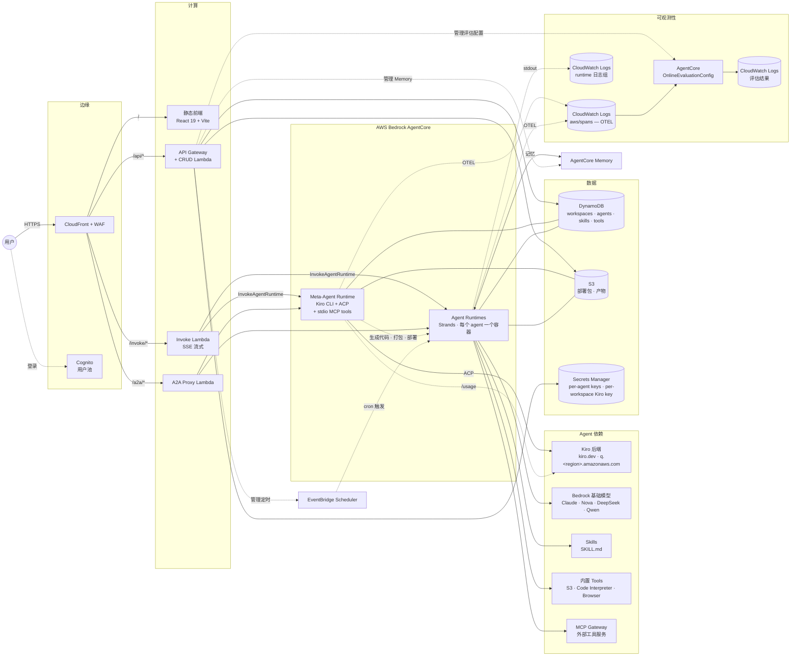

# 架构

完整系统图与组件说明。简要概览见 [主 README](../README.md#架构)。

## 端到端图



## 请求路径

| 路径 | 链路 | 用途 |
|---|---|---|
| `/` | CloudFront → S3 | 前端静态资源 |
| `/api/*` | CloudFront → API Gateway → CRUD Lambda | JSON CRUD：workspace、agent、skill、tool、schedule、secret、endpoint、cost、trace、evaluation |
| `/invoke/*` | CloudFront OAC → Invoke Lambda (SigV4) | 流式代理到 AgentCore `InvokeAgentRuntime`。强制 W3C traceparent `Sampled=1`，让对话 span 进 OTEL |
| `/a2a/*` | CloudFront OAC → A2A Proxy Lambda | 外部 agent-to-agent 协议端点。CloudFront Function 在 OAC SigV4 签名前把 `Authorization` 改名为 `x-a2a-authorization` |

## 组件

### Meta-Agent（Kiro-backed）
推理后端是 Kiro CLI。AgentCore 容器启动后，`main.py` 启动 `kiro-cli-chat acp --agent meta-agent` 子进程，通过 ACP 协议驱动对话。Meta-Agent 的全部 `@tool` 函数（agent / skill / MCP / schedule / secret / preview / link 等）通过 **stdio MCP subprocess** 暴露给 Kiro，调用在进程内完成，无需经过网络。适配层实现见 `meta-agent/kiro_adapter/`。

单次调用流水线：

1. Invoke Lambda 从 Secrets Manager 读取 workspace 的 Kiro API Key，作为 payload 字段传给 AgentCore（明文仅通过 SigV4+TLS 传输，不进入 Runtime 环境变量）
2. `main.py` 为本次调用构建独立的 `KIRO_HOME`（agent config + prompts + MCP 配置），并通过环境变量将 `KIRO_API_KEY` 注入 Kiro 子进程
3. Kiro 拉取模型目录 → 通过 `session/load` 恢复已有会话，或 `session/new` 创建新会话
4. 每轮 user prompt → Kiro 流式 `session/update` 事件 → `sse_mapper.py` 转换为前端既有的 SSE 帧格式（文本 + `__tool` 标记）
5. Auto-continue 监督器：若 Kiro 结束回合时未输出 `[[TASK_COMPLETE]]` 标记，但已触发过工具调用，则自动追加 "Continue." 再执行一轮，最多 3 轮

Entrypoint 之外还提供两个短路 action：

| Action | 功能 |
|---|---|
| `list_models` | 执行 `kiro-cli-chat chat --list-models`，向前端 picker（chat header 与 3 个 AI 助手侧栏共享）返回当前模型目录 |
| `get_usage` | 执行 `kiro-cli-chat chat "/usage"`，解析 TUI 输出并返回结构化的 credits / limit / reset date / tier / overage，供前端 Workspace Settings 的 Kiro Credits 卡片消费 |

创建 Agent 流程：
1. 用户："帮我做个 code reviewer agent"
2. Meta-Agent 写 `main.py` / `tools.py` / `prompt.txt` / `config.json`
3. 下载 `s3://bucket/base/deployment.zip`，注入生成文件
4. 上传 `s3://bucket/agents/{id}/deployment.zip`
5. 调 AgentCore 控制面的 `create_agent_runtime`
6. 轮询直到 READY（≤300s）

### Kiro Key & Credits
每 workspace 一把 Kiro API Key，存 `agent-studio/workspaces/{wsId}/kiro-api-key`（Secrets Manager），带 `kiroRegion` tag（`us-east-1` 或 `eu-central-1`）。

| 路由 | 角色 | 功能 |
|---|---|---|
| `GET /api/workspaces/{wsId}/kiro-key` | viewer+ | 返回 `{configured, region, lastUpdated, updatedBy}`，不返回明文密钥 |
| `PUT /api/workspaces/{wsId}/kiro-key` | admin | 写入 key 与 region，刷新 `updatedBy` 标签，清除用量缓存 |
| `DELETE /api/workspaces/{wsId}/kiro-key` | admin | 删除 key，清除用量缓存 |
| `GET /api/workspaces/{wsId}/kiro-key/usage` | viewer+ | 以 `action=get_usage` 调用 Meta-Agent，返回 credits / limit / reset date / tier / overage rate，结果在 Lambda 进程内缓存 60 秒 |

CRUD Lambda 在 `infra/lib/constructs/api.ts` 中对 `bedrock-agentcore:InvokeAgentRuntime` 的 Resource 指定精确的 Meta-Agent runtime ARN（不含通配符），且该语句只授予这一项 Action。

### Agents
每个用户创建的 Agent 对应一个 AgentCore Runtime。Python 3.10 Strands Agent，包含：
- 用户编写的 tool（`@tool` 装饰函数，存 DynamoDB，部署时组装）
- 用户编写的 skill（AgentSkills.io 格式，存 S3，运行时经 `load_skill` 按需加载）
- 捆绑内置 tool：`upload_to_s3`、`run_command`（Code Interpreter）、`fetch_webpage`（Browser）、`read_document`、`web_search` 等
- 可选 MCP gateway tool（走 workspace 的 MCP Gateway）

emit 的 span 中 `resource.attributes.service.name` 即 agent runtime id（如 `CustomerServiceBot-y3res08W8S`），Runs / Evaluations / Costs 页签均以此为过滤条件。

### Memory（AgentCore Memory）
每个 workspace 一个 AgentCore Memory 资源，workspace 创建时自动建立（`lambda/crud/workspaces.py`），内含 4 种内置策略：`userPreference`（偏好）、`semantic`（事实）、`summary`（摘要）、`episodic`（场景）。

Actor 隔离模型：`actorId = "{agentId}_{callerId}"`，按 Agent × 用户粒度天然隔离，同一 workspace 内不同 Agent 的记忆互不可见。

运行时行为（`meta-agent/templates/_memory_context_src.py`）：
- **invoke 开始**：并行预取偏好（`ListMemoryRecords`）+ 摘要（`RetrieveMemoryRecords` 语义搜索），注入 system prompt
- **invoke 结束**：fire-and-forget 写入用户 turn 和助手 turn（`CreateEvent`）
- **按需检索**：`recall_facts` 和 `recall_episodes` 两个 tool，Agent 主动调用时走语义搜索

Builder 通过 Agent 编辑页的 Memory section 开关功能并选择策略。End User 通过 ChatPanel 的 💭 记忆抽屉查看、单条删除或全部清除（`lambda/crud/memories.py`）。

| 端点 | 用途 |
|---|---|
| `GET /agents/{id}/my-memories` | 列出当前用户在当前 Agent 下的记忆（分 4 种策略，支持分页） |
| `DELETE /agents/{id}/my-memories/{recordId}` | 单条删除（含 actorId 归属校验） |
| `DELETE /agents/{id}/my-memories` | 全部清除（hard cap 1000/次） |
| `POST /workspaces/{id}/memory/repair` | Workspace owner 重建 Memory 资源 |

### Evaluator
每个 Agent 对应一个 AgentCore OnlineEvaluationConfig 实例（AgentCore 限制 `serviceNames` 仅支持单元素，无法以 workspace 为粒度）。评估器按 service.name 过滤 `aws/spans`，对所有完成的会话执行 LLM-as-Judge（Correctness / Helpfulness / GoalSuccessRate）评分。结果写入 `/aws/bedrock-agentcore/evaluations/results/<config-id>`。

生命周期：
- 由 `lambda/crud/agents.py::create_agent` hook 创建
- 由 `lambda/crud/agents.py::delete_agent` hook 删除

### Scheduler
EventBridge Scheduler 通过 AWS SDK Universal Target `aws-sdk:bedrockagentcore:invokeAgentRuntime` 调用 Agent。注意事项：`RuntimeSessionId` 必须置于 `Target.Input` 顶层字段，仅放在 `Payload` 中会导致调用静默失败。Session id 采用 `sched-{suffix}-<aws.scheduler.scheduled-time>` 的格式，便于 UI 的 Recent Runs 按 session 前缀过滤 span。

"Run now" 会创建一个 `at(now+5s)` 的一次性定时任务，触发后自动删除。它与周期性 cron 共用同一套代码路径，但可在 1 秒内返回，避免冷启动较慢的 Agent 导致 Lambda 超时。

### 可观测数据流

```
Agent 进程
    ├── Strands Agent → OTEL tracer → aws/spans log group
    │       └── 按 Agent 的 service.name + session.id 属性
    │       └── gen_ai.* 属性：模型、输入/输出 token、延迟
    └── stdout（业务输出）→ runtime log group
            └── 流名：runtime-logs-<sessionId>-<uuid>

aws/spans
    ├── Traces 页签消费（会话列表 + 展开详情，复用 RunDetail）
    ├── StatsStrip 消费（调用数 / 错误率 / p95 延迟 / 平均延迟 + sparkline）
    ├── Runs 页签消费（每行按 session id 分类为 定时/手动/聊天）
    ├── Evaluations 页签消费（通过 OnlineEvaluationConfig）
    └── Costs 页签消费（token / 调用次数聚合）

runtime log groups
    └── Logs 页签 + Runs 响应卡片消费
```

## 前端

- React 19 + Vite 8 + Tailwind 4
- hash 路由（`createHashRouter`）—— CloudFront 不用配 SPA 404 回写；`/api/*` 的 404 以 JSON 原样透传
- 每个领域一个 Zustand store（agents / skills / tools / ui / workspace）
- 所有代码编辑统一用 Monaco
- Amplify Auth（Cognito）登录

Agent 详情页采用 sticky 侧栏 + IntersectionObserver lazy-mount。**顶部首位是 StatsStrip**（4 指标卡片 + sparkline，24h/7d 切换），下方依次为 Traces（首位页签）、Schedules、Evaluations、Costs、Integration；底部 Advanced 折叠组：Deployments、Endpoints、Secrets、Logs。单个运行可通过 `/agents/:id/runs/:sessionId` 直接分享。

新增组件：
- **记忆抽屉**（ChatPanel 右侧 💭 按钮）—— 列出 4 种策略的记忆条目，支持单条删除和全部清除

## 基础设施（AWS CDK, TypeScript）

| Stack | 关键资源 |
|---|---|
| `WafStack` (us-east-1) | 正则 + 限流规则；绑定到 CloudFront |
| `AgentStudioStack` (应用区域) | Cognito、DynamoDB、API Gateway + CRUD Lambda、Invoke Lambda、A2A Proxy Lambda、CloudFront + OAC、S3、Secrets Manager |

命名与安全规则由 CDK aspects 与 pre-commit hook 在代码层面强制执行，不依赖文档约束。详见 `infra/lib/aspects/public-access-guard.ts`。

### Workspace IAM 隔离

```
Workspace (业务用户)              Workspace (运维团队)
  │ 共享角色                         │ 自定义角色
  │ AgentStudioSubAgent-basic        │ AgentStudio-ws-{id}
  │                                  │   + Permission Boundary 封顶
  │ 平台工具 ✅                       │   + MCP-Access inline policy
  │ AWS 服务工具 🔒                   │
  ▼                                  │ 平台工具 ✅
Agent (web_search, chart, skills)   │ AWS 服务工具 ✅ (已授权的)
                                     ▼
                                    Agent (cloudwatch, cloudtrail MCP)
                                     │
                                     ▼
                                    MCP Runtime (per-target 角色)
                                    AgentStudioMCP-cloudwatch-{region}
```

- **按需 opt-in**：大多数 workspace 用共享角色，不创建额外 IAM 资源
- **Permission Boundary**（`AgentStudioWorkspaceCeiling`）：定义 workspace 角色最大权限范围，`DenyEscalation` 阻止 IAM 变更 / STS 跨角色 / 横向移动
- **工具过滤**：`iam_policy` 声明（IAM Policy 标准格式）→ `SimulatePrincipalPolicy` 探测 → `list_mcp_servers` 返回 `granted` / `denied` → `validate_agent` 部署前拦截
- **一键授权**：CRUD Lambda 代执行 `iam:PutRolePolicy`（rebuild-from-truth，DDB 乐观锁），boundary 封顶保证安全
- **Per-target MCP 角色**：CDK 从 `mcp-registry.yaml` 生成 `AgentStudioMCP-{name}` 角色，每个 MCP runtime 仅有其服务所需的最小权限

---

# Architecture (English)

Full system diagram and component-by-component notes. For the
one-paragraph overview see [the main README](../README.md#architecture).

## End-to-end diagram


## Request paths

| Path | Route | Purpose |
|---|---|---|
| `/` | CloudFront → S3 | Static frontend assets |
| `/api/*` | CloudFront → API Gateway → CRUD Lambda | JSON CRUD: workspaces, agents, skills, tools, schedules, secrets, endpoints, costs, traces, evaluations |
| `/invoke/*` | CloudFront OAC → Invoke Lambda (SigV4) | SSE streaming proxy to AgentCore `InvokeAgentRuntime`. Forces W3C traceparent with `Sampled=1` so chat spans land in OTEL |
| `/a2a/*` | CloudFront OAC → A2A Proxy Lambda | External agent-to-agent protocol endpoint. CloudFront Function renames `Authorization` → `x-a2a-authorization` before OAC SigV4 signing |

## Components

### Meta-Agent (Kiro-backed)
The reasoning backend is the Kiro CLI. When the AgentCore container
boots, `main.py` spawns `kiro-cli-chat acp --agent meta-agent` and
drives it over ACP. All of the Meta-Agent's `@tool` functions (agent /
skill / MCP / schedule / secret / preview / link, …) are exposed to
Kiro via a **stdio MCP subprocess** — in-process calls, no network
hop. The glue layer lives in `meta-agent/kiro_adapter/`.

Per-invocation pipeline:

1. The Invoke Lambda reads the workspace's Kiro API key from Secrets
   Manager and places it on the payload sent to AgentCore. The
   plaintext is transmitted only via SigV4+TLS and never stored in
   Runtime environment variables.
2. `main.py` materializes a per-invocation `KIRO_HOME` (agent config,
   prompts, MCP config) and injects `KIRO_API_KEY` into the Kiro
   subprocess via environment.
3. Kiro fetches the model catalog, then either resumes an existing
   conversation with `session/load` or starts a new one with
   `session/new`.
4. Each user prompt streams back as `session/update` events;
   `sse_mapper.py` converts them into the SSE frame format the
   frontend already consumes (plain text + `__tool` markers).
5. An auto-continue supervisor watches for the `[[TASK_COMPLETE]]`
   marker. If Kiro ends a turn without emitting it but has already
   invoked tools, the supervisor automatically submits "Continue."
   for another round (capped at 3).

Besides the main turn handler, the entrypoint short-circuits two
control-plane actions:

| Action | What it does |
|---|---|
| `list_models` | Runs `kiro-cli-chat chat --list-models`, returns the live model catalog for the frontend picker (shared by the chat header and all three AI-assistant sidebars). |
| `get_usage` | Runs `kiro-cli-chat chat "/usage"`, parses the TUI output, returns structured credits / limit / reset date / tier / overage. Consumed by the Kiro Credits card in Workspace Settings. |

Creating an agent:
1. User: "make me a code reviewer agent"
2. Meta-Agent writes `main.py` / `tools.py` / `prompt.txt` / `config.json`
3. Downloads `s3://bucket/base/deployment.zip`, injects generated files
4. Uploads `s3://bucket/agents/{id}/deployment.zip`
5. Calls `create_agent_runtime` on AgentCore control plane
6. Polls until READY (≤300 s)

### Kiro Key & Credits
One Kiro API key per workspace, stored at
`agent-studio/workspaces/{wsId}/kiro-api-key` in Secrets Manager with a
`kiroRegion` tag (`us-east-1` or `eu-central-1`).

| Route | Role | Purpose |
|---|---|---|
| `GET /api/workspaces/{wsId}/kiro-key` | viewer+ | Returns `{configured, region, lastUpdated, updatedBy}`; plaintext never leaves the backend. |
| `PUT /api/workspaces/{wsId}/kiro-key` | admin | Writes key + region; refreshes `updatedBy` tag; busts usage cache. |
| `DELETE /api/workspaces/{wsId}/kiro-key` | admin | Removes key; busts usage cache. |
| `GET /api/workspaces/{wsId}/kiro-key/usage` | viewer+ | Invokes the Meta-Agent with `action=get_usage`; returns credits / limit / reset date / tier / overage rate. 60 s in-memory cache keyed per workspace. |

In `infra/lib/constructs/api.ts`, the CRUD Lambda's statement for
`bedrock-agentcore:InvokeAgentRuntime` uses the literal Meta-Agent
runtime ARN as its Resource (no wildcards), and that is the only
Action granted on that statement.

### Agents
One AgentCore Runtime per user-created agent. Python 3.10 Strands
Agent with:
- User-authored tools (`@tool`-decorated functions, stored in DynamoDB, assembled at deploy)
- User-authored skills (AgentSkills.io format, stored in S3, loaded on demand via `load_skill`)
- Bundled builtin tools: `upload_to_s3`, `run_command` (Code Interpreter), `fetch_webpage` (Browser), `read_document`, `web_search`, etc.
- Optional MCP gateway tools via the workspace's MCP Gateway

`resource.attributes.service.name` on emitted spans is the agent
runtime id (e.g. `CustomerServiceBot-y3res08W8S`). This is the key the
Runs / Evaluations / Costs tabs use to filter.

### Memory (AgentCore Memory)
One AgentCore Memory resource per workspace, created automatically on
workspace creation (`lambda/crud/workspaces.py`). Four built-in
strategies: `userPreference` (preferences), `semantic` (facts),
`summary` (conversation summaries), `episodic` (structured episodes).

Actor isolation: `actorId = "{agentId}_{callerId}"` — naturally scoped
per Agent x User. Memories from different Agents in the same workspace
are invisible to each other.

Runtime behavior (`meta-agent/templates/_memory_context_src.py`):
- **On invoke start:** parallel pre-fetch of preferences
  (`ListMemoryRecords`) and summaries (`RetrieveMemoryRecords` semantic
  search), injected into the system prompt.
- **On invoke end:** fire-and-forget writes of user and assistant turns
  via `CreateEvent`.
- **On demand:** `recall_facts` and `recall_episodes` tools — the Agent
  calls them when it needs specific historical information.

Builders toggle memory and choose strategies in the Agent edit form.
End users manage their memories from a drawer in ChatPanel
(`lambda/crud/memories.py`).

| Endpoint | Purpose |
|---|---|
| `GET /agents/{id}/my-memories` | List current user's memories for this Agent (4 strategies, paginated) |
| `DELETE /agents/{id}/my-memories/{recordId}` | Delete single record (actorId ownership check) |
| `DELETE /agents/{id}/my-memories` | Forget all (hard cap 1000/request) |
| `POST /workspaces/{id}/memory/repair` | Workspace owner re-creates Memory resource |

### Evaluator
One AgentCore OnlineEvaluationConfig per agent (AgentCore restricts
`serviceNames` to a single element, which rules out a workspace-wide
configuration). The evaluator filters `aws/spans` by the agent's
`service.name` and runs LLM-as-Judge (Correctness, Helpfulness,
GoalSuccessRate) over every completed session. Results land in
`/aws/bedrock-agentcore/evaluations/results/<config-id>`.

Lifecycle:
- Created by the `lambda/crud/agents.py::create_agent` hook
- Deleted by the `lambda/crud/agents.py::delete_agent` hook

### Scheduler
EventBridge Scheduler invokes agents via the AWS SDK Universal Target
`aws-sdk:bedrockagentcore:invokeAgentRuntime`. Important caveat:
`RuntimeSessionId` must appear at the top level of `Target.Input`;
placing it inside `Payload` alone causes the invocation to fail
silently. Session IDs follow the format
`sched-{suffix}-<aws.scheduler.scheduled-time>` so Recent Runs in the
UI can filter spans by session prefix.

"Run now" creates a one-shot `at(now+5s)` schedule that deletes itself
after firing. It shares the same code path as a recurring cron but
returns in under one second, avoiding Lambda timeouts on agents with
heavy cold-start cost.

### Observability data flow

```
Agent process
    ├── Strands Agent → OTEL tracer → aws/spans log group
    │       └── per-agent service.name + session.id attributes
    │       └── gen_ai.* attrs: model, input/output tokens, latency
    └── stdout (business output) → runtime log group
            └── stream name: runtime-logs-<sessionId>-<uuid>

aws/spans
    ├── consumed by Traces tab (session list + expandable detail, reuses RunDetail)
    ├── consumed by StatsStrip (invocations / error rate / p95 / avg latency + sparklines)
    ├── consumed by Runs tab (each row tagged scheduled / manual / chat by session id)
    ├── consumed by Evaluations tab (via OnlineEvaluationConfig)
    └── consumed by Costs tab (token / invocation aggregates)

runtime log groups
    └── consumed by Logs tab + Runs response card
```

## Frontend

- React 19 + Vite 8 + Tailwind 4
- Hash-based router (`createHashRouter`) — no SPA 404 rewrite on
  CloudFront needed; `/api/*` 404s pass through as JSON
- Per-domain Zustand stores (agents, skills, tools, ui, workspace)
- Monaco editor for all code editing
- Amplify Auth (Cognito) for login

Agent detail page uses a sticky side-nav + IntersectionObserver
lazy-mount. **StatsStrip sits above all sections** (4 metric cards +
sparklines, 24h/7d toggle). Below it: Traces (first tab) → Schedules →
Evaluations → Costs → Integration; a collapsed Advanced group at the
bottom contains Deployments / Endpoints / Secrets / Logs. A single run
is shareable via `/agents/:id/runs/:sessionId`.

New components:
- **Memory drawer** (💭 button in ChatPanel) — lists memory records
  across 4 strategies, supports single delete and forget-all.

## Infrastructure (AWS CDK, TypeScript)

| Stack | Key resources |
|---|---|
| `WafStack` (us-east-1) | Regex + rate-limit rules; bound to CloudFront |
| `AgentStudioStack` (app region) | Cognito, DynamoDB, API Gateway + CRUD Lambda, Invoke Lambda, A2A Proxy Lambda, CloudFront + OAC, S3, Secrets Manager |

Naming and security rules are enforced in code (CDK aspects plus a
pre-commit hook) rather than relying on documentation to enforce them.
See `infra/lib/aspects/public-access-guard.ts`.

### Workspace IAM Isolation

- **Opt-in per-workspace roles**: most workspaces use the shared `AgentStudioSubAgent-basic` role. Only workspaces needing AWS service access (CloudWatch, CloudTrail, IAM MCP) bind a custom `AgentStudio-ws-{id}` role.
- **Permission Boundary** (`AgentStudioWorkspaceCeiling`): caps workspace role permissions; `DenyEscalation` blocks IAM mutation, all STS assume paths, and lateral movement services.
- **Tool visibility filtering**: `iam_policy` declarations (standard IAM Policy format) in `mcp-registry.yaml` → `SimulatePrincipalPolicy` checks → `list_mcp_servers` returns `granted`/`denied` → `validate_agent` blocks unauthorized deploys.
- **One-click MCP grant**: CRUD Lambda executes `iam:PutRolePolicy` using rebuild-from-truth (DDB optimistic lock), boundary caps what can take effect.
- **Per-target MCP roles**: CDK generates `AgentStudioMCP-{name}` roles from the registry, each with only the downstream AWS permissions that MCP server needs.
