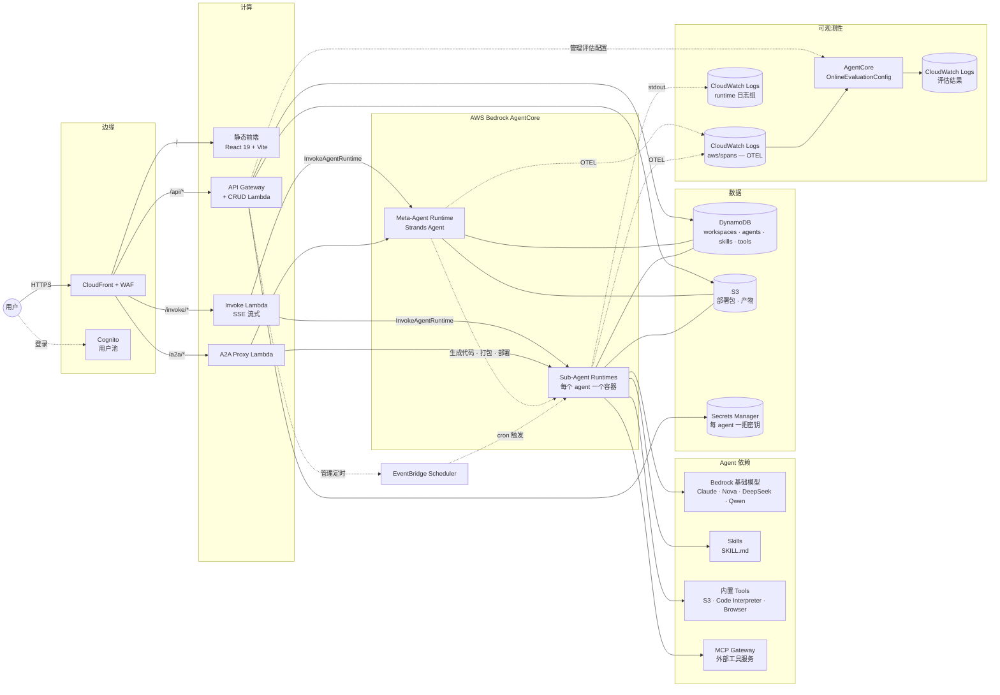
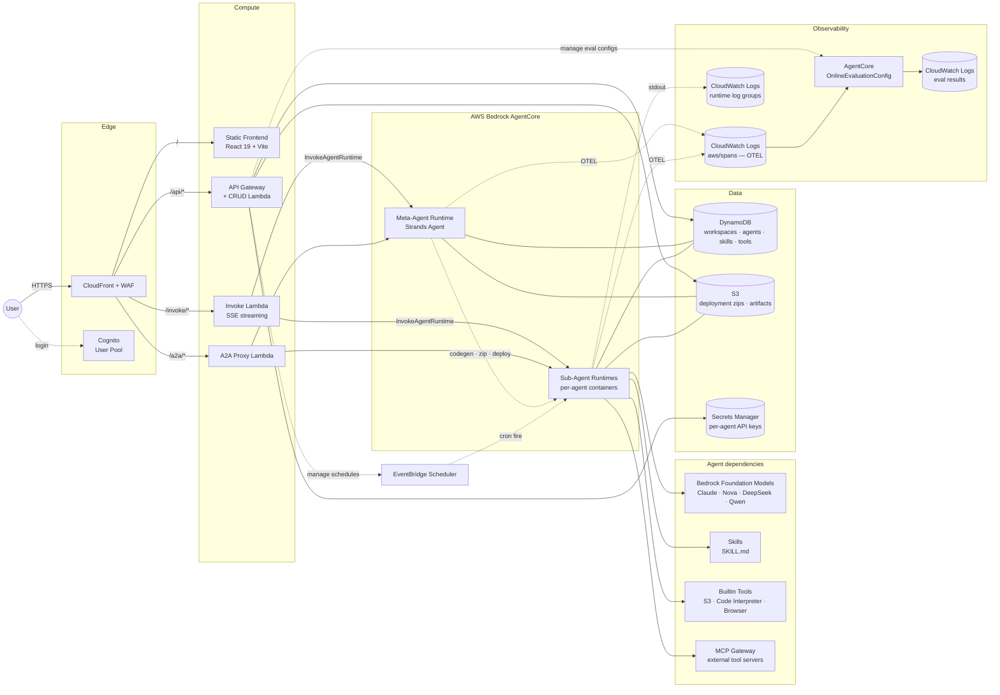

# 架构

完整系统图与组件说明。两句话总览见 [主 README](../README.md#架构)。

## 端到端图



## 请求路径

| 路径 | 链路 | 用途 |
|---|---|---|
| `/` | CloudFront → S3 | 前端静态资源 |
| `/api/*` | CloudFront → API Gateway → CRUD Lambda | JSON CRUD：workspace、agent、skill、tool、schedule、secret、endpoint、cost、trace、evaluation |
| `/invoke/*` | CloudFront OAC → Invoke Lambda (SigV4) | 流式代理到 AgentCore `InvokeAgentRuntime`。强制 W3C traceparent `Sampled=1`，让对话 span 进 OTEL |
| `/a2a/*` | CloudFront OAC → A2A Proxy Lambda | 外部 agent-to-agent 协议端点。CloudFront Function 在 OAC SigV4 签名前把 `Authorization` 改名为 `x-a2a-authorization` |

## 组件

### Meta-Agent
运行在 AgentCore Runtime 的单个 Strands Agent，外加约 25 个 tool，用来 CRUD DynamoDB / S3 / AgentCore runtimes。用户通过和 sub-agent 对话同一个聊天 UI 与之交互。

创建 sub-agent 流程：
1. 用户："帮我做个 code reviewer agent"
2. Meta-Agent 写 `main.py` / `tools.py` / `prompt.txt` / `config.json`
3. 下载 `s3://bucket/base/deployment.zip`，注入生成文件
4. 上传 `s3://bucket/agents/{id}/deployment.zip`
5. 调 AgentCore 控制面的 `create_agent_runtime`
6. 轮询直到 READY（≤300s）

### Sub-Agents
每个用户创建的 agent 对应一个 AgentCore Runtime。Python 3.10 Strands Agent，包含：
- 用户编写的 tool（`@tool` 装饰函数，存 DynamoDB，部署时组装）
- 用户编写的 skill（AgentSkills.io 格式，存 S3，运行时经 `load_skill` 按需加载）
- 捆绑内置 tool：`upload_to_s3`、`run_command`（Code Interpreter）、`fetch_webpage`（Browser）、`read_document`、`web_search` 等
- 可选 MCP gateway tool（走 workspace 的 MCP Gateway）

发出的 span 里 `resource.attributes.service.name` 就是 agent runtime id（如 `CustomerServiceBot-y3res08W8S`），Traces / Evaluations / Costs 页签都按这个 key 过滤。

### Evaluator
AgentCore OnlineEvaluationConfig，每个 agent 一个（AgentCore 限制 `serviceNames` 只能一个元素，无法 per-workspace）。评估器监听 `aws/spans` 按 service.name 过滤，对 100% 完成会话跑 LLM-as-Judge（Correctness / Helpfulness / GoalSuccessRate）。结果写入 `/aws/bedrock-agentcore/evaluations/results/<config-id>`。

CRUD 生命周期：
- 在 `lambda/crud/agents.py::create_agent` 钩子里创建
- 在 `create_agent::delete_agent` 钩子里删除

### Scheduler
EventBridge Scheduler 调用 AWS SDK Universal Target `aws-sdk:bedrockagentcore:invokeAgentRuntime`。关键坑：`RuntimeSessionId` 必须是 `Target.Input` 的顶层字段（不能只放在 `Payload` 里），否则调用会静默失败。Session id 形如 `sched-{suffix}-<aws.scheduler.scheduled-time>`，UI 里 Recent Runs 可按 session 前缀过滤 span。

"Run now" 创建一个 `at(now+5s)` 的一次性定时任务，触发后自删 —— 和真正 cron 走同一套代码，但 <1s 返回（避免冷启动偏重的 agent 把 Lambda 打 timeout）。

### 可观测数据流

```
sub-agent 进程
    ├── Strands Agent → OTEL tracer → aws/spans log group
    │       └── 按 agent 的 service.name + session.id 属性
    │       └── gen_ai.* 属性：模型、输入/输出 token、延迟
    └── stdout（业务输出）→ runtime log group
            └── 流名：runtime-logs-<sessionId>-<uuid>

aws/spans
    ├── Traces 页签消费（列表 / 会话详情 / 统计）
    ├── Evaluations 页签消费（通过 OnlineEvaluationConfig）
    └── Costs 页签消费（token / 调用次数聚合）

runtime log groups
    └── Logs 页签 + Traces 响应卡片消费
```

## 前端

- React 19 + Vite 8 + Tailwind 4
- hash 路由（`createHashRouter`）—— CloudFront 不用配 SPA 404 回写；`/api/*` 的 404 以 JSON 原样透传
- 每个领域一个 Zustand store（agents / skills / tools / ui / workspace）
- 所有代码编辑统一用 Monaco
- Amplify Auth（Cognito）登录

Agent 详情页采用 sticky 侧栏 + IntersectionObserver lazy-mount（Logs / Traces / Evaluations / Costs 不会在页面加载时全部打后端）。当前 section 按 agentId 持久化到 `sessionStorage`。

## 基础设施（AWS CDK, TypeScript）

| Stack | 关键资源 |
|---|---|
| `WafStack` (us-east-1) | 正则 + 限流规则；绑定到 CloudFront |
| `AgentStudioStack` (应用区域) | Cognito、DynamoDB、API Gateway + CRUD Lambda、Invoke Lambda、A2A Proxy Lambda、CloudFront + OAC、S3、Secrets Manager |

命名与安全规则由 CDK aspects + pre-commit hook 在代码里强制执行，不靠文档自觉。详见 `infra/lib/aspects/public-access-guard.ts`。

---

# Architecture (English)

Full system diagram and component-by-component notes. For the
2-sentence pitch see [the main README](../README.md#architecture).

## End-to-end diagram



## Request paths

| Path | Route | Purpose |
|---|---|---|
| `/` | CloudFront → S3 | Static frontend assets |
| `/api/*` | CloudFront → API Gateway → CRUD Lambda | JSON CRUD: workspaces, agents, skills, tools, schedules, secrets, endpoints, costs, traces, evaluations |
| `/invoke/*` | CloudFront OAC → Invoke Lambda (SigV4) | SSE streaming proxy to AgentCore `InvokeAgentRuntime`. Forces W3C traceparent with `Sampled=1` so chat spans land in OTEL |
| `/a2a/*` | CloudFront OAC → A2A Proxy Lambda | External agent-to-agent protocol endpoint. CloudFront Function renames `Authorization` → `x-a2a-authorization` before OAC SigV4 signing |

## Components

### Meta-Agent
Single Strands Agent running on AgentCore Runtime, plus ~25 tools that
CRUD DynamoDB / S3 / AgentCore runtimes. Users talk to it through the
same chat UI they use to talk to their sub-agents.

Flow for creating a new sub-agent:
1. User: "make me a code reviewer agent"
2. Meta-Agent writes `main.py` / `tools.py` / `prompt.txt` / `config.json`
3. Downloads `s3://bucket/base/deployment.zip`, injects generated files
4. Uploads `s3://bucket/agents/{id}/deployment.zip`
5. Calls `create_agent_runtime` on AgentCore control plane
6. Polls until READY (≤300 s)

### Sub-Agents
One AgentCore Runtime per user-created agent. Python 3.10 Strands
Agent with:
- User-authored tools (`@tool`-decorated functions, stored in DynamoDB, assembled at deploy)
- User-authored skills (AgentSkills.io format, stored in S3, loaded on demand via `load_skill`)
- Bundled builtin tools: `upload_to_s3`, `run_command` (Code Interpreter), `fetch_webpage` (Browser), `read_document`, `web_search`, etc.
- Optional MCP gateway tools via the workspace's MCP Gateway

`resource.attributes.service.name` on emitted spans is the agent
runtime id (e.g. `CustomerServiceBot-y3res08W8S`). This is the key the
Traces / Evaluations / Costs tabs use to filter.

### Evaluator
AgentCore OnlineEvaluationConfig, one per agent (AgentCore restricts
`serviceNames` to a single element, so per-workspace doesn't work). The
evaluator watches `aws/spans` filtered by the agent's service.name and
runs LLM-as-Judge (Correctness / Helpfulness / GoalSuccessRate) on
100% of completed sessions. Results land in
`/aws/bedrock-agentcore/evaluations/results/<config-id>`.

CRUD lifecycle:
- Created from `lambda/crud/agents.py::create_agent` (hook)
- Deleted from `create_agent::delete_agent` (hook)

### Scheduler
EventBridge Scheduler targets the AWS SDK Universal Target
`aws-sdk:bedrockagentcore:invokeAgentRuntime`. Key gotcha:
`RuntimeSessionId` must be a top-level field in `Target.Input` (not
just inside `Payload`), otherwise invocations silently fail. Session
ids are shaped `sched-{suffix}-<aws.scheduler.scheduled-time>` so
Recent Runs in the UI can filter spans by session prefix.

"Run now" creates a one-shot `at(now+5s)` schedule that deletes itself
after firing — identical code path to real cron, but returns in <1 s
(no Lambda timeout risk for cold-start-heavy agents).

### Observability data flow

```
sub-agent process
    ├── Strands Agent → OTEL tracer → aws/spans log group
    │       └── per-agent service.name + session.id attributes
    │       └── gen_ai.* attrs: model, input/output tokens, latency
    └── stdout (business output) → runtime log group
            └── stream name: runtime-logs-<sessionId>-<uuid>

aws/spans
    ├── consumed by Traces tab (list / session detail / stats)
    ├── consumed by Evaluations tab (via OnlineEvaluationConfig)
    └── consumed by Costs tab (token / invocation aggregates)

runtime log groups
    └── consumed by Logs tab + Traces response card
```

## Frontend

- React 19 + Vite 8 + Tailwind 4
- Hash-based router (`createHashRouter`) — no SPA 404 rewrite on
  CloudFront needed; `/api/*` 404s pass through as JSON
- Per-domain Zustand stores (agents, skills, tools, ui, workspace)
- Monaco editor for all code editing
- Amplify Auth (Cognito) for login

Agent detail page uses a sticky side-nav + IntersectionObserver
lazy-mount per section (Logs / Traces / Evaluations / Costs don't all
hit their respective backends on page load). Active section persisted
per-agent in `sessionStorage`.

## Infrastructure (AWS CDK, TypeScript)

| Stack | Key resources |
|---|---|
| `WafStack` (us-east-1) | Regex + rate-limit rules; bound to CloudFront |
| `AgentStudioStack` (app region) | Cognito, DynamoDB, API Gateway + CRUD Lambda, Invoke Lambda, A2A Proxy Lambda, CloudFront + OAC, S3, Secrets Manager |

Naming and security rules are enforced in code (CDK aspects +
pre-commit hook), not in docs. See `infra/lib/aspects/public-access-guard.ts`.
