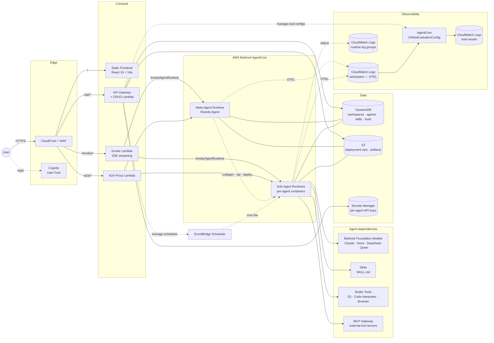

# Architecture

Full system diagram and component-by-component notes. For the
2-sentence pitch see [the main README](../README.md#architecture).

## End-to-end diagram



## Request paths

| Path | Route | Purpose |
|---|---|---|
| `/` | CloudFront → S3 | Static frontend assets |
| `/api/*` | CloudFront → API Gateway → CRUD Lambda | JSON CRUD: workspaces, agents, skills, tools, schedules, secrets, endpoints, costs, traces, evaluations |
| `/invoke/*` | CloudFront OAC → Invoke Lambda (SigV4) | SSE streaming proxy to AgentCore `InvokeAgentRuntime`. Forces W3C traceparent with `Sampled=1` so chat spans land in OTEL |
| `/a2a/*` | CloudFront OAC → A2A Proxy Lambda | External agent-to-agent protocol endpoint. CloudFront Function renames `Authorization` → `x-a2a-authorization` before OAC SigV4 signing |

## Components

### Meta-Agent
Single Strands Agent running on AgentCore Runtime, plus ~25 tools that
CRUD DynamoDB / S3 / AgentCore runtimes. Users talk to it through the
same chat UI they use to talk to their sub-agents.

Flow for creating a new sub-agent:
1. User: "make me a code reviewer agent"
2. Meta-Agent writes `main.py` / `tools.py` / `prompt.txt` / `config.json`
3. Downloads `s3://bucket/base/deployment.zip`, injects generated files
4. Uploads `s3://bucket/agents/{id}/deployment.zip`
5. Calls `create_agent_runtime` on AgentCore control plane
6. Polls until READY (≤300 s)

### Sub-Agents
One AgentCore Runtime per user-created agent. Python 3.10 Strands
Agent with:
- User-authored tools (`@tool`-decorated functions, stored in DynamoDB, assembled at deploy)
- User-authored skills (AgentSkills.io format, stored in S3, loaded on demand via `load_skill`)
- Bundled builtin tools: `upload_to_s3`, `run_command` (Code Interpreter), `fetch_webpage` (Browser), `read_document`, `web_search`, etc.
- Optional MCP gateway tools via the workspace's MCP Gateway

`resource.attributes.service.name` on emitted spans is the agent
runtime id (e.g. `CustomerServiceBot-y3res08W8S`). This is the key the
Traces / Evaluations / Costs tabs use to filter.

### Evaluator
AgentCore OnlineEvaluationConfig, one per agent (AgentCore restricts
`serviceNames` to a single element, so per-workspace doesn't work). The
evaluator watches `aws/spans` filtered by the agent's service.name and
runs LLM-as-Judge (Correctness / Helpfulness / GoalSuccessRate) on
100% of completed sessions. Results land in
`/aws/bedrock-agentcore/evaluations/results/<config-id>`.

CRUD lifecycle:
- Created from `lambda/crud/agents.py::create_agent` (hook)
- Deleted from `create_agent::delete_agent` (hook)
- Backfill script: `scripts/backfill_eval_configs.py`

### Scheduler
EventBridge Scheduler targets the AWS SDK Universal Target
`aws-sdk:bedrockagentcore:invokeAgentRuntime`. Key gotcha:
`RuntimeSessionId` must be a top-level field in `Target.Input` (not
just inside `Payload`), otherwise invocations silently fail. Session
ids are shaped `sched-{suffix}-<aws.scheduler.scheduled-time>` so
Recent Runs in the UI can filter spans by session prefix.

"Run now" creates a one-shot `at(now+5s)` schedule that deletes itself
after firing — identical code path to real cron, but returns in <1 s
(no Lambda timeout risk for cold-start-heavy agents).

### Observability data flow

```
sub-agent process
    ├── Strands Agent → OTEL tracer → aws/spans log group
    │       └── per-agent service.name + session.id attributes
    │       └── gen_ai.* attrs: model, input/output tokens, latency
    └── stdout (business output) → runtime log group
            └── stream name: runtime-logs-<sessionId>-<uuid>

aws/spans
    ├── consumed by Traces tab (list / session detail / stats)
    ├── consumed by Evaluations tab (via OnlineEvaluationConfig)
    └── consumed by Costs tab (token / invocation aggregates)

runtime log groups
    └── consumed by Logs tab + Traces response card
```

## Frontend

- React 19 + Vite 8 + Tailwind 4
- Hash-based router (`createHashRouter`) — no SPA 404 rewrite on
  CloudFront needed; `/api/*` 404s pass through as JSON
- Per-domain Zustand stores (agents, skills, tools, ui, workspace)
- Monaco editor for all code editing
- Amplify Auth (Cognito) for login

Agent detail page uses a sticky side-nav + IntersectionObserver
lazy-mount per section (Logs / Traces / Evaluations / Costs don't all
hit their respective backends on page load). Active section persisted
per-agent in `sessionStorage`.

## Infrastructure (AWS CDK, TypeScript)

| Stack | Key resources |
|---|---|
| `WafStack` (us-east-1) | Regex + rate-limit rules; bound to CloudFront |
| `AgentStudioStack` (app region) | Cognito, DynamoDB, API Gateway + CRUD Lambda, Invoke Lambda, A2A Proxy Lambda, CloudFront + OAC, S3, Secrets Manager |

Naming and security rules are enforced in code (CDK aspects +
pre-commit hook), not in docs. See `infra/lib/aspects/public-access-guard.ts`.
