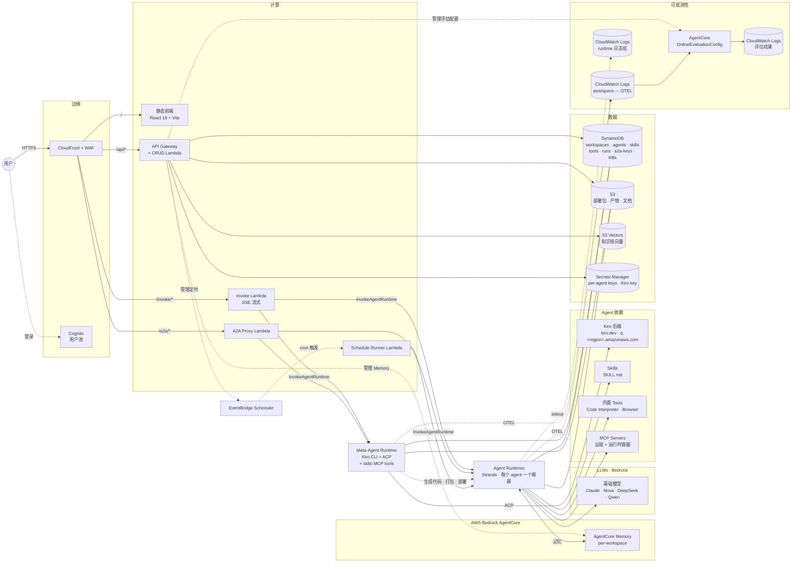
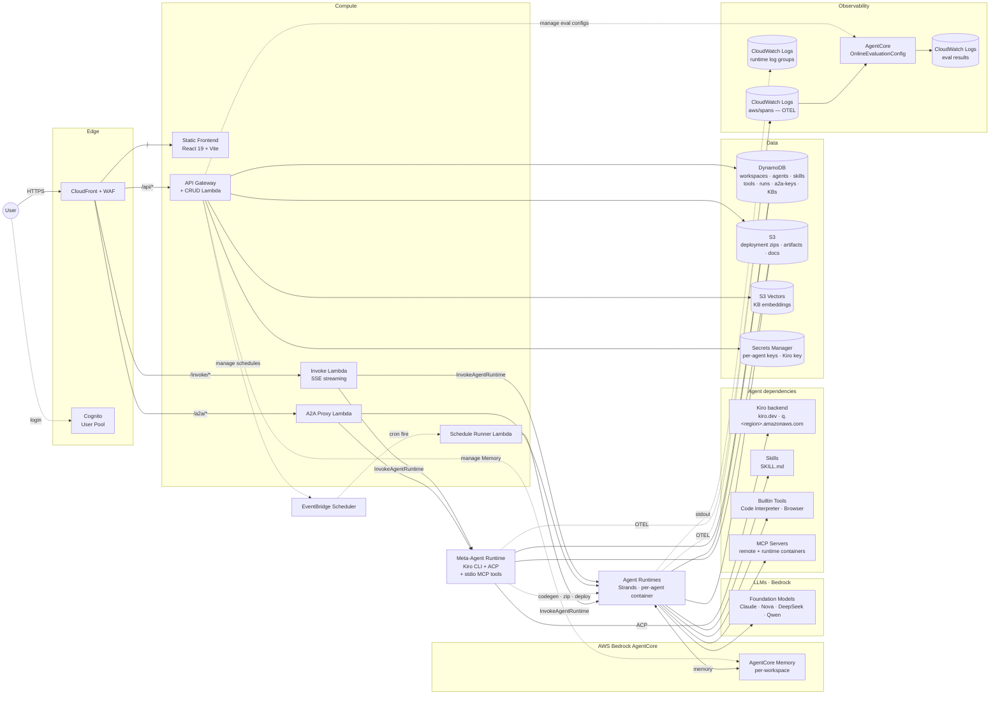

# 架构

完整系统图与组件说明。简要概览见 [主 README](../README.md#架构)。

## 端到端图



## 请求路径

| 路径 | 链路 | 用途 |
|---|---|---|
| `/` | CloudFront → S3 | 前端静态资源 |
| `/api/*` | CloudFront → API Gateway → CRUD Lambda | JSON CRUD：workspace、agent、skill、tool、schedule、secret、endpoint、cost、trace、evaluation、memory、KB、upload、MCP |
| `/invoke/*` | CloudFront OAC → Invoke Lambda (SigV4) | 流式代理到 AgentCore `InvokeAgentRuntime`。强制 W3C traceparent `Sampled=1`，让对话 span 进 OTEL |
| `/a2a/*` | CloudFront OAC → A2A Proxy Lambda | 外部 agent-to-agent 协议端点。CloudFront Function 在 OAC SigV4 签名前把 `Authorization` 改名为 `x-a2a-authorization` |

## 组件

### Meta-Agent（Kiro-backed）

推理后端是 Kiro CLI。AgentCore 容器启动后，`main.py` 通过 `KiroACPClient` 启动 `kiro-cli-chat acp --agent meta-agent` 子进程，通过 ACP 协议驱动对话。全部 46 个 `@tool` 函数通过 **stdio MCP subprocess** 暴露给 Kiro，调用在进程内完成，无需经过网络（HTTP 方案因 AgentCore 网络沙箱阻断 loopback TCP 而弃用）。适配层实现见 `meta-agent/kiro_adapter/`。

**单次调用流水线：**

1. `invoke()` 入口立即 yield 零字节 keepalive（防止 AgentCore 30s 首字节超时）
2. 解析 payload：`prompt`, `history`, `model_id`, `caller_id`, `workspace_id`, `mode`, `action`, `language`
3. `apply_scope(caller_id, workspace_id)` 注入当次调用身份
4. `ensure_kiro_home()` 写入 system prompt、agent config、MCP 配置到 `/mnt/kiro`（sessionStorage 持久挂载）
5. 创建 `KiroACPClient`，尝试 `session/load(saved_uuid)`；失败则 `session/new`
6. 每轮 user prompt → Kiro 流式 `session/update` 事件 → `sse_mapper.py` 转换为前端 SSE 帧（文本 + `__tool` 标记）
7. Auto-continue 监督器：若 Kiro 结束回合时未输出 `[[TASK_COMPLETE]]` 标记但已触发过工具调用，自动追加 "Continue." 再执行一轮，最多 3 轮
8. 异常安全包裹：`ACPError` / general exception → 安全错误信封（不泄露内部路径/prompt）

**Mode 路由：**

| Mode | Agent 配置 | 工具 |
|---|---|---|
| `default` | `META_AGENT_NAME` | 全部 46 tools |
| `skill_edit` | `SKILL_EDIT_AGENT_NAME` | 无工具（输出 `__file_content:PATH` 块） |
| `agent_edit` | `AGENT_EDIT_AGENT_NAME` | 无工具（纯文本指导） |

**短路 Action：**

| Action | 功能 |
|---|---|
| `list_models` | 执行 `kiro-cli-chat chat --list-models`，向前端 picker 返回当前模型目录 |
| `get_usage` | 执行 `kiro-cli-chat chat "/usage"`，正则解析 TUI 输出返回 credits / limit / reset date / tier / overage |

**Kiro Adapter 架构：**

```
Browser SSE → Lambda → AgentCore Runtime
├── 1. mcp_stdio_server.py: stdio MCP subprocess
│      包装 46 个 @tool 函数为 MCP tools（Kiro spawn → stdin/stdout JSON-RPC）
├── 2. kiro_home.py: 物化 KIRO_HOME (/tmp/kiro-home)
│      ├─ .kiro/agents/meta-agent.json
│      ├─ prompts/meta-agent.md (system prompt)
│      └─ .kiro/settings/mcp.json (本地 HTTP MCP)
├── 3. acp_client.py: JSON-RPC over stdio → kiro-cli acp 子进程
├── 4. sse_mapper.py: ACP 事件 → Agent Studio SSE 帧
└── 5. 持久化: /mnt/kiro/kiro_session.txt (session uuid 跨容器复用)
```

**存储分层：**
- `/tmp/kiro-home/` — Kiro 的 $HOME（临时 ext4，不能是 NFS）
- `/mnt/kiro/` — AgentCore sessionStorage（跨调用持久），保存 session uuid

**46 个工具分类：**

| 能力域 | 工具 |
|---|---|
| Agent 管理 (11) | `create_agent`, `create_harness_agent`, `list_agents`, `get_agent_detail`, `update_agent`, `update_harness_agent`, `delete_agent`, `delete_harness_agent`, `restore_agent`, `purge_agent`, `invoke_agent` |
| Skill 系统 (11) | `create_skill`, `list_skills`, `list_skill_files`, `read_skill_file`, `write_skill_file`, `delete_skill_file_in_skill`, `update_skill`, `delete_skill`, `import_skill`, `sync_agent_skill`, `attach_agent_skill` |
| 知识库 (9) | `kb_create`, `kb_upload_document`, `kb_list`, `kb_get`, `kb_check_ingestion`, `kb_delete`, `kb_delete_document`, `kb_attach_to_agent`, `kb_detach_from_agent` |
| 代码与工具 (3) | `preview_assembled_code`, `list_tool_library`, `get_tool_library_code` |
| MCP (2) | `list_mcp_servers`, `list_mcp_target_tools` |
| Agent 互调 (2) | `link_agent`, `unlink_agent` |
| 调试与可观测 (2) | `check_agent_logs`, `analyze_trace` |
| 密钥与权限 (4) | `set_agent_secrets`, `list_agent_secrets`, `delete_agent_secret`, `check_workspace_permissions` |
| 部署 (1) | `validate_agent` |
| 定时 (1) | `create_schedule` |

### Kiro Key & Credits

每 workspace 一把 Kiro API Key，存 `agent-studio/workspaces/{wsId}/kiro-api-key`（Secrets Manager），带 `kiroRegion` tag（`us-east-1` 或 `eu-central-1`）。

| 路由 | 角色 | 功能 |
|---|---|---|
| `GET /api/workspaces/{wsId}/kiro-key` | viewer+ | 返回 `{configured, region, lastUpdated, updatedBy}`，不返回明文密钥 |
| `PUT /api/workspaces/{wsId}/kiro-key` | admin | 写入 key 与 region，刷新 `updatedBy` 标签，清除用量缓存 |
| `DELETE /api/workspaces/{wsId}/kiro-key` | admin | 删除 key，清除用量缓存 |
| `GET /api/workspaces/{wsId}/kiro-key/usage` | viewer+ | 以 `action=get_usage` 调用 Meta-Agent，返回 credits / limit / reset date / tier / overage rate，60 秒进程内缓存 |

CRUD Lambda 对 `bedrock-agentcore:InvokeAgentRuntime` 的 Resource 指定精确的 Meta-Agent runtime ARN（不含通配符），且该语句只授予这一项 Action。

### Agents

每个用户创建的 Agent 对应一个 AgentCore Runtime。Python 3.10 Strands Agent，包含：
- 用户编写的 tool（`@tool` 装饰函数，存 DynamoDB，部署时组装）
- 用户编写的 skill（AgentSkills.io 格式，存 S3，运行时经 `load_skill` 按需加载）
- 捆绑内置 tool：`upload_to_s3`、`run_command`（Code Interpreter）、`fetch_webpage`（Browser）、`read_document`、`web_search` 等
- 可选 MCP gateway tool（走 workspace 的 MCP Gateway）
- 可选 A2A linked agents（`invoke_linked_agent` 工具）

emit 的 span 中 `resource.attributes.service.name` 即 agent runtime id（如 `CustomerServiceBot-y3res08W8S`），Runs / Evaluations / Costs 页签均以此为过滤条件。

**两种运行时：**

| 运行时 | 适合 | Base zip |
|---|---|---|
| **zip**（默认） | 需要自定义 Python 工具、MCP、Skills、A2A 关联 | `base/agent-deployment.zip`（含 Playwright + strands-agents-tools） |
| **harness**（实验性） | 只需 prompt + 模型 + 长期记忆，追求创建可靠性和最短冷启动 | 无 zip，AgentCore 原生 |

### 预构建工具库 (tools_library/)

8 个预构建 tool 模板，Meta-Agent 通过 `list_tool_library` / `get_tool_library_code` 查阅后按需组装进 Agent：

| 模板 | 功能 |
|---|---|
| `web_search` | Web 搜索 |
| `fetch_webpage` | 网页内容提取 |
| `s3_read` | S3 对象读取 |
| `sql_readonly` | 只读 SQL 查询 |
| `translate` | 文本翻译 |
| `chart_generator` | 数据可视化 |
| `agent_caller` | 调用其他 Agent |
| `kb_retrieve` | 知识库检索 |

`registry.py` 管理目录：`assemble_tools(tool_ids)` 组装代码 + 名称到 Agent zip；`upload_tool_catalog()` 同步内置工具到 DynamoDB + S3 目录。

### Memory（AgentCore Memory）

每个 workspace 一个 AgentCore Memory 资源，workspace 创建时自动建立。内含 4 种内置策略：`userPreference`（偏好）、`semantic`（事实）、`summary`（摘要）、`episodic`（场景）。

Actor 隔离模型：`actorId = "{agentId}_{callerId}"`，按 Agent × 用户粒度天然隔离。

运行时行为（`meta-agent/templates/_memory_context_src.py`）：
- **invoke 开始**：并行预取偏好（`ListMemoryRecords`）+ 摘要（`RetrieveMemoryRecords` 语义搜索），注入 system prompt
- **invoke 结束**：fire-and-forget 写入用户 turn 和助手 turn（`CreateEvent`）
- **按需检索**：`recall_facts` 和 `recall_episodes` 两个 tool，Agent 主动调用时走语义搜索

| 端点 | 用途 |
|---|---|
| `GET /agents/{id}/my-memories` | 列出当前用户在当前 Agent 下的记忆（分 4 种策略，支持分页） |
| `DELETE /agents/{id}/my-memories/{recordId}` | 单条删除（含 actorId 归属校验） |
| `DELETE /agents/{id}/my-memories` | 全部清除（hard cap 1000/次） |
| `POST /workspaces/{id}/memory/repair` | Workspace owner 重建 Memory 资源 |

### 知识库 (Knowledge Base)

三层 AWS 服务协同：
- **S3 Vectors** — 向量索引（Cohere Multilingual v3 嵌入，1024 维，cosine 距离）
- **Bedrock Knowledge Base** — 托管 KB + Data Source，自动分块与摄取
- **S3** — 源文档存储（workspace/KB 前缀隔离）

支持文档类型：PDF, MD, TXT, HTML, CSV, DOCX, XLSX, PPTX（单文件 50MB 上限）

| 端点 | 用途 |
|---|---|
| `GET /knowledge-bases` | 列出 workspace 下所有 KB |
| `GET /knowledge-bases/{kbId}` | KB 详情 + 文档列表 + 摄取状态 |
| `POST /knowledge-bases` | 创建 KB（S3 Vectors 索引 + Bedrock KB + Data Source） |
| `DELETE /knowledge-bases/{kbId}` | 软删除 → 异步清理（data source, KB, vector index, S3, agent 绑定） |
| `POST /knowledge-bases/{kbId}/documents` | 上传文档并触发摄取 |
| `POST /knowledge-bases/{kbId}/documents/delete` | 删除文档并重新摄取 |
| `GET /knowledge-bases/{kbId}/ingestion` | 摄取任务历史（最近 5 条） |

Agent 通过 `kb_retrieve` 内置 tool 检索 KB 内容。Meta-Agent 通过 KB 工具组（9 个）管理全生命周期。

### MCP 工具集

**双层架构：**

| 类型 | 特点 | 示例 |
|---|---|---|
| 远程 Target（零部署） | 直接注册远程 HTTP 端点，SigV4 认证 | `aws-api`, `aws-knowledge`, `aws-pricing` |
| 运行时 Target（容器部署） | Docker 镜像，mcp-proxy 桥接 stdio→HTTP/8000 | `cloudwatch`, `cloudtrail`, `s3`, `dynamodb`, `bedrock-kb` 等 |

**单一数据源：** `mcp-runtime/mcp-registry.yaml`（29KB），定义 60+ 个 target 的：
- IAM 策略声明
- 敏感度等级（low / medium / high）
- 可用区域限制
- 类别标签（14 个分类：general, observability, security, cost, compute, database, messaging, ai_ml, search, networking, industry, data, devtools, operations）

**IAM 权限流：**
1. `scripts/sync-mcp-iam-policies.py` 从 registry 提取策略 → 生成 `lambda/crud/mcp_iam_registry.py`
2. CDK `McpRoles` construct 从 registry 生成 `AgentStudioMCP-{name}` per-target IAM 角色
3. 启用 target 时 CRUD Lambda 合并 IAM 策略到 workspace 角色的 `WorkspaceGrants` 内联策略
4. `SimulatePrincipalPolicy` 实时探测 → 前端展示已授权/缺失 action

### Evaluator

每个 Agent 对应一个 AgentCore OnlineEvaluationConfig 实例。评估器按 `service.name` 过滤 `aws/spans`，对所有完成的会话执行 LLM-as-Judge（Correctness / Helpfulness / GoalSuccessRate）评分。结果写入 `/aws/bedrock-agentcore/evaluations/results/<config-id>`。

生命周期：
- 由 `lambda/crud/agents.py::create_agent` hook 创建
- 由 `lambda/crud/agents.py::delete_agent` hook 删除

### Scheduler

EventBridge Scheduler 通过 **Schedule Runner Lambda** 调用 Agent。Runner Lambda（Node.js 22, 900s 超时）drain 完整的 AgentCore 流式响应，使 Agent 内部的 `_stream_and_record` 处理器能写入 run 记录到 DynamoDB + S3。

注意事项：`RuntimeSessionId` 必须置于 `Target.Input` 顶层字段，仅放在 `Payload` 中会导致调用静默失败。Session id 采用 `sched-{suffix}-<aws.scheduler.scheduled-time>` 格式，便于 UI 的 Recent Runs 按 session 前缀过滤 span。

"Run now" 会创建一个 `at(now+5s)` 的一次性定时任务，触发后自动删除。

### 可观测数据流

```
Agent 进程
    ├── Strands Agent → OTEL tracer → aws/spans log group
    │       └── 按 Agent 的 service.name + session.id 属性
    │       └── gen_ai.* 属性：模型、输入/输出 token、延迟
    └── stdout（业务输出）→ runtime log group
            └── 流名：runtime-logs-<sessionId>-<uuid>

aws/spans
    ├── Traces 页签消费（会话列表 + 展开详情，复用 RunDetail）
    ├── StatsStrip 消费（调用数 / 错误率 / p95 延迟 / 平均延迟 + sparkline）
    ├── Runs 页签消费（每行按 session id 分类为 定时/手动/聊天）
    ├── Evaluations 页签消费（通过 OnlineEvaluationConfig）
    └── Costs 页签消费（token / 调用次数聚合）

runtime log groups
    └── Logs 页签 + Runs 响应卡片消费
```

## 前端

### 技术栈
- React 19 + Vite 8 + Tailwind 4 + TypeScript 5.9 (strict)
- Hash 路由（`createHashRouter`）—— CloudFront 不用配 SPA 404 回写
- Zustand 5（11 个 store）
- Monaco Editor（统一代码编辑器）
- Amplify Auth（Cognito）+ i18next（中英双语）

### Store 架构

| Store | 职责 |
|---|---|
| `agent-list-store` | Agent 列表 + 归档 + 分页 |
| `agent-edit-store` | Agent 表单编辑 + 本地 draft 自动保存 |
| `chat-store` | 多轮对话 + tool 调用记录 + 流式处理 |
| `edit-assistant-store` | AI 辅助编辑 Agent 表单（持久化到 S3） |
| `skill-assistant-store` | AI 辅助编辑 Skill 文件 |
| `tool-assistant-store` | AI 辅助编辑 Tool 代码 |
| `kb-store` | 知识库管理（列表、创建、删除、文档操作） |
| `tool-library-store` | 工具模板库 + 软删除/恢复 |
| `memory-store` | Agent 记忆管理（4 种策略分桶 + 分页） |
| `ui-settings-store` | 主题/语言/布局（localStorage 持久化） |
| `workspace-store` | Workspace 切换 + 角色管理 |

### 路由结构

```
/
├── /agents                          # Agent 列表（ChatPanel）
│   ├── /agents/chat/:agentId        # Agent 对话
│   ├── /agents/edit/:agentId        # Agent 编辑表单
│   │   └── /skills/:skillId         # 嵌套 Skill 编辑
│   ├── /agents/:agentId             # Agent 详情/分析
│   └── /agents/:agentId/runs/:runId # 单次运行详情
├── /skills                          # Skill 库
│   └── /skills/:skillId             # Skill 详情/编辑器
├── /tools                           # Tool 库
│   └── /tools/:toolId               # Tool 详情/编辑器
├── /knowledge-bases                 # 知识库列表
│   └── /knowledge-bases/:kbId       # KB 详情/文档管理
├── /mcp                             # MCP 目录（14 个分类）
├── /mcp-policy                      # MCP 策略管理
├── /marketplace                     # 公共市场（Agent/Skill/Tool 标签页）
├── /costs                           # 成本分析（24h/7d/30d）
├── /admin                           # 管理控制台（平台管理员）
└── /settings                        # Workspace/账号设置
```

### Agent 详情页结构

Sticky 侧栏 + IntersectionObserver lazy-mount：
- **顶部**：StatsStrip（4 指标卡片 + sparkline，24h/7d 切换）
- **主体**：Traces → Schedules → Evaluations → Costs → Integration
- **底部 Advanced 折叠**：Deployments → Endpoints → Secrets → Logs

单个运行可通过 `/agents/:id/runs/:sessionId` 直接分享。

### 关键组件

| 组件 | 用途 |
|---|---|
| `ChatPanel` | 主聊天界面（含记忆抽屉 💭） |
| `AgentEditForm` | Agent 配置表单（含 EditAssistant AI 侧栏） |
| `AgentDetailPage` | Agent 详情/分析面板 |
| `McpTargetSelector` | MCP target 多选器 |
| `MemoryDrawer` | 记忆管理抽屉 |
| `MarketplacePage` | 公共市场（标签式浏览 + 克隆） |
| `AdminConsolePage` | 平台管理（workspace IAM + 成本） |
| `KBDetail` | 知识库详情（文档表格 + 摄取状态） |

## 基础设施（AWS CDK, TypeScript）

### Stack 结构

| Stack | 关键资源 |
|---|---|
| `WafStack` (us-east-1) | 正则 + 限流规则；绑定到 CloudFront |
| `AgentStudioStack` (应用区域) | 见下方 Construct 列表 |

### Construct 清单

| Construct | 创建的资源 |
|---|---|
| `auth.ts` | Cognito User Pool + Identity Pool |
| `database.ts` | DynamoDB 表 ×7（workspaces, agents, skills, tools, runs, a2a-keys, knowledge-bases） |
| `api.ts` | API Gateway + CRUD Lambda (Python 3.12) |
| `invoke.ts` | Invoke Lambda (Node.js 22) + Function URL |
| `a2a-proxy.ts` | A2A Proxy Lambda + Function URL |
| `schedule-runner.ts` | Schedule Runner Lambda (Node.js 22, 900s 超时) |
| `cdn.ts` | CloudFront + OAC + CloudFront Function（header rename） |
| `base-deployment.ts` | S3 base zip 管理 |
| `meta-agent-runtime.ts` | Meta-Agent AgentCore Runtime（PUBLIC 网络 + HTTP 协议） |
| `kb-vectors.ts` | S3 Vector Bucket + KB IAM 服务角色 |
| `mcp-roles.ts` | Per-target MCP IAM 角色（从 registry 生成） |
| `roles.ts` | 共享角色（SubAgent-basic, MetaAgent, SchedulerTarget） |
| `workspace-boundary.ts` | Permission Boundary 托管策略（AgentStudioWorkspaceCeiling） |
| `agentcore-shared.ts` | AgentCore 共享配置 |

### DynamoDB 表

| 表 | PK | SK | GSI | 备注 |
|---|---|---|---|---|
| `agent-studio-workspaces` | `workspaceId` | `sk` | `user-index`(userId + workspaceId) | Streams(NEW_AND_OLD_IMAGES), TTL(`expires_at`) |
| `agent-studio-agents` | — | — | — | 从现有表导入（`Table.fromTableName`） |
| `agent-studio-skills` | `skillId` | — | `workspace-index`(workspace_id + created_at) | — |
| `agent-studio-tools` | — | — | — | 从现有表导入（`Table.fromTableName`） |
| `agent-studio-runs` | `agentId` | `runId` | `schedule-index`(scheduleId + startedAt) | TTL(`ttl`) |
| `agent-studio-a2a-keys` | `apiKeyHash` | — | `user-agent-index`(userAgentKey + createdAt) | — |
| `agent-studio-knowledge-bases` | `ws_id` | `kb_id` | — | — |

所有 CDK 新建的表使用 PAY_PER_REQUEST 计费、PITR 启用、RETAIN 删除策略。

### Security Aspects

| Aspect | 作用 |
|---|---|
| `PublicAccessGuard` | Synth 时拒绝 Lambda Function URL `AuthType=NONE` 和 `Principal:"*"` resource policy |

通过 `app.ts` 全局应用，配合 pre-commit hook 双重防护。

### Workspace IAM 隔离

```
Workspace (普通用户)              Workspace (运维团队)
  │ 共享角色                         │ 自定义角色
  │ AgentStudioSubAgent-basic        │ AgentStudio-ws-{id}
  │                                  │   + Permission Boundary 封顶
  │ 平台工具 ✅                       │   + WorkspaceGrants inline policy
  │ AWS 服务工具 🔒                   │
  ▼                                  │ 平台工具 ✅
Agent (web_search, chart, skills)   │ AWS 服务工具 ✅ (已授权的)
                                     ▼
                                    Agent + MCP (同一 workspace 角色)
```

- **按需 opt-in**：大多数 workspace 用共享角色，不创建额外 IAM 资源
- **Permission Boundary**（`AgentStudioWorkspaceCeiling`）：定义 workspace 角色最大权限范围，显式 Deny IAM 变更 / STS 跨角色 / 横向移动
- **工具过滤**：`iam_policy` 声明 → `SimulatePrincipalPolicy` 探测 → `list_mcp_servers` 返回 `granted`/`denied` → `validate_agent` 部署前拦截
- **一键授权**：CRUD Lambda 代执行 `iam:PutRolePolicy`（rebuild-from-truth, DDB 乐观锁），boundary 封顶保证安全
- **MCP runtime 复用 workspace 角色**：Agent 和 MCP 容器同一 IAM 身份

### CRUD Lambda 路由注册

`lambda/crud/handler.py` 注册 20 个路由模块：

```
workspaces, agents, skills, tools, uploads, secrets, mcp,
runtime, traces, meta_agent, a2a_keys, schedules, costs,
logs, memories, runs, kiro_key, chat, workspace_iam, kb
```

入口 `lambda_handler` 先校验 `x-origin-verify` header（阻止绕过 CloudFront 直连 APIGW），再委托给 Powertools `APIGatewayRestResolver`。

### Marketplace（公共市场）

| 端点 | 用途 |
|---|---|
| `GET /api/public/agents` | 列出公开 Agent（分页，30s 缓存） |
| `GET /api/public/skills` | 列出公开 Skill |
| `GET /api/public/tools` | 列出公开 Tool |
| `POST /api/public/agents/{id}/clone` | 克隆 Agent 到目标 workspace（S3 产物复制，跳过 deployment.zip） |
| `POST /api/public/skills/{id}/clone` | 克隆 Skill |
| `POST /api/public/tools/{id}/clone` | 克隆 Tool |

元数据公开，源码克隆后才可见。前端 `MarketplacePage` 按 agent/skill/tool 三标签浏览。

---

# Architecture (English)

Full system diagram and component-by-component notes. For the
one-paragraph overview see [the main README](../README.md#architecture).

## End-to-end diagram



## Request paths

| Path | Route | Purpose |
|---|---|---|
| `/` | CloudFront → S3 | Static frontend assets |
| `/api/*` | CloudFront → API Gateway → CRUD Lambda | JSON CRUD: workspaces, agents, skills, tools, schedules, secrets, endpoints, costs, traces, evaluations, memories, KBs, uploads, MCP |
| `/invoke/*` | CloudFront OAC → Invoke Lambda (SigV4) | SSE streaming proxy to AgentCore `InvokeAgentRuntime`. Forces W3C traceparent with `Sampled=1` so chat spans land in OTEL |
| `/a2a/*` | CloudFront OAC → A2A Proxy Lambda | External agent-to-agent protocol endpoint. CloudFront Function renames `Authorization` → `x-a2a-authorization` before OAC SigV4 signing |

## Components

### Meta-Agent (Kiro-backed)

The reasoning backend is the Kiro CLI. When the AgentCore container boots, `main.py` spawns `kiro-cli-chat acp --agent meta-agent` via `KiroACPClient` and drives it over ACP. All 46 `@tool` functions are exposed to Kiro via a **local HTTP MCP Server** (FastMCP) — in-process calls, no network hop. The glue layer lives in `meta-agent/kiro_adapter/`.

**Per-invocation pipeline:**

1. `invoke()` entry immediately yields a zero-byte keepalive (prevents AgentCore's ~30s first-byte timeout)
2. Parse payload: `prompt`, `history`, `model_id`, `caller_id`, `workspace_id`, `mode`, `action`, `language`
3. `apply_scope(caller_id, workspace_id)` injects per-invocation identity
4. `ensure_kiro_home()` materializes system prompt, agent config, MCP config to `/mnt/kiro` (sessionStorage persistent mount)
5. Create `KiroACPClient`, try `session/load(saved_uuid)`; fall back to `session/new`
6. Each user prompt streams back as `session/update` events; `sse_mapper.py` converts them to frontend SSE frames (text + `__tool` markers)
7. Auto-continue supervisor: if Kiro ends a turn without `[[TASK_COMPLETE]]` but has invoked tools, automatically submits "Continue." (capped at 3 rounds)
8. Exception safety: `ACPError` / general exceptions → safe error envelopes (no internal path/prompt leakage)

**Mode routing:**

| Mode | Agent config | Tools |
|---|---|---|
| `default` | `META_AGENT_NAME` | All 46 tools |
| `skill_edit` | `SKILL_EDIT_AGENT_NAME` | None (emits `__file_content:PATH` blocks) |
| `agent_edit` | `AGENT_EDIT_AGENT_NAME` | None (text guidance only) |

**Short-circuit actions:**

| Action | What it does |
|---|---|
| `list_models` | Runs `kiro-cli-chat chat --list-models`, returns the live model catalog for the frontend picker |
| `get_usage` | Runs `kiro-cli-chat chat "/usage"`, regex-parses TUI output, returns structured credits / limit / reset date / tier / overage |

**Kiro Adapter architecture:**

```
Browser SSE → Lambda → AgentCore Runtime
├── 1. mcp_stdio_server.py: stdio MCP subprocess
│      Wraps 46 @tool functions as MCP tools (Kiro spawns → stdin/stdout JSON-RPC)
├── 2. kiro_home.py: Materializes KIRO_HOME (/tmp/kiro-home)
│      ├─ .kiro/agents/meta-agent.json
│      ├─ prompts/meta-agent.md (system prompt)
│      └─ .kiro/settings/mcp.json (local HTTP MCP endpoint)
├── 3. acp_client.py: JSON-RPC over stdio → kiro-cli acp subprocess
├── 4. sse_mapper.py: ACP events → Agent Studio SSE frames
└── 5. Persistence: /mnt/kiro/kiro_session.txt (session uuid for cross-container reuse)
```

**Storage split:**
- `/tmp/kiro-home/` — Kiro's $HOME (ephemeral ext4, must NOT be NFS)
- `/mnt/kiro/` — AgentCore sessionStorage (persistent across invocations), holds session uuid

**46 tools by domain:**

| Domain | Tools |
|---|---|
| Agent management (11) | `create_agent`, `create_harness_agent`, `list_agents`, `get_agent_detail`, `update_agent`, `update_harness_agent`, `delete_agent`, `delete_harness_agent`, `restore_agent`, `purge_agent`, `invoke_agent` |
| Skill system (11) | `create_skill`, `list_skills`, `list_skill_files`, `read_skill_file`, `write_skill_file`, `delete_skill_file_in_skill`, `update_skill`, `delete_skill`, `import_skill`, `sync_agent_skill`, `attach_agent_skill` |
| Knowledge Base (9) | `kb_create`, `kb_upload_document`, `kb_list`, `kb_get`, `kb_check_ingestion`, `kb_delete`, `kb_delete_document`, `kb_attach_to_agent`, `kb_detach_from_agent` |
| Code & tools (3) | `preview_assembled_code`, `list_tool_library`, `get_tool_library_code` |
| MCP (2) | `list_mcp_servers`, `list_mcp_target_tools` |
| Agent linking (2) | `link_agent`, `unlink_agent` |
| Observability (2) | `check_agent_logs`, `analyze_trace` |
| Secrets & permissions (4) | `set_agent_secrets`, `list_agent_secrets`, `delete_agent_secret`, `check_workspace_permissions` |
| Validation (1) | `validate_agent` |
| Scheduling (1) | `create_schedule` |

### Kiro Key & Credits

One Kiro API key per workspace, stored at `agent-studio/workspaces/{wsId}/kiro-api-key` in Secrets Manager with a `kiroRegion` tag (`us-east-1` or `eu-central-1`).

| Route | Role | Purpose |
|---|---|---|
| `GET /api/workspaces/{wsId}/kiro-key` | viewer+ | Returns `{configured, region, lastUpdated, updatedBy}`; plaintext never leaves the backend |
| `PUT /api/workspaces/{wsId}/kiro-key` | admin | Writes key + region; refreshes `updatedBy` tag; busts usage cache |
| `DELETE /api/workspaces/{wsId}/kiro-key` | admin | Removes key; busts usage cache |
| `GET /api/workspaces/{wsId}/kiro-key/usage` | viewer+ | Invokes Meta-Agent with `action=get_usage`; returns credits / limit / reset date / tier / overage. 60s in-memory cache |

The CRUD Lambda's `bedrock-agentcore:InvokeAgentRuntime` statement uses the literal Meta-Agent runtime ARN as its Resource (no wildcards).

### Agents

One AgentCore Runtime per user-created agent. Python 3.10 Strands Agent with:
- User-authored tools (`@tool`-decorated functions, stored in DynamoDB, assembled at deploy)
- User-authored skills (AgentSkills.io format, stored in S3, loaded on demand via `load_skill`)
- Bundled builtin tools: `upload_to_s3`, `run_command` (Code Interpreter), `fetch_webpage` (Browser), `read_document`, `web_search`, etc.
- Optional MCP gateway tools via the workspace's MCP Gateway
- Optional A2A linked agents (`invoke_linked_agent` tool)

`resource.attributes.service.name` on emitted spans is the agent runtime id (e.g. `CustomerServiceBot-y3res08W8S`). This is the key the Runs / Evaluations / Costs tabs use to filter.

**Two runtimes:**

| Runtime | Best for | Base zip |
|---|---|---|
| **zip** (default) | Custom Python tools, MCP, Skills, A2A links | `base/agent-deployment.zip` (includes Playwright + strands-agents-tools) |
| **harness** (experimental) | Prompt + model + memory only, maximum creation reliability and minimal cold-start | None (AgentCore native) |

### Pre-built Tool Library (tools_library/)

8 pre-built tool templates, consulted by Meta-Agent via `list_tool_library` / `get_tool_library_code` and assembled into agents on demand:

| Template | Purpose |
|---|---|
| `web_search` | Web search |
| `fetch_webpage` | Webpage content extraction |
| `s3_read` | S3 object retrieval |
| `sql_readonly` | Read-only SQL queries |
| `translate` | Text translation |
| `chart_generator` | Data visualization |
| `agent_caller` | Invoke other agents |
| `kb_retrieve` | Knowledge base retrieval |

`registry.py` manages the catalog: `assemble_tools(tool_ids)` prepares code + names for agent zip; `upload_tool_catalog()` syncs builtins to DynamoDB + S3 catalog.

### Memory (AgentCore Memory)

One AgentCore Memory resource per workspace, created automatically on workspace creation. Four built-in strategies: `userPreference` (preferences), `semantic` (facts), `summary` (conversation summaries), `episodic` (structured episodes).

Actor isolation: `actorId = "{agentId}_{callerId}"` — naturally scoped per Agent × User.

Runtime behavior (`meta-agent/templates/_memory_context_src.py`):
- **On invoke start:** parallel pre-fetch of preferences (`ListMemoryRecords`) + summaries (`RetrieveMemoryRecords` semantic search), injected into the system prompt
- **On invoke end:** fire-and-forget writes of user and assistant turns via `CreateEvent`
- **On demand:** `recall_facts` and `recall_episodes` tools — the Agent calls them when it needs specific historical information

| Endpoint | Purpose |
|---|---|
| `GET /agents/{id}/my-memories` | List current user's memories for this Agent (4 strategies, paginated) |
| `DELETE /agents/{id}/my-memories/{recordId}` | Delete single record (actorId ownership check) |
| `DELETE /agents/{id}/my-memories` | Forget all (hard cap 1000/request) |
| `POST /workspaces/{id}/memory/repair` | Workspace owner re-creates Memory resource |

### Knowledge Base

Three AWS services in concert:
- **S3 Vectors** — vector index (Cohere Multilingual v3 embeddings, 1024 dimensions, cosine distance)
- **Bedrock Knowledge Base** — managed KB + Data Source, automatic chunking and ingestion
- **S3** — source document storage (workspace/KB prefix isolation)

Supported documents: PDF, MD, TXT, HTML, CSV, DOCX, XLSX, PPTX (50 MB per-file cap)

| Endpoint | Purpose |
|---|---|
| `GET /knowledge-bases` | List workspace KBs |
| `GET /knowledge-bases/{kbId}` | KB detail + document list + ingestion status |
| `POST /knowledge-bases` | Create KB (S3 Vectors index + Bedrock KB + Data Source) |
| `DELETE /knowledge-bases/{kbId}` | Soft delete → async cleanup (data source, KB, vector index, S3, agent bindings) |
| `POST /knowledge-bases/{kbId}/documents` | Upload document and trigger ingestion |
| `POST /knowledge-bases/{kbId}/documents/delete` | Delete document and re-ingest |
| `GET /knowledge-bases/{kbId}/ingestion` | Ingestion job history (last 5) |

Agents retrieve KB content via the `kb_retrieve` builtin tool. The Meta-Agent manages the full lifecycle through its 9 KB tools.

### MCP Toolbelt

**Two-tier architecture:**

| Type | Characteristics | Examples |
|---|---|---|
| Remote targets (zero-deploy) | Direct HTTP endpoint registration, SigV4 auth | `aws-api`, `aws-knowledge`, `aws-pricing` |
| Runtime targets (containerized) | Docker image, mcp-proxy bridges stdio→HTTP/8000 | `cloudwatch`, `cloudtrail`, `s3`, `dynamodb`, `bedrock-kb`, etc. |

**Single source of truth:** `mcp-runtime/mcp-registry.yaml` (29 KB), defining 60+ targets with:
- IAM policy statements
- Sensitivity levels (low / medium / high)
- Regional availability constraints
- Category labels (14 categories: general, observability, security, cost, compute, database, messaging, ai_ml, search, networking, industry, data, devtools, operations)

**IAM permission flow:**
1. `scripts/sync-mcp-iam-policies.py` extracts policies from registry → generates `lambda/crud/mcp_iam_registry.py`
2. CDK `McpRoles` construct generates `AgentStudioMCP-{name}` per-target IAM roles from registry
3. On target enable, CRUD Lambda merges IAM policies into the workspace role's `WorkspaceGrants` inline policy
4. `SimulatePrincipalPolicy` real-time probe → frontend displays granted/missing actions

### Evaluator

One AgentCore OnlineEvaluationConfig per agent. The evaluator filters `aws/spans` by the agent's `service.name` and runs LLM-as-Judge (Correctness, Helpfulness, GoalSuccessRate) over every completed session. Results land in `/aws/bedrock-agentcore/evaluations/results/<config-id>`.

Lifecycle:
- Created by the `lambda/crud/agents.py::create_agent` hook
- Deleted by the `lambda/crud/agents.py::delete_agent` hook

### Scheduler

EventBridge Scheduler invokes agents via a **Schedule Runner Lambda** (Node.js 22, 900s timeout). The Runner Lambda drains the full AgentCore streaming response so agents' internal `_stream_and_record` handlers can write run records to DynamoDB + S3.

Important: `RuntimeSessionId` must appear at the top level of `Target.Input`; placing it inside `Payload` alone causes silent failure. Session IDs follow the format `sched-{suffix}-<aws.scheduler.scheduled-time>` so Recent Runs in the UI can filter spans by session prefix.

"Run now" creates a one-shot `at(now+5s)` schedule that self-deletes after firing.

### Observability data flow

```
Agent process
    ├── Strands Agent → OTEL tracer → aws/spans log group
    │       └── per-agent service.name + session.id attributes
    │       └── gen_ai.* attrs: model, input/output tokens, latency
    └── stdout (business output) → runtime log group
            └── stream name: runtime-logs-<sessionId>-<uuid>

aws/spans
    ├── consumed by Traces tab (session list + expandable detail, reuses RunDetail)
    ├── consumed by StatsStrip (invocations / error rate / p95 / avg latency + sparklines)
    ├── consumed by Runs tab (each row tagged scheduled / manual / chat by session id)
    ├── consumed by Evaluations tab (via OnlineEvaluationConfig)
    └── consumed by Costs tab (token / invocation aggregates)

runtime log groups
    └── consumed by Logs tab + Runs response card
```

## Frontend

### Tech stack
- React 19 + Vite 8 + Tailwind 4 + TypeScript 5.9 (strict)
- Hash-based router (`createHashRouter`) — no SPA 404 rewrite on CloudFront needed
- Zustand 5 (11 stores)
- Monaco Editor (unified code editor)
- Amplify Auth (Cognito) + i18next (English / Chinese)

### Store architecture

| Store | Responsibility |
|---|---|
| `agent-list-store` | Agent list + archive + pagination |
| `agent-edit-store` | Agent form editing + local draft autosave |
| `chat-store` | Multi-turn conversations + tool call records + streaming |
| `edit-assistant-store` | AI-assisted agent form editing (persisted to S3) |
| `skill-assistant-store` | AI-assisted skill file editing |
| `tool-assistant-store` | AI-assisted tool code editing |
| `kb-store` | Knowledge base management (list, create, delete, document ops) |
| `tool-library-store` | Tool template library + soft delete/restore |
| `memory-store` | Agent memory management (4 strategies bucketed + paginated) |
| `ui-settings-store` | Theme/language/layout (localStorage persisted) |
| `workspace-store` | Workspace switching + role management |

### Route structure

```
/
├── /agents                          # Agent list (ChatPanel)
│   ├── /agents/chat/:agentId        # Agent conversation
│   ├── /agents/edit/:agentId        # Agent edit form
│   │   └── /skills/:skillId         # Nested skill editing
│   ├── /agents/:agentId             # Agent detail/analytics
│   └── /agents/:agentId/runs/:runId # Single run detail
├── /skills                          # Skill library
│   └── /skills/:skillId             # Skill detail/editor
├── /tools                           # Tool library
│   └── /tools/:toolId               # Tool detail/editor
├── /knowledge-bases                 # Knowledge base list
│   └── /knowledge-bases/:kbId       # KB detail/document management
├── /mcp                             # MCP catalog (14 categories)
├── /mcp-policy                      # MCP policy management
├── /marketplace                     # Public marketplace (Agent/Skill/Tool tabs)
├── /costs                           # Cost analytics (24h/7d/30d)
├── /admin                           # Admin console (platform admins only)
└── /settings                        # Workspace/account settings
```

### Agent detail page structure

Sticky side-nav + IntersectionObserver lazy-mount:
- **Top:** StatsStrip (4 metric cards + sparklines, 24h/7d toggle)
- **Main:** Traces → Schedules → Evaluations → Costs → Integration
- **Bottom Advanced (collapsed):** Deployments → Endpoints → Secrets → Logs

Single runs are shareable via `/agents/:id/runs/:sessionId`.

### Key components

| Component | Purpose |
|---|---|
| `ChatPanel` | Main chat interface (with memory drawer 💭) |
| `AgentEditForm` | Agent configuration form (with EditAssistant AI sidebar) |
| `AgentDetailPage` | Agent detail/analytics panel |
| `McpTargetSelector` | MCP target multi-selector |
| `MemoryDrawer` | Memory management drawer |
| `MarketplacePage` | Public marketplace (tabbed browsing + clone) |
| `AdminConsolePage` | Platform admin (workspace IAM + costs) |
| `KBDetail` | KB detail (document table + ingestion status) |

## Infrastructure (AWS CDK, TypeScript)

### Stack structure

| Stack | Key resources |
|---|---|
| `WafStack` (us-east-1) | Regex + rate-limit rules; bound to CloudFront |
| `AgentStudioStack` (app region) | See Construct list below |

### Construct list

| Construct | Resources created |
|---|---|
| `auth.ts` | Cognito User Pool + Identity Pool |
| `database.ts` | DynamoDB tables ×7 (workspaces, agents, skills, tools, runs, a2a-keys, knowledge-bases) |
| `api.ts` | API Gateway + CRUD Lambda (Python 3.12) |
| `invoke.ts` | Invoke Lambda (Node.js 22) + Function URL |
| `a2a-proxy.ts` | A2A Proxy Lambda + Function URL |
| `schedule-runner.ts` | Schedule Runner Lambda (Node.js 22, 900s timeout) |
| `cdn.ts` | CloudFront + OAC + CloudFront Function (header rename) |
| `base-deployment.ts` | S3 base zip management |
| `meta-agent-runtime.ts` | Meta-Agent AgentCore Runtime (PUBLIC network + HTTP protocol) |
| `kb-vectors.ts` | S3 Vector Bucket + KB IAM service role |
| `mcp-roles.ts` | Per-target MCP IAM roles (generated from registry) |
| `roles.ts` | Shared roles (SubAgent-basic, MetaAgent, SchedulerTarget) |
| `workspace-boundary.ts` | Permission Boundary managed policy (AgentStudioWorkspaceCeiling) |
| `agentcore-shared.ts` | AgentCore shared configuration |

### DynamoDB tables

| Table | PK | SK | GSI | Notes |
|---|---|---|---|---|
| `agent-studio-workspaces` | `workspaceId` | `sk` | `user-index`(userId + workspaceId) | Streams(NEW_AND_OLD_IMAGES), TTL(`expires_at`) |
| `agent-studio-agents` | — | — | — | Imported from existing table (`Table.fromTableName`) |
| `agent-studio-skills` | `skillId` | — | `workspace-index`(workspace_id + created_at) | — |
| `agent-studio-tools` | — | — | — | Imported from existing table (`Table.fromTableName`) |
| `agent-studio-runs` | `agentId` | `runId` | `schedule-index`(scheduleId + startedAt) | TTL(`ttl`) |
| `agent-studio-a2a-keys` | `apiKeyHash` | — | `user-agent-index`(userAgentKey + createdAt) | — |
| `agent-studio-knowledge-bases` | `ws_id` | `kb_id` | — | — |

All CDK-created tables use PAY_PER_REQUEST billing, PITR enabled, RETAIN on deletion.

### Security aspects

| Aspect | Effect |
|---|---|
| `PublicAccessGuard` | Synth-time rejection of Lambda Function URL `AuthType=NONE` and `Principal:"*"` resource policies |

Applied globally in `app.ts`, paired with a pre-commit hook for defense in depth.

### Workspace IAM isolation

- **Opt-in per-workspace roles**: most workspaces use the shared `AgentStudioSubAgent-basic` role; only those needing AWS service access bind a custom `AgentStudio-ws-{id}` role
- **Permission Boundary** (`AgentStudioWorkspaceCeiling`): caps workspace role permissions; explicit Deny blocks IAM mutation, STS assume paths, and lateral movement
- **Tool visibility filtering**: `iam_policy` declarations in `mcp-registry.yaml` → `SimulatePrincipalPolicy` checks → `list_mcp_servers` returns `granted`/`denied` → `validate_agent` blocks unauthorized deploys
- **One-click MCP grant**: CRUD Lambda executes `iam:PutRolePolicy` using rebuild-from-truth (DDB optimistic lock), boundary caps what can take effect
- **MCP runtime reuses workspace role**: Agent and MCP containers share the same IAM identity

### CRUD Lambda router registration

`lambda/crud/handler.py` registers 20 route modules:

```
workspaces, agents, skills, tools, uploads, secrets, mcp,
runtime, traces, meta_agent, a2a_keys, schedules, costs,
logs, memories, runs, kiro_key, chat, workspace_iam, kb
```

Entry `lambda_handler` validates the `x-origin-verify` header (blocks direct APIGW access bypassing CloudFront), then delegates to the Powertools `APIGatewayRestResolver`.

### Marketplace (public market)

| Endpoint | Purpose |
|---|---|
| `GET /api/public/agents` | List public agents (paginated, 30s cache) |
| `GET /api/public/skills` | List public skills |
| `GET /api/public/tools` | List public tools |
| `POST /api/public/agents/{id}/clone` | Clone agent to target workspace (S3 artifact copy, skips deployment.zip) |
| `POST /api/public/skills/{id}/clone` | Clone skill |
| `POST /api/public/tools/{id}/clone` | Clone tool |

Metadata is public; source becomes visible only after cloning. Frontend `MarketplacePage` provides tabbed browsing by agent/skill/tool.
